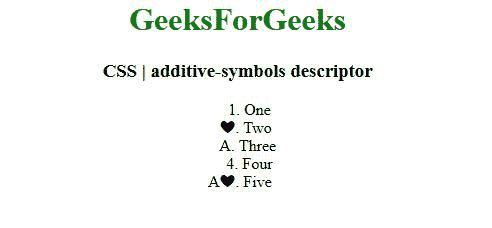
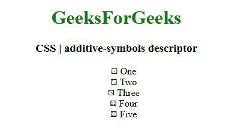

# CSS 加法符号描述符

> 原文:[https://www . geesforgeks . org/CSS-additive-symbols-descriptor/](https://www.geeksforgeeks.org/css-additive-symbols-descriptor/)

**CSS 加性-符号描述符**主要用于计数器系统描述符的值为**加性**时指定符号。它定义了加法元组，每个元组都是包含一个符号和一个非负整数权重的对。

**语法:**

```html
additive-symbols : positiveIntegerCounter identifier(s)/string(s)/image(s);
```

**属性值:**有几个重要的属性值可以用在加法符号中:

*   标识符
*   字符串
*   图像

说明 CSS 附加符号描述符的程序:

**例 1:**

## 超文本标记语言

```html
<!DOCTYPE HTML>
<html>

<head>
    <style>
        @counter-style mylist {
            system: additive;
            additive-symbols: 3 "A", 2 "\2764";
        }

        ul {
            list-style-type: mylist;
        }
    </style>
</head>

<body style="text-align:center;">
    <h1 style="color:green;">
        GeeksForGeeks
    </h1>
    <h3>
        CSS | additive-symbols descriptor
    </h3>

    <ul class="list">
        <li>One</li>
        <li>Two</li>
        <li>Three</li>
        <li>Four</li>
        <li>Five</li>
    </ul>
</body>

</html>
```

**输出:**



**例 2:**

## 超文本标记语言

```html
<!DOCTYPE HTML>
<html>

<head>

    <style>
        @counter-style dice {
            system: additive;
            additive-symbols: 6 "\2685", 
                5 "\2684", 4 "\2683", 
                3 "\2682", 2 "\2681", 1 "\2680";
            suffix: " ";
        }

        ul {
            list-style-type: dice;
        }
    </style>
</head>

<body style="text-align:center;">
    <h1 style="color:green;">
        GeeksForGeeks
    </h1>
    <h3>
        CSS | additive-symbols descriptor
    </h3>

    <ul>
        <li>One</li>
        <li>Two</li>
        <li>Three</li>
        <li>Four</li>
        <li>Five</li>
    </ul>
</body>

</html>
```

**输出:**



**支持的浏览器:**

*   火狐浏览器
*   Firefox Android