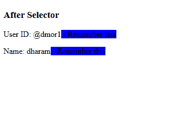

# CSS |::在选择器

之后

> 原文:[https://www.geeksforgeeks.org/css-after-selector/](https://www.geeksforgeeks.org/css-after-selector/)

**::after selector** 用于在其他元素的内容后多次添加相同的内容。此选择器与选择器之前的::相同。

**语法:**

```css
::after{
        content:
}

```

下面的 HTMl/CSS 代码显示了::after 选择器的功能:

```css
<!DOCTYPE html>
<html>

<head>
    <style>
        p::after {
            content: " - Remember this";
            background-color: blue;
        }
    </style>
</head>

<body>
    <h3>After Selector</h3>
    <p>User ID: @dmor1</p>
    <p>Name: dharam</p>
</body>

</html>
```

**输出:**


**支持的浏览器**

*   谷歌 Chrome 4.0*   Edge 9.0*   Firefox 3.5*   Safari 3.1*   Opera 7.0

    **注意:** Internet Explorer 8 和 Opera 4-6 支持带单冒号。(:之后)