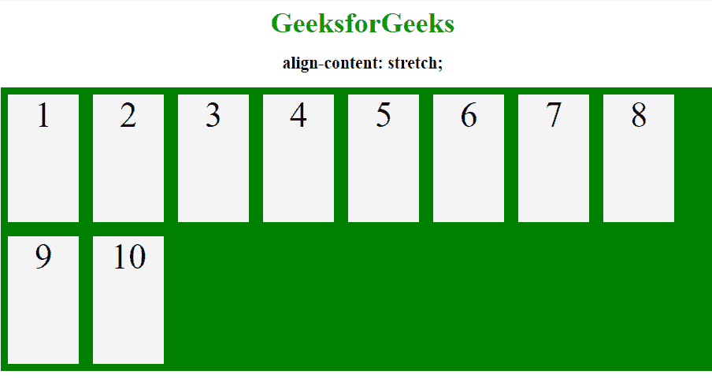

# CSS |对齐-内容属性

> 原文:[https://www.geeksforgeeks.org/css-align-content-property/](https://www.geeksforgeeks.org/css-align-content-property/)

align-content 属性更改 flex-wrap 属性的行为。它对齐伸缩线。它用于指定柔性容器内各行之间的对齐方式。此属性定义了每个 flex line 在 flexbox 中的对齐方式，仅适用于应用了 flex-wrap: wrap 的情况，即存在多行 flexbox 项目的情况。

**对齐内容属性列表:**

*   中心
*   伸展
*   弹性启动
*   柔性端
*   太空环绕
*   间隔

**用实例描述属性值**

**center:**

*   **语法:**

    ```html
    align-content:center;

    ```

    *   **Example:**

    ## Hypertext Markup Language

    ```html
    <!DOCTYPE html>
    <html>
        <head>
            <title>align-content property</title>
            <style>
                .main-container {
                    display: flex;
                    height: 400px;
                    flex-wrap: wrap;
                    align-content: center;
                    background-color: green;
                }

                .main-container div {
                    background-color: #f4f4f4;
                    width: 100px;
                    margin: 10px;
                    text-align: center;
                    font-size: 50px;
                }
                h2 {
                    text-align:center;
                }
                .geeks {
                    font-size:40px;
                    text-align:center;
                    color:#009900;
                    font-weight:bold;
                } 
            </style>
        </head>
        <body>
            <div class = "geeks">GeeksforGeeks</div>
            <h2>align-content: center;</h2>
            <div class="main-container">
                <div>1</div>
                <div>2</div>
                <div>3</div> 
                <div>4</div>
                <div>5</div>
                <div>6</div> 
                <div>7</div>
                <div>8</div>
                <div>9</div> 
                <div>10</div>
            </div>
        </body>
    </html>                    
    ```

    *   **Output:**
    

    **拉伸:**拉伸的线占据 flex 容器的剩余空间。这是默认值。

    *   **语法:**

        ```html
        align-content: stretch;

        ```

    *   **Example:**

        ## Hypertext Markup Language

        ```html
        <!DOCTYPE html>
        <html>
            <head>
                <title>align-content property</title>
                <style>
                    .main-container {
                        display: flex;
                        height: 400px;
                        flex-wrap: wrap;
                        align-content: stretch;
                        background-color: green;
                    }

                    .main-container div {
                        background-color: #f4f4f4;
                        width: 100px;
                        margin: 10px;
                        text-align: center;
                        font-size: 50px;
                    }
                    h2 {
                        text-align:center;
                    }
                    .geeks {
                        font-size:40px;
                        text-align:center;
                        color:#009900;
                        font-weight:bold;
                    } 
                </style>
            </head>
            <body>
                <div class = "geeks">GeeksforGeeks</div>
                <h2>align-content: stretch;</h2>
                <div class="main-container">
                    <div>1</div>
                    <div>2</div>
                    <div>3</div> 
                    <div>4</div>
                    <div>5</div>
                    <div>6</div> 
                    <div>7</div>
                    <div>8</div>
                    <div>9</div> 
                    <div>10</div>
                </div>
            </body>
        </html>                    
        ```

    *   **输出:**
        

    **伸缩-开始:**显示伸缩容器开始处的线条。

    *   **语法:**

        ```html
        align-content: flex-start;

        ```

    *   **Example:**

        ## Hypertext Markup Language

        ```html
        <!DOCTYPE html>
        <html>
            <head>
                <title>align-content property</title>
                <style>
                    .main-container {
                        display: flex;
                        height: 400px;
                        flex-wrap: wrap;
                        align-content: flex-start;
                        background-color: green;
                    }

                    .main-container div {
                        background-color: #f4f4f4;
                        width: 100px;
                        margin: 10px;
                        text-align: center;
                        font-size: 50px;
                    }
                    h2 {
                        text-align:center;
                    }
                    .geeks {
                        font-size:40px;
                        text-align:center;
                        color:#009900;
                        font-weight:bold;
                    } 
                </style>
            </head>
            <body>
                <div class = "geeks">GeeksforGeeks</div>
                <h2>align-content: flex-start;</h2>
                <div class="main-container">
                    <div>1</div>
                    <div>2</div>
                    <div>3</div> 
                    <div>4</div>
                    <div>5</div>
                    <div>6</div> 
                    <div>7</div>
                    <div>8</div>
                    <div>9</div> 
                    <div>10</div>
                </div>
            </body>
        </html>                    
        ```

    *   **输出:**
        

    **伸缩端:**显示伸缩容器末端的伸缩线

    *   **语法:**

        ```html
        align-content: flex-end;

        ```

    *   **Example:**

        ## Hypertext Markup Language

        ```html
        <!DOCTYPE html>
        <html>
            <head>
                <title>align-content property</title>
                <style>
                    .main-container {
                        display: flex;
                        height: 400px;
                        flex-wrap: wrap;
                        align-content: flex-end;
                        background-color: green;
                    }

                    .main-container div {
                        background-color: #f4f4f4;
                        width: 100px;
                        margin: 10px;
                        text-align: center;
                        font-size: 50px;
                    }
                    h2 {
                        text-align:center;
                    }
                    .geeks {
                        font-size:40px;
                        text-align:center;
                        color:#009900;
                        font-weight:bold;
                    } 
                </style>
            </head>
            <body>
                <div class = "geeks">GeeksforGeeks</div>
                <h2>align-content: flex-end;</h2>
                <div class="main-container">
                    <div>1</div>
                    <div>2</div>
                    <div>3</div> 
                    <div>4</div>
                    <div>5</div>
                    <div>6</div> 
                    <div>7</div>
                    <div>8</div>
                    <div>9</div> 
                    <div>10</div>
                </div>
            </body>
        </html>                    
        ```

    *   **输出:**
        

    **环绕空间:**通过使用环绕空间属性，空间将平均分布在挠曲线周围。

    *   **语法:**

        ```html
        align-content: space-around;

        ```

    *   **Example:**

        ## Hypertext Markup Language

        ```html
        <!DOCTYPE html>
        <html>
            <head>
                <title>align-content property</title>
                <style>
                    .main-container {
                        display: flex;
                        height: 400px;
                        flex-wrap: wrap;
                        align-content: space-around;
                        background-color: green;
                    }

                    .main-container div {
                        background-color: #f4f4f4;
                        width: 100px;
                        margin: 10px;
                        text-align: center;
                        font-size: 50px;
                    }
                    h2 {
                        text-align:center;
                    }
                    .geeks {
                        font-size:40px;
                        text-align:center;
                        color:#009900;
                        font-weight:bold;
                    } 
                </style>
            </head>
            <body>
                <div class = "geeks">GeeksforGeeks</div>
                <h2>align-content: space-around;</h2>
                <div class="main-container">
                    <div>1</div>
                    <div>2</div>
                    <div>3</div> 
                    <div>4</div>
                    <div>5</div>
                    <div>6</div> 
                    <div>7</div>
                    <div>8</div>
                    <div>9</div> 
                    <div>10</div>
                </div>
            </body>
        </html>                    
        ```

    *   **输出:**
        

    **间距:**显示间距相等的折线。

    *   **语法:**

        ```html
        align-content: space-between;

        ```

    *   **Example:**

        ## Hypertext Markup Language

        ```html
        <!DOCTYPE html>
        <html>
            <head>
                <title>align-content property</title>
                <style>
                    .main-container {
                        display: flex;
                        height: 400px;
                        flex-wrap: wrap;
                        align-content: space-between;
                        background-color: green;
                    }

                    .main-container div {
                        background-color: #f4f4f4;
                        width: 100px;
                        margin: 10px;
                        text-align: center;
                        font-size: 50px;
                    }
                    h2 {
                        text-align:center;
                    }
                    .geeks {
                        font-size:40px;
                        text-align:center;
                        color:#009900;
                        font-weight:bold;
                    } 
                </style>
            </head>
            <body>
                <div class = "geeks">GeeksforGeeks</div>
                <h2>align-content: space-between;</h2>
                <div class="main-container">
                    <div>1</div>
                    <div>2</div>
                    <div>3</div> 
                    <div>4</div>
                    <div>5</div>
                    <div>6</div> 
                    <div>7</div>
                    <div>8</div>
                    <div>9</div> 
                    <div>10</div>
                </div>
            </body>
        </html>                    
        ```

    *   **输出:**
        

    **支持的浏览器:**以下列出了 *CSS | align-content 属性*支持的浏览器:

    *   谷歌 Chrome 21.0
    *   Internet Explorer 11.0
    *   Firefox 28.0
    *   歌剧 12.1
    *   Safari 9.0，7.0 -webkit-