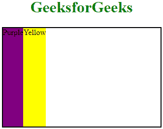

# CSS |对齐项目属性

> 原文:[https://www.geeksforgeeks.org/css-align-items-property/](https://www.geeksforgeeks.org/css-align-items-property/)

align-items 属性用于设置柔性容器内部或给定窗口中项目的对齐方式。它将伸缩项目与轴对齐。align-self 属性用于重写 align-items 属性。

**语法:**

```css
align-items: stretch|center|flex-start|flex-end|baseline|initial|
inherit;

```

**默认值**

*   **拉伸**

**属性值:**

**拉伸:**项目被拉伸以适合容器，这是默认值。

*   **语法:**

    ```css
    align-items: stretch;
    ```

*   **例:**

    ## 爪哇描述语言

    ```css
    <!DOCTYPE html>
    <html>

    <head>
        <title>
            CSS | align-items Property
        </title>
        <style>

            #stretch {
                width: 320px;
                height: 200px;
                border: 2px solid black;
                display: flex;
                align-items: stretch;
            }
        </style>
    </head>

    <body>
        <center>
            <h1 style="color:green;">GeeksforGeeks</h1>

            <div id="stretch">
                <div style="background-color:Purple;">
                   Purple
                </div>
                <div style="background-color:Yellow;">
                   Yellow
                </div>
            </div>

        </center>
    </body>

    </html>
    ```

*   **输出:**
    

**中心:**物品的位置应垂直于容器的中心。

*   **语法:**

    ```css
    align-items: center;
    ```

*   **例:**

    ## 爪哇描述语言

    ```css
    <!DOCTYPE html>
    <html>

    <head>
        <title>
            CSS | align-items Property
        </title>
        <style>

            #center {
                width: 320px;
                height: 200px;
                border: 2px solid black;
                display: flex;
                align-items: center;
            }
        </style>
    </head>

    <body>
        <center>
            <h1 style="color:green;">GeeksforGeeks</h1>

            <div id="center">
                <div style="background-color:Purple;">
                  Purple
                </div>
                <div style="background-color:Yellow;">
                  Yellow
                </div>
            </div>

        </center>
    </body>

    </html>
    ```

*   **输出:**
    

**伸缩启动:**物品将被放置在容器的开始处。

*   **语法:**

    ```css
    align-items: flex-start;
    ```

*   **例:**

    ## 爪哇描述语言

    ```css
    <!DOCTYPE html>
    <html>

    <head>
        <title>
            CSS | align-items Property
        </title>
        <style>

            #flex-start {
                width: 320px;
                height: 200px;
                border: 2px solid black;
                display: flex;
                align-items: flex-start;
            }
        </style>
    </head>

    <body>
        <center>
            <h1 style="color:green;">GeeksforGeeks</h1>

            <div id="flex-start">
                <div style="background-color:Purple;">
                  Purple
                </div>
                <div style="background-color:Yellow;">
                  Yellow
                </div>
            </div>

        </center>
    </body>

    </html>
    ```

*   **输出:**
    

**弯曲端:**物品将放置在容器的末端。

*   **语法:**

    ```css
    align-items: flex-end;
    ```

*   **例:**

    ## 爪哇描述语言

    ```css
    <!DOCTYPE html>
    <html>

    <head>
        <title>
            CSS | align-items Property
        </title>
        <style>

            #flex-end {
                width: 320px;
                height: 200px;
                border: 2px solid black;
                display: flex;
                align-items: flex-end;
            }
        </style>
    </head>

    <body>
        <center>
            <h1 style="color:green;">GeeksforGeeks</h1>

            <div id="flex-end">
                <div style="background-color:Purple;">
                  Purple
                </div>
                <div style="background-color:Yellow;">
                  Yellow
                </div>
            </div>

        </center>
    </body>

    </html>
    ```

*   **输出:**
    

**基线:**物品将定位到集装箱的基线。

*   **语法:**

    ```css
    align-items: baseline;
    ```

*   **例:**

    ## 爪哇描述语言

    ```css
    <!DOCTYPE html>
    <html>

    <head>
        <title>
            CSS | align-items Property
        </title>
        <style>

            #baseline {
                width: 320px;
                height: 200px;
                border: 2px solid black;
                display: flex;
                align-items: baseline;
            }
        </style>
    </head>

    <body>
        <center>
            <h1 style="color:green;">GeeksforGeeks</h1>

            <div id="baseline">
                <div style="background-color:Purple;">
                  Purple
                </div>
                <div style="background-color:Yellow;">
                  Yellow
                </div>
            </div>

        </center>
    </body>

    </html>
    ```

*   **输出:**
    

**初始值:**将该值/属性设置为默认值。

*   **语法:**

    ```css
    align-items: initial;
    ```

*   **例:**

    ## 爪哇描述语言

    ```css
    <!DOCTYPE html>
    <html>

    <head>
        <title>
            CSS | align-items Property
        </title>
        <style>

            #initial {
                width: 320px;
                height: 200px;
                border: 2px solid black;
                display: flex;
                align-items: initial;
            }
        </style>
    </head>

    <body>
        <center>
            <h1 style="color:green;">GeeksforGeeks</h1>

            <div id="initial">
                <div style="background-color:Purple;">
                  Purple
                </div>
                <div style="background-color:Yellow;">
                  Yellow
                </div>
            </div>

        </center>
    </body>

    </html>
    ```

*   **输出:**
    

**继承:**从父元素继承属性。

**支持的浏览器:**CSS align-items 属性支持的浏览器如下:

*   谷歌 Chrome 21.0
*   Internet Explorer 11.0
*   Firefox 20.0
*   歌剧 12.1
*   Safari 9.0，7.0 -webkit-