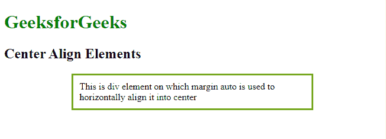
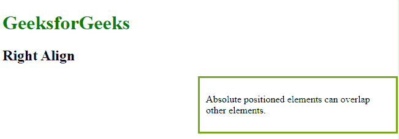
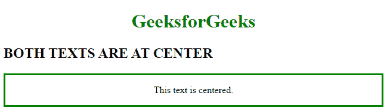
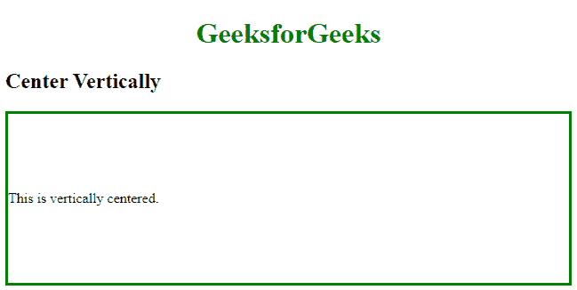
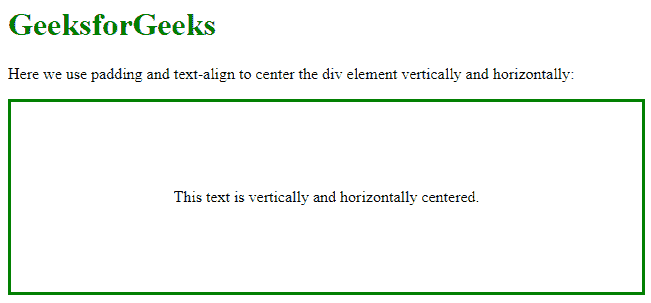

# CSS 对齐

> 原文:[https://www.geeksforgeeks.org/css-align/](https://www.geeksforgeeks.org/css-align/)

CSS 中的**对齐**用于定位项目以及设置内容项目之间和周围的空间分布。我们可以水平或垂直对齐项目。各种方法和技术被用来使它们居中，注意左边和右边距等。&其用法的各种对齐方法讨论如下:

**边距:自动:**此属性用于将块元素对齐到中心。

**注意:**使用*余量:自动*在 IE8 不工作除非 a！DOCTYPE 已声明。

**示例 1:** 本示例使用*边距:自动*属性描述 CSS 对齐。

## 超文本标记语言

```html
<!DOCTYPE html>
<html>

<head>
    <style>
    .center {
        margin: auto;
        width: 60%;
        border: 3px solid #73AD21;
        padding: 10px;
    }
    </style>
</head>

<body>
    <h1 style="color:green;">  
            GeeksforGeeks  
        </h1>
    <h2>Center Align Elements</h2>
    <div class="center"> 
        This is div element on which
        margin auto is used to horizontally
        align it into center 
    </div>
</body>

</html>
```

**输出:**



**位置:绝对；**我们可以使用这个属性来对齐项目。

**示例 2:** 本示例使用*位置描述 CSS 对齐:绝对；*属性。

## 超文本标记语言

```html
<!DOCTYPE html>
<html>

<head>
    <style>
    .right {
        position: absolute;
        right: 0px;
        width: 300px;
        border: 3px solid #73AD21;
        padding: 10px;
    }
    </style>
</head>

<body>
    <h1 style="color:green;">  
            GeeksforGeeks  
        </h1>
    <h2>Right Align</h2>
    <div class="right">
        <p> 
            Absolute positioned elements 
            can overlap other elements. 
        </p>
    </div>
</body>

</html>
```

**输出:**



**文本对齐:居中；**我们可以将任何用 HTML 编写的文本对齐在中间。我们可以在各种标签中使用这个属性。

**示例 3:** 本示例使用*文本对齐:居中来描述 CSS 对齐；*属性。

## 超文本标记语言

```html
<!DOCTYPE html>
<html>

<head>
    <style>
    .center {
        text-align: center;
        border: 3px solid green;
    }
    </style>
</head>

<body>
    <h1 style="color:green;
               text-align: center;">  
            GeeksforGeeks  
        </h1>
    <h2>BOTH TEXTS ARE AT CENTER</h2>
    <div class="center">
        <p>This text is centered.</p>
    </div>
</body>

</html>
```

**输出:**



**填充:**要垂直对齐项目，我们可以使用填充。

**示例 4:** 本示例使用填充属性描述 CSS 对齐。

## 超文本标记语言

```html
<!DOCTYPE html>
<html>

<head>
    <style>
    .center {
        padding: 70px 0;
        border: 3px solid green;
    }
    </style>
</head>

<body>
    <h1 style="color:green;
               text-align:center;">  
            GeeksforGeeks  
        </h1>
    <h2>Center Vertically</h2>
    <div class="center">
        <p>This is vertically centered.</p>
    </div>
</body>

</html>
```

**输出:**



**填充&文本对齐；**使用填充和文本对齐的组合来垂直和水平对齐文本:居中。

**示例 5:** 本示例使用填充&文本对齐属性描述 CSS 对齐。

## 超文本标记语言

```html
<!DOCTYPE html>
<html>

<head>
    <style>
    .center {
        padding: 70px 0;
        border: 3px solid green;
        text-align: center;
    }
    </style>
</head>

<body>
    <h1 style="color:green;">  
          GeeksforGeeks  
        </h1>
    <p>
        Here we use padding and 
        text-align to center the
        div element vertically 
        and horizontally:
    </p>

    <div class="center">
        <p>
          This text is vertically 
          and horizontally centered.
        </p>
    </div>
</body>

</html>
```

**输出:**



**支持的浏览器:**

*   谷歌 Chrome 95.0
*   微软边缘 95.0
*   Firefox 93.0
*   Opera 80.0
*   Safari 15.0