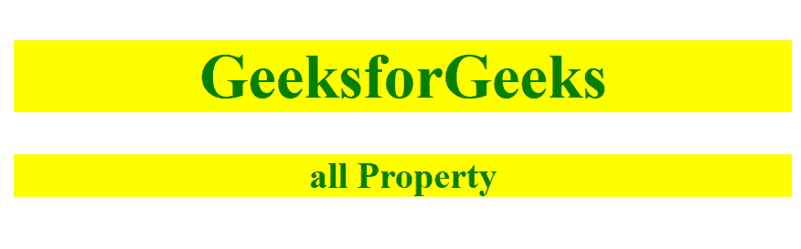

# CSS |全部属性

> 原文:[https://www.geeksforgeeks.org/css-all-property/](https://www.geeksforgeeks.org/css-all-property/)

CSS 中的 **all 属性**是一个简写属性，用于将所有元素的值设置为它们的初始值或继承值，或者在某些情况下用于将这些值设置为另一个电子表格原点。此属性用于重置文档中的所有 CSS 属性。
**语法:**

```html
all: initial|inherit|unset|revert;
```

**默认值:**默认值为无。

**属性值:**
**初始值:**该属性用于将所有属性设置为默认值。

*   **语法:**

```html
all: initial;
```

*   **例:**

## 超文本标记语言

```html
<!DOCTYPE html> 
<html> 
    <head> 
        <title>
            CSS all property
        </title> 

        <!-- CSS all property -->
        <style> 
            h1, h3 { 
                background-color: yellow;
                color: green;
                all: initial; 
            } 
            body { 
                text-align: center; 
                all: initial;
            } 
        </style> 
    </head>

    <body> 
        <h1>GeeksforGeeks</h1> 
        <h3>all property</h3> 
    </body> 
</html>                    
```

*   **输出:**

```html
GeeksforGeeks all property
```

*   **语法:**

```html
all: inherit;
```

*   **例:**

## 超文本标记语言

```html
<!DOCTYPE html> 
<html> 
    <head> 
        <title>All Property</title> 
        <style> 
            div {
                text-align:center;
                color:green;
                all:initial
            }
            h1, h3 { 
                all: inherit; 
            } 
        </style> 
    </head> 
    <body> 
        <div>
            <h1>GeeksforGeeks</h1> 
            <h3>all property</h3> 
        </div>
    </body> 
</html>                    
```

*   **输出:**

```html
GeeksforGeeks all property
```

*   **语法:**

```html
all: unset;
```

*   **例:**

## 超文本标记语言

```html
<!DOCTYPE html> 
<html> 
    <head> 
        <title>
            CSS all property
        </title> 

        <style> 
            h1, h3 { 
                background-color: green;
                color: white;
                all: unset; 
            } 
            body { 
                text-align: center; 
                all: unset;
            } 
        </style> 
    </head> 

    <body> 
        <h1>GeeksforGeeks</h1> 
        <h3>all property</h3> 
    </body> 
</html>                    
```

*   **输出:**

```html
GeeksforGeeks all property
```

*   **语法:**

```html
all: revert;
```

*   **例:**

## 超文本标记语言

```html
<!DOCTYPE html> 
<html> 
    <head> 
        <title>
            CSS all property
        </title> 

        <style> 
            h1, h3 { 
                background-color: yellow;
                color: green;
                all: revert; 

            } 
            body { 
                text-align: center; 
                all: revert; 
            } 
        </style> 
    </head> 

    <body> 
        <h1>GeeksforGeeks</h1> 
        <h3>all Property</h3> 
    </body> 
</html>                    
```

*   **输出:**



**支持浏览器运行代码 CSS 全部属性:**

*   Chrome 37.0
*   Firefox 27.0
*   Opera 24.0
*   Safari 9.1
*   微软边缘 79.0