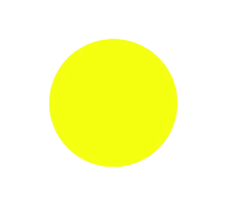
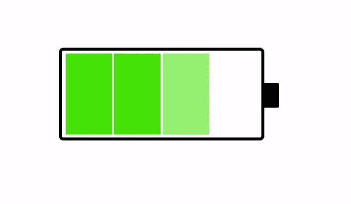

# CSS 动画和@关键帧属性

> 原文:[https://www . geesforgeks . org/CSS-动画和关键帧-属性/](https://www.geeksforgeeks.org/css-animation-and-keyframes-property/)

CSS 允许在不使用 JavaScript 的情况下动画化 HTML 元素。一个动画让一个元素有系统地和适当的时机，从一种风格改变到另一种风格。您可以根据需要更改任何 CSS 属性，结束次数。要使用 CSS 动画，您必须首先为动画指定一些@关键帧。@关键帧将描述该元素在特定时间具有哪些样式。

我们将使用一个基本的例子，比如电池充电的动画。

关键帧属性可以选择将动画时间分成部分/百分比，并在动画的整个持续时间内执行为该部分指定的活动。根据动画的名称，每个动画都有一个@关键帧属性。它也允许你无限地运行动画。

这里有一个简单的 CSS 块，解释了@关键帧的用法:

**示例:**背景颜色变化中@关键帧的使用。

```html
<!DOCTYPE html>
<html>

<head>
    <title>
        CSS Animation and @Keyframes Property
    </title>

    <style>
        div {
            width: 200px;
            height: 200px;
            margin: 200px;
            border-radius: 100px;
            background-color: red;
            animation: circle 8s infinite;
        }

        @keyframes circle {
            0% {
                background-color: red;
            }

            25% {
                background-color: yellow;
            }

            50% {
                background-color: blue;
            }

            100% {
                background-color: green;
            }
        }
    </style>
</head>

<body>
    <div></div>
</body>

</html>
```

```html
Output:

```



**注意:**在使用@关键帧时，有一些指导方针已经设置好，可以让您创建平滑的工作动画。指导原则，例如，确保过渡平滑，并指定样式更改发生的时间(百分比)或关键字“从”和“到”，这与 0%和 100%相同。0%是动画将要开始的时间，100%是动画完成的时间。为了获得最佳的浏览器支持，即确保整个互联网的所有浏览器都支持动画，请务必同时定义 0%和 100%选择器。

为电池充电的动画很重要，因为它可以帮助您了解@关键帧属性将如何帮助您以完美的时间间隔为动画计时，从而帮助平滑过渡。电池充电用于解释如何通过指定分割百分比来设置给定时间段内的各种动画，在示例中，电池如何从 0-25%充电，然后从 25-50%充电，等等。

```html
<!DOCTYPE html>
<html>

<head>
    <title>
        CSS Animation and @Keyframes Property
    </title>

    <style>
        body {
            background-color: #fff;
        }

        .battery {
            height: 140px;
            width: 321px;
            border: 5px solid #000;
            border-radius: 7px;
            position: absolute;
            margin: auto;
            left: 0;
            right: 0;
            bottom: 0;
            top: 0;
        }

        .top {
            height: 40px;
            width: 25px;
            background-color: #000;
            position: relative;
            left: 325px;
            top: 52px;
            border-radius: 0 3px 3px 0;
        }

        .charge1,
        .charge2,
        .charge3,
        .charge4 {
            width: 75px;
            height: 130px;
            background-color: #3BC700;
            position: relative;
            opacity: 0;
        }

        .charge1 {
            margin: 9px 2px 3px 6px;
            bottom: 44px;
            animation: charge-1 2s infinite;
        }

        .charge2 {
            margin: 9px 9px 3px 9px;
            bottom: 183px;
            left: 75px;
            animation: charge-2 2s infinite;
        }

        .charge3 {
            margin: 9px 9px 3px 12px;
            bottom: 322px;
            left: 150px;
            animation: charge-3 2s infinite;
        }

        .charge4 {
            margin: 9px 2px 3px 15px;
            bottom: 461px;
            left: 225px;
            animation: charge-4 2s infinite;
        }

        @keyframes charge-1 {

            25%,
            100% {
                opacity: 1;
            }
        }

        @keyframes charge-2 {

            0%,
            25% {
                opacity: 0;
            }

            50%,
            100% {
                opacity: 1;
            }
        }

        @keyframes charge-3 {

            0%,
            50% {
                opacity: 0;
            }

            75%,
            100% {
                opacity: 1;
            }
        }

        @keyframes charge-4 {

            0%,
            75% {
                opacity: 0;
            }

            100% {
                opacity: 1;
            }
        }
    </style>
</head>

<body>
    <div class="battery">
        <div class="top"></div>
        <div class="charge1"></div>
        <div class="charge2"></div>
        <div class="charge3"></div>
        <div class="charge4"></div>
    </div>
</body>

</html>
```

```html
Output:

```

