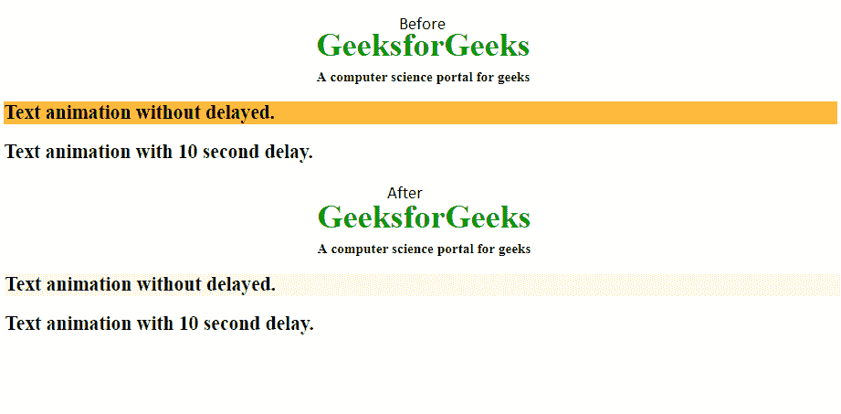

# CSS |动画-延迟属性

> 原文:[https://www.geeksforgeeks.org/css-animation-delay-property/](https://www.geeksforgeeks.org/css-animation-delay-property/)

CSS 中的**动画-延迟**属性用于指定动画开始的延迟。动画延迟值以秒或毫秒为单位定义。

**语法:**

```html
animation-delay: time|initial|inherit;
```

**属性值:**

*   **时间:**该值可选。它用于定义动画开始前等待的秒数或毫秒数，即动画延迟的时间。默认值为 0。允许负值。如果使用负值，动画将开始播放，就像已经播放了 N 秒/毫秒一样。
*   **初始值:**该值用于将属性设置为默认值。
*   **inherit:** 该值用于从其父元素继承属性。

**示例:** HTML 程序来说明 CSS 的动画-延迟属性。

```html
<!DOCTYPE html> 
<html> 
    <head> 
        <title>
             CSS | animation-delay Property
        </title>
        <style> 
            .geeks { 
                font-size: 40px; 
                text-align:center; 
                font-weight:bold; 
                color:#090; 
                padding-bottom:5px; 
                font-family:Times New Roman; 
            } 

            .geeks1 { 
                font-size:17px; 
                font-weight:bold; 
                text-align:center; 
                font-family:Times New Roman; 
            } 

            #one { 
                animation-name: example; 
                animation-duration: 10s; 

            } 

            #two { 
                animation-name: example; 
                animation-duration: 10s; 
                animation-delay: 10s; 
            } 

            @keyframes example { 
                from { 
                    background-color: orange; 
                } 
                to { 
                    background-color: white; 
                } 
            } 
        </style> 
    </head> 
    <body> 
        <div class = "geeks">
            GeeksforGeeks
        </div> 

        <div class = "geeks1">
            A computer science portal for geeks
        </div> 

        <!-- Animation of below h2 tag is not delayed
            and begins as soon as the page is loaded 
            in the browser -->
        <h2 id="one">
            Text animation without delayed.
        </h2> 

        <!-- The animation of below h2 tag is delayed for 10s
             That is, it begins after 10s of successfully 
             loading of the current page -->
        <h2 id="two">
            Text animation with 10 second delay.
        </h2> 
    </body> 
</html>                                    
```

**输出:**


**支持的浏览器:**动画延迟支持的浏览器如下:

*   谷歌 Chrome 43.0
*   Internet Explorer 10.0
*   Firefox 16.0
*   Opera 30.0
*   Safari 9.0