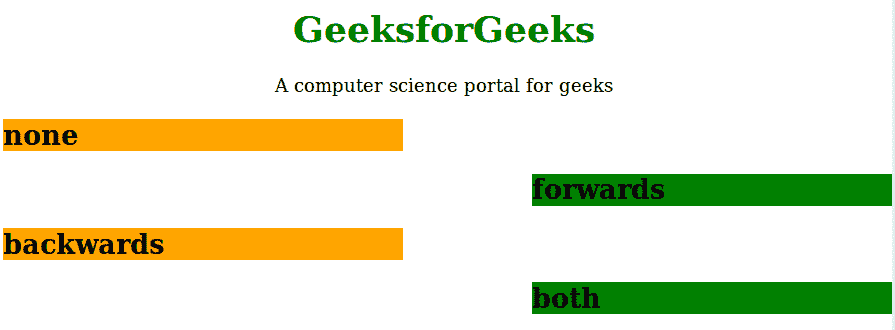

# CSS |动画-填充-模式属性

> 原文:[https://www . geesforgeks . org/CSS-动画-填充-模式-属性/](https://www.geeksforgeeks.org/css-animation-fill-mode-property/)

动画填充模式属性用于指定动画执行前后应用值。在播放第一个关键帧之前或播放最后一个关键帧之后，CSS 动画不会影响元素。动画填充模式属性可以重写此行为。

**语法:**

```html
animation-fill-mode: none | forwards | backwards | both | initial | 
inherit;
```

**属性值:**动画填充模式属性包含许多值，如下所示:

*   **无:**为默认值。动画属性不会在执行之前或之后应用于任何元素。
*   **向前:**动画完成后，元素将保留最后一个关键帧的相同动画属性。
*   **向后:**该属性值用于在开始动画之前将元素设置为第一个关键帧值。
*   **两者:**该属性用于遵循向前和向后的规则。
*   **初始值:**该属性用于将属性设置为默认值。
*   **inherit:** 该属性用于从其父元素继承该属性。

**示例:**

```html
<!DOCTYPE html> 
<html> 
    <head> 
        <title>
            CSS | animation-fill-mode Property
        </title>
        <style> 
            h1 {
                color:green;
            }
            h1, p {
                text-align:center;
            }
            h2 { 
                width: 400px; 
                background-color: orange; 
                animation-name: text; 
                animation-duration: 3s; 
            } 
            #one { 
                animation-fill-mode: none; 
            } 
            #two { 
                animation-fill-mode: forwards; 
            } 
            #three { 
                animation-fill-mode: backwards; 
                animation-delay: 2s; 
            } 
            #four { 
                animation-fill-mode: both; 
                animation-delay: 2s; 
            } 
            @keyframes text { 
                from { 
                    margin-left: 0%; 
                    background-color: #aaaaaa; 
                } 
                to { 
                    margin-left: 60%; 
                    background-color: #008000; 
                } 
            } 
        </style> 
    </head> 
    <body> 
        <h1>GeeksforGeeks</h1> 
        <p>A computer science portal for geeks</p> 
        <h2 id="one">none</h2> 
        <h2 id="two">forwards</h2> 
        <h2 id="three">backwards</h2> 
        <h2 id="four">both</h2> 
    </body> 
</html>                                           
```

**输出:**


**支持的浏览器:***动画填充模式属性*支持的浏览器如下:

*   谷歌 Chrome 43.0
*   Internet Explorer 10.0
*   Firefox 16.0
*   Opera 15.0
*   Safari 4.0