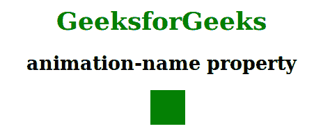

# CSS |动画-名称属性

> 原文:[https://www.geeksforgeeks.org/css-animation-name-property/](https://www.geeksforgeeks.org/css-animation-name-property/)

**动画名称属性**用于指定描述动画的@关键帧的名称。

**语法:**

```
animation-name: keyframename|none|initial|inherit;
```

**属性值:**动画名称属性值如下:

*   **关键帧名称:**该属性用于指定需要与选择器绑定的关键帧的名称。
*   **无:**为默认值。它用于指定不会有动画。
*   **初始值:**该属性用于将该属性设置为默认值。
*   **inherit:** 该属性用于从其父元素继承该属性。

**示例:**

```
<!DOCTYPE html> 
<html> 
    <head> 
        <title>
            CSS | animation-name Property
        </title>
        <style> 
            body {
                text-align:center;
                width:70%;
            }
            h1 {
                color:green;
            }
            div {
                width: 50px;
                height: 50px;
                background: green;
                position: relative;
                -webkit-animation: geeks 5s infinite;
                -webkit-animation-delay: 2s;
                animation: geeks 5s infinite;
                animation-delay: 2s;
            }
            @-webkit-keyframes geeks {
                from {
                    left: 0%;
                }
                to {
                    left: 80%;
                }
            }
            @keyframes geeks {
                from {
                    left: 0px;
                }
                to {
                    left: 80%;
                }
            } 
            #one { 
                animation-direction: alternate-reverse;; 
            } 
            @keyframes text { 
                from { 
                    margin-left: 60%; 
                } 
                to { 
                    margin-left: 0%; 
                } 
            } 
        </style> 
    </head> 
    <body> 
        <h1>GeeksforGeeks</h1> 
        <h2>animation-name property</h2> 
        <div class = "gfg"></div> 
    </body> 
</html>                                                    
```

**输出:**


**支持的浏览器:***动画名称属性*支持的浏览器如下:

*   谷歌 Chrome 43.0
*   Internet Explorer 10.0
*   Firefox 16.0
*   Opera 30.0
*   Safari 9.0