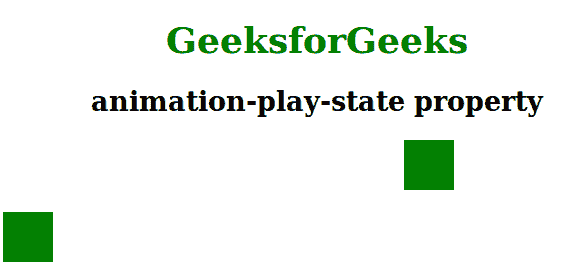

# CSS |动画-播放-状态属性

> 原文:[https://www . geesforgeks . org/CSS-动画-播放-状态-属性/](https://www.geeksforgeeks.org/css-animation-play-state-property/)

**动画播放状态属性**用于指定动画是正在运行还是暂停。

**语法:**

```html
animation-play-state: paused|running|initial|inherit;
```

**属性值:**动画播放状态属性如下:

*   **暂停:**该属性用于指定动画暂停。
*   **运行:**为默认值。此属性用于指定动画正在运行。
*   **初始值:**该属性用于设置默认值。
*   **继承:**用于从其父级继承动画属性。

**示例:**

```html
<!DOCTYPE html> 
<html> 
    <head> 
        <title>
            CSS | animation-play-state Property
        </title>
        <style> 
            body {
                text-align:center;
                width:70%;
            }
            h1 {
                color:green;
            }
            .gfg {
                width: 50px;
                height: 50px;
                background: green;
                position: relative;
                -webkit-animation: mymove 10s;
                -webkit-animation-play-state: play;
                animation: mymove 5s;
                animation-play-state: play;
            }
            .geeks {
                width: 50px;
                height: 50px;
                background: green;
                position: relative;
                -webkit-animation: mymove 10s;
                -webkit-animation-play-state: paused;
                animation: mymove 5s;
                animation-play-state: paused;
            }
            @-webkit-keyframes mymove {
                from {
                    left: 0%;
                }
                to {
                    left: 80%;
                }
            }

            @keyframes mymove {
                from {
                    left: 0%;
                }
                to {
                    left: 80%;
                }
            }
        </style> 
    </head> 
    <body> 
        <h1>GeeksforGeeks</h1> 
        <h2>animation-play-state property</h2> 
        <div class = "gfg"></div><br> 
        <div class = "geeks"></div> 
    </body> 
</html>                                                  
```

**输出:**


**支持的浏览器:***动画播放状态属性*支持的浏览器如下:

*   谷歌 Chrome 43.0
*   Internet Explorer 10.0
*   Firefox 16.0
*   Opera 30.0
*   Safari 9.0