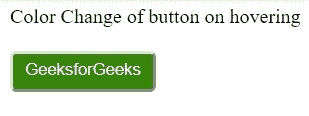
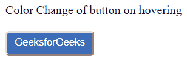

# CSS |改变按钮/图像悬停状态的动画

> 原文:[https://www . geesforgeks . org/CSS-动画-更改悬停状态按钮图像/](https://www.geeksforgeeks.org/css-animation-to-change-the-hover-state-of-a-button-image/)

1.在悬停状态下更改按钮的颜色/大小。

**进场:**

*   设置悬停状态的动画和持续时间
*   使用**@关键帧**设置背景颜色

**语法:**

```
button:hover {
    animation-name: background-color;
    animation-duration: 500ms;
    }

    @keyframes background-color {
        100% {
        background-color:#4065F3;
    }
}
```

**示例:**

## 超文本标记语言

```
<!DOCTYPE html>
<html>

<head>
    Color Change of button on hovering
</head>
<style>
    button {
        border-radius: 5px;
        color: white;
        background-color: #368508;
        padding: 5px 10px 8px 10px;
    }

    /*Button hover state*/
    button:hover {
        animation-name: background-color;
        animation-duration: 500ms;
    }

    /*keyframes*/
    @keyframes background-color {
        100% {
            background-color: #4065F3;
        }
    }
</style>

<body>
    <br>
    <br>
    <button>GeeksforGeeks</button>
</body>

</html>
```

**输出:**
**最初，按钮看起来是这样的:**



**悬停时变为:**



2.要更改悬停状态下图像的颜色/大小

。**进场:**

*   设置悬停状态的动画和持续时间
*   使用**@关键帧**设置图像大小

**语法:**

```
 img:hover {
       animation-name: breadth;
       animation-duration: 500ms;
     }

      @keyframes breadth {
      50% {
       width: 400px;
      }
      100% {
       width: 600px;
      }
    }
```

## 超文本标记语言

```
<!DOCTYPE html>
<html>

<head>
  Size Change of image on hovering
  </head>
<style>
    img:hover {
        animation-name: breadth;
        animation-duration: 500ms;
    }

    @keyframes breadth {
        50% {
            width: 400px;
        }
        100% {
            width: 600px;
        }
    }
</style>

<body>
    
</body>

</html>
```

**输出:**
**最初，图像的大小是这样的:**


**悬停时，其大小在半个持续时间内减小到这个程度:**


**然后在完成持续时间后再次恢复到原始大小:**

