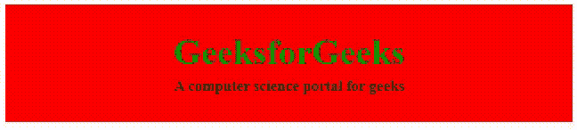
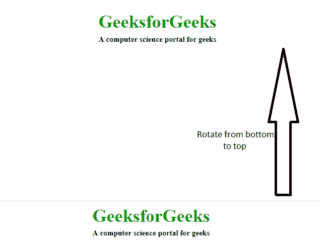
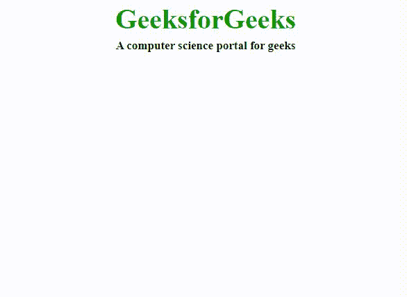
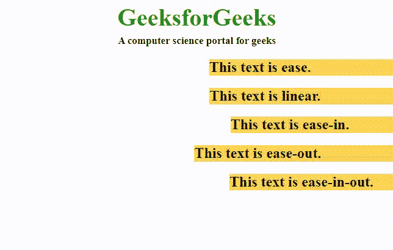
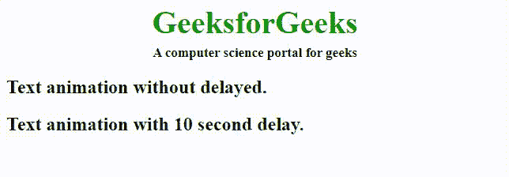
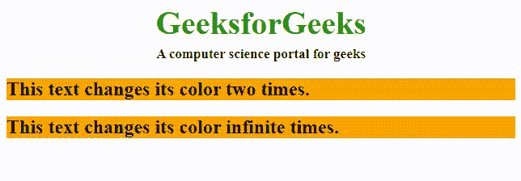
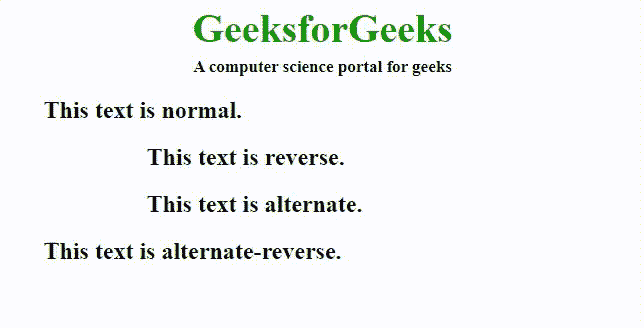
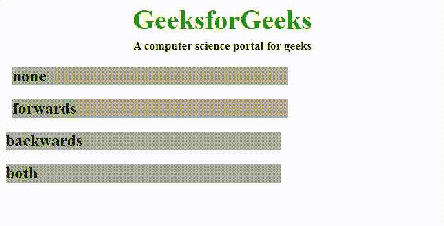
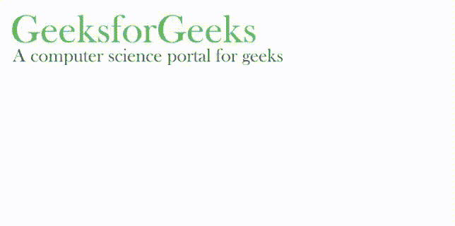

# CSS 动画

> 哎哎哎:# t0]https://www . geeksforgeeks . org/CSS 动画/

**CSS 动画:** CSS 动画是一种改变网页中各种元素的外观和行为的技术。它用于通过改变元素的运动或显示来控制元素。它有两部分，一部分包含描述元素动画的 CSS 属性，另一部分包含某些关键帧，这些关键帧指示元素的动画属性以及这些属性必须出现的特定时间间隔。

**[**@关键帧规则**](https://www.geeksforgeeks.org/css-keyframes-rule/) **:** 关键帧是 CSS 动画工作的基础。它们定义了动画在其整个持续时间的各个阶段的显示。例如:在下面的代码中，段落随时间改变颜色。在 0%完成时，它是红色的，在 50%完成时，它是橙色的，在完全完成时，即 100%，它是棕色的。**

****示例:**本示例使用@关键帧规则描述 CSS 动画。**

## **超文本标记语言**

```html
<!DOCTYPE html>
<html>

<head>
    <style>
    #gfg {
        animation-name: color;
        animation-duration: 25s;
        padding-top: 30px;
        padding-bottom: 30px;
        font-family: Times New Roman;
    }

    #geeks {
        font-size: 40px;
        text-align: center;
        font-weight: bold;
        color: #090;
        padding-bottom: 5px;
    }

    #geeks1 {
        font-size: 17px;
        font-weight: bold;
        text-align: center;
    }

    @keyframes color {
        0% {
            background-color: red;
        }
        50% {
            background-color: orange;
        }
        100% {
            background-color: brown;
        }
    }
    </style>
</head>

<body>
    <div id="gfg">
        <div id="geeks">GeeksforGeeks</div>
        <div id="geeks1">A computer science portal for geeks</div>
    </div>
</body>

</html>
```

****输出:****

****

****动画属性:**下面给出了一些动画属性:**

**[**动画-名称**](https://www.geeksforgeeks.org/css-animation-name-property/) **:用于指定描述动画的@关键帧的名称。****

```html
animation-name: animation_name;
```

**[**动画-时长**](https://www.geeksforgeeks.org/css-animation-duration-property/) **:用于指定动画完成一个循环所需要的时长。****

****示例:**本示例使用动画持续时间属性描述 CSS 动画属性。**

## **超文本标记语言**

```html
<html>

<head>
    <style>
    #gfg1 {
        animation-name: text;
        animation-duration: 5s;
        animation-iteration-count: infinite;
    }

    #geek1 {
        font-size: 40px;
        text-align: center;
        font-weight: bold;
        color: #090;
        padding-bottom: 5px;
    }

    #geek2 {
        font-size: 17px;
        font-weight: bold;
        text-align: center;
    }

    @keyframes text {
        from {
            margin-top: 400px;
        }
        to {
            margin-top: 0px;
        }
    }
    </style>
</head>

<body>
    <div id="gfg1">
        <div id="geek1">GeeksforGeeks</div>
        <div id="geek2">A computer science portal for geeks</div>
    </div>
</body>

</html>
```

****输出:****

****

**动画将如下所示:**

****

**[**动画-定时-功能**](https://www.geeksforgeeks.org/css-animation-timing-function-property/) **:** 指定动画如何通过关键帧进行过渡。它可以有以下值:** 

*   ****缓和:**动画开始慢，然后快，最后慢慢结束(这是默认)**
*   ****线性:**动画从头到尾以相同的速度播放**
*   ****轻松进入:**动画缓慢开始播放**
*   ****放松:**动画以缓慢的结尾播放**
*   ****放松:**动画开始和结束都很慢。**

****示例:**本示例使用动画定时功能属性描述 CSS 动画属性。**

## **超文本标记语言**

```html
<!DOCTYPE html>
<html>

<head>
    <style>
    .geeks {
        font-size: 40px;
        text-align: center;
        font-weight: bold;
        color: #090;
        padding-bottom: 5px;
        font-family: Times New Roman;
    }

    .geeks1 {
        font-size: 17px;
        font-weight: bold;
        text-align: center;
        font-family: Times New Roman;
    }

    h2 {
        width: 350px;
        animation-name: text;
        animation-duration: 4s;
        animation-iteration-count: infinite;
        background-color: rgb(255, 210, 85);
    }

    #one {
        animation-timing-function: ease;
    }

    #two {
        animation-timing-function: linear;
    }

    #three {
        animation-timing-function: ease-in;
    }

    #four {
        animation-timing-function: ease-out;
    }

    #five {
        animation-timing-function: ease-in-out;
    }

    @keyframes text {
        from {
            margin-left: 60%;
        }
        to {
            margin-left: 0%;
        }
    }
    </style>
</head>

<body>
    <div class="geeks">GeeksforGeeks</div>
    <div class="geeks1">A computer science portal for geeks</div>
    <h2 id="one">This text is ease.</h2>
    <h2 id="two">This text is linear.</h2>
    <h2 id="three">This text is ease-in.</h2>
    <h2 id="four">This text is ease-out.</h2>
    <h2 id="five">This text is ease-in-out.</h2>
</body>

</html>
```

****输出:****

****

**[**动画-延时**](https://www.geeksforgeeks.org/css-animation-delay-property/) **:用于指定动画开始时的延时。****

****示例:**本示例使用动画延迟属性描述 CSS 动画属性。**

## **超文本标记语言**

```html
<!DOCTYPE html>
<html>

<head>
    <style>
    .geeks {
        font-size: 40px;
        text-align: center;
        font-weight: bold;
        color: #090;
        padding-bottom: 5px;
        font-family: Times New Roman;
    }

    .geeks1 {
        font-size: 17px;
        font-weight: bold;
        text-align: center;
        font-family: Times New Roman;
    }

    #one {
        animation-name: example;
        animation-duration: 10s;
    }

    #two {
        animation-name: example;
        animation-duration: 10s;
        animation-delay: 10s;
    }

    @keyframes example {
        from {
            background-color: orange;
        }
        to {
            background-color: white;
        }
    }
    </style>
</head>

<body>
    <div class="geeks">GeeksforGeeks</div>
    <div class="geeks1">A computer science portal for geeks</div>
    <h2 id="one">Text animation without delayed.</h2>
    <h2 id="two">Text animation with 10 second delay.</h2> </body>

</html>
```

****输出:****

****

**[**动画-迭代-计数**](https://www.geeksforgeeks.org/css-animation-iteration-count-property/) **:用于指定动画重复的次数。它可以指定为无限来无限重复动画。****

****示例:**本示例使用动画迭代计数属性描述 CSS 动画属性。**

## **超文本标记语言**

```html
<!DOCTYPE html>
<html>

<head>
    <style>
    .geeks {
        font-size: 40px;
        text-align: center;
        font-weight: bold;
        color: #090;
        padding-bottom: 5px;
        font-family: Times New Roman;
    }

    .geeks1 {
        font-size: 17px;
        font-weight: bold;
        text-align: center;
        font-family: Times New Roman;
    }

    #one {
        animation-name: example;
        animation-duration: 2s;
        animation-iteration-count: 2;
    }

    #two {
        animation-name: example;
        animation-duration: 2s;
        animation-iteration-count: infinite;
    }

    @keyframes example {
        from {
            background-color: orange;
        }
        to {
            background-color: white;
        }
    }
    </style>
</head>

<body>
    <div class="geeks">GeeksforGeeks</div>
    <div class="geeks1">A computer science portal for geeks</div>
    <h2 id="one">This text changes its color two times.</h2>
    <h2 id="two">This text changes its color infinite times.</h2>
</body>

</html>
```

****输出:****

****

**[**动画-方向**](https://www.geeksforgeeks.org/css-animation-direction-property/) **:指定动画的方向。它可以具有以下值:****

*   ****正常:**动画向前播放。这是默认值。**
*   ****反转:**动画播放方向相反，即向后。**
*   ****交替:**动画先向前播放，后向后播放。**
*   ****交替-反转:**动画先向后播放，再向前播放。**

****示例:**本示例使用动画方向属性描述 CSS 动画属性。**

## **超文本标记语言**

```html
<!DOCTYPE html>
<html>

<head>
    <style>
    .geeks {
        font-size: 40px;
        text-align: center;
        font-weight: bold;
        color: #090;
        padding-bottom: 5px;
        font-family: Times New Roman;
    }

    .geeks1 {
        font-size: 17px;
        font-weight: bold;
        text-align: center;
        font-family: Times New Roman;
    }

    h2 {
        width: 100%;
        animation-name: text;
        animation-duration: 2s;
        animation-iteration-count: infinite;
    }

    #one {
        animation-direction: normal;
    }

    #two {
        animation-direction: reverse;
    }

    #three {
        animation-direction: alternate;
    }

    #four {
        animation-direction: alternate-reverse;
    }

    @keyframes text {
        from {
            margin-left: 60%;
        }
        to {
            margin-left: 0%;
        }
    }
    </style>
</head>

<body>
    <div class="geeks">GeeksforGeeks</div>
    <div class="geeks1">A computer science portal for geeks</div>
    <h2 id="one">This text is normal.</h2>
    <h2 id="two">This text is reverse.</h2>
    <h2 id="three">This text is alternate.</h2>
    <h2 id="four">This text is alternate-reverse.</h2>
</body>

</html>
```

****输出:****

****

**[**动画-填充-模式**](https://www.geeksforgeeks.org/css-animation-fill-mode-property/) **:** 指定动画执行前后应用的值。**

*   ****无:**动画在执行之前或之后不会对元素应用任何属性。这是默认值。**
*   ****向前:**动画完成后，元素将保留最后一个关键帧的相同动画属性。**
*   ****向后:**元素将获得动画开始前第一个关键帧的属性。**
*   ****两者:**动画将遵循向前和向后的规则，即它将在开始前获得为初始关键帧定义的属性，并将在动画完成后保留最后一个关键帧的值。**

****示例:**本示例使用动画填充模式属性描述了 CSS 动画属性。**

## **超文本标记语言**

```html
<!DOCTYPE html>
<html>

<head>
    <style>
    .geeks {
        font-size: 40px;
        text-align: center;
        font-weight: bold;
        color: #090;
        padding-bottom: 5px;
        font-family: Times New Roman;
    }

    .geeks1 {
        font-size: 17px;
        font-weight: bold;
        text-align: center;
        font-family: Times New Roman;
    }

    h2 {
        width: 400px;
        background-color: orange;
        animation-name: text;
        animation-duration: 3s;
    }

    #one {
        animation-fill-mode: none;
    }

    #two {
        animation-fill-mode: forwards;
    }

    #three {
        animation-fill-mode: backwards;
        animation-delay: 2s;
    }

    #four {
        animation-fill-mode: both;
        animation-delay: 2s;
    }

    @keyframes text {
        from {
            margin-left: 0%;
            background-color: #aaaaaa;
        }
        to {
            margin-left: 60%;
            background-color: #008000;
        }
    }
    </style>
</head>

<body>
    <div class="geeks">GeeksforGeeks</div>
    <div class="geeks1">A computer science portal for geeks</div>
    <h2 id="one">none</h2>
    <h2 id="two">forwards</h2>
    <h2 id="three">backwards</h2>
    <h2 id="four">both</h2>
</body>

</html>
```

****输出:****

****

**[**动画-播放-状态**](https://www.geeksforgeeks.org/css-animation-play-state-property/) **:这可以让你播放/暂停动画。****

****动画简写属性:**这是一种简写方式，暗示动画属性，以获得更快的代码。属性应该按以下顺序排列:**

```html
animation: [animation-name] [animation-duration] [animation-timing-function] [animation-delay] 
          [animation-iteration-count] [animation-direction] [animation-fill-mode] 
          [animation-play-state];
```

**例如，通常动画代码如下所示:**

****示例:**本示例使用动画播放状态属性描述 CSS 动画属性，没有动画速记属性。**

## **超文本标记语言**

```html
<!DOCTYPE html>
<html>

<head>
    <style>
    #g4g {
        width: 400px;
        height: 100px;
        position: relative;
        animation-name: GFG;
        animation-duration: 5s;
        animation-timing-function: linear;
        animation-delay: 1s;
        animation-iteration-count: infinite;
        animation-direction: alternate;
    }

    @keyframes GFG {
        0% {
            left: 0px;
            top: 0px;
        }
        25% {
            left: 200px;
            top: 200px;
        }
        50% {
            left: 200px;
            top: 0px;
        }
        75% {
            left: 0px;
            top: 200px;
        }
        100% {
            left: 0px;
            top: 0px;
        }
    }
    </style>
</head>

<body>
    
</body>

</html>
```

****输出:****

****

**简写上述 HTML 代码可以写成:**

****示例:**本示例使用动画播放状态属性和动画速记属性来描述 CSS 动画属性。**

## **超文本标记语言**

```html
<!DOCTYPE html>
<html>

<head>
    <style>
    #geeks4g {
        width: 400px;
        height: 100px;
        position: relative;
        animation: GFG 5s linear 1s infinite alternate;
    }

    @keyframes GFG {
        0% {
            left: 0px;
            top: 0px;
        }
        25% {
            left: 200px;
            top: 200px;
        }
        50% {
            left: 200px;
            top: 0px;
        }
        75% {
            left: 0px;
            top: 200px;
        }
        100% {
            left: 0px;
            top: 0px;
        }
    }
    </style>
</head>

<body>
    
</body>

</html>
```

****输出:****

****

****支持的浏览器:****

*   **谷歌 Chrome 43.0**
*   **微软边缘 12.0**
*   **Firefox 16.0**
*   **Safari 9.0**
*   **Opera 30.0**