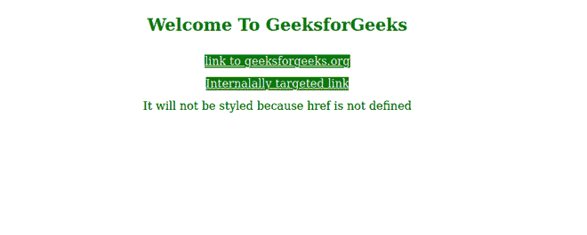
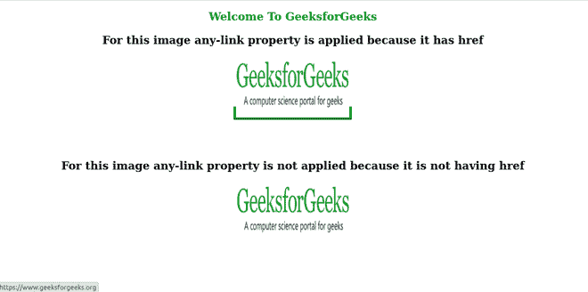

# CSS:任意链接选择器

> 原文:[https://www.geeksforgeeks.org/css-any-link-selector/](https://www.geeksforgeeks.org/css-any-link-selector/)

**:任意链接**选择器用于为每个< a >、<区域>或<链接>具有**“href”**属性的元素设置样式。它将跳过对那些未定义**“href”**的< a >、<区域>、< href >标签应用 CSS 属性。因此，它匹配所有匹配**:链接**或**:已访问的元素。**

**语法:**

```html
:any-link{
  /*css properties*/
}

```

下面的例子说明了**:任意链接**伪类选择器的用法。

**例 1:**

```html
<!DOCTYPE html>
<html>
  <head>
    <title>
      :any-link
    </title>
    <style>
        a:any-link {
        background-color: green;
        color: white;
      }
    </style>
  </head>
  <body>
    <div style="text-align: center;
        line-height: 2rem;">
        <h2 style="color: green;
            text-align: center;">
            Welcome To GeeksforGeeks
        </h2>
        <a style="text-align: center; " 
           href="https://geeksforgeeks.org">
           link to geeksforgeeks.org
        </a>
        <br>
        <a style="text-align: center;" 
           href="#">
           Internalally targeted link
        </a>
        <br>
        <a style="text-align: center;">
           It will not be styled because
           href is not defined
        </a>
    </div>
  </body>
</html>
```

**输出:**



**例 2:**

```html
<!DOCTYPE html>
<html>
  <head>
    <title>
      :any-link
    </title>
    <style>
        a:any-link {
        border: 5px solid green;
      }
    </style>
  </head>
  <body>
    <div style="text-align: center;
            line-height: 2rem;">
        <h2 style="color: green;
            text-align: center;">
            Welcome To GeeksforGeeks
        </h2>
        <h2>
          For this image any-link property
          is applied because it has href
        </h2>
        <a href="https://www.geeksforgeeks.org">
            
        </a>
        <br>
        <br>
        <br>
        <h2>
          For this image any-link property
          is not applied because it is not 
          having href
        </h2>
        <a>
            
        </a>
    </div>
  </body>
</html>
```

**输出:**



**注意:**不支持 Internet Explorer。

**支持的浏览器:**

*   铬
*   火狐浏览器
*   歌剧
*   旅行队
*   边缘