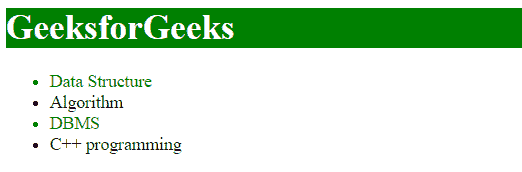
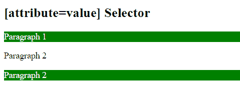

# CSS |【属性=值】选择器

> 原文:[https://www . geesforgeks . org/CSS-attribute value-selector-2/](https://www.geeksforgeeks.org/css-attributevalue-selector-2/)

CSS 中的[属性=值]选择器用于选择属性值等于“值”的元素。
**语法:**

```html
element [attribute = "value"] {
    // CSS Property
}
```

**注:** <！对于 IE8 和更早版本，必须声明 DOCTYPE >。
**例 1:**

## 超文本标记语言

```html
<!DOCTYPE html>
<html>
    <head>

        <!-- CSS property used here -->
        <style>
            h1[id = "geeks"] {
                background-color: green;
                color:white;
            }
            li[class = "gfg"] {
                color:green;
            }
        </style>
    </head>

    <body>
        <h1 id = "geeks">GeeksforGeeks</h1>
        <ul>
            <li class = "gfg">Data Structure</li>
            <li class = "geeks">Algorithm</li>
            <li class = "gfg">DBMS</li>
            <li class = "geeks">C++ programming</li>
        </ul>

    </body>
</html>                   
```

**输出:**



**例 2:**

## 超文本标记语言

```html
<!DOCTYPE html>
<html>
    <head>
        <title>
            CSS [attribute=value] Selector
        </title>

        <!-- CSS property -->
        <style>
            p[this=Geeks] {
                background-color: green;
                color:white;
            }
        </style>
    </head>

    <body>
        <h2>[attribute=value] Selector</h2>
        <p this = "Geeks">Paragraph 1</p>

        <p this = "geeks">Paragraph 2</p>

        <p this="Geeks">Paragraph 2</p>

    </body>
</html>                   
```

**输出:**



**支持的浏览器:**

*   谷歌 Chrome
*   微软边缘
*   火狐浏览器
*   歌剧
*   旅行队