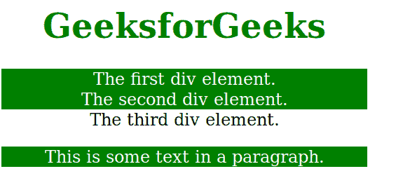

# CSS |【属性$ =值】选择器

> 原文:[https://www . geesforgeks . org/CSS-attribute value-selector-3/](https://www.geeksforgeeks.org/css-attributevalue-selector-3/)

[attribute$="value"]选择器用于选择那些属性值以指定值" value "结尾的元素。该值不需要作为单独的单词出现。它可能是另一个单词或表达的一部分，但它需要出现在结尾。

**语法:**

```css
[attribute$="value"] {
    // CSS property
} 
```

**例 1:**

```css
<!DOCTYPE html> 
<html> 
    <head> 
        <style> 
            [class$="str"] {
                background: green; 
                color: white; 
            } 
            h1 { 
                color:green; 
            } 
            body { 
                text-align:center; 
                width:60%; 
            } 
        </style> 
    </head> 
    <body> 
        <h1>GeeksforGeeks</h1> 

        <!-- All items ending with str are highlighted -->
        <div class="firststr">The first div element.</div> 
        <div class="stsecondstr">The second div element.</div> 
        <div class="start">The third div element.</div> 
        <p class="mystr">This is some text in a paragraph.</p> 
    </body> 
</html>                                 
```

**输出:**


**例 2:**

```css
<!DOCTYPE html>
<html>
    <head>
        <title>
            CSS [attribute$=value] Selector
        </title>

        <style> 
            [class$=Geeks] {
                border: 5px solid blue; 
            }
        </style>
    </head>

    <body>
        <h2 style = "text-align:center">[attribute$=value] Selector</h2>

        

         

        
    </body>
</html>                    
```

**输出:**


**支持的浏览器:**T2【属性$ =值】选择器支持的浏览器如下:

*   谷歌 Chrome 4.0
*   Internet Explorer 7.0
*   Firefox 3.5
*   Safari 3.2
*   歌剧 9.6