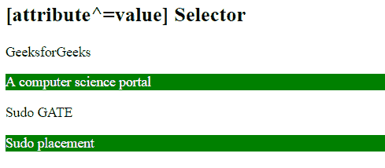

# CSS | [attribute^=value]选择器

> 原文:[https://www . geesforgeks . org/CSS-attribute value-selector-6/](https://www.geeksforgeeks.org/css-attributevalue-selector-6/)

[attribute^=value]选择器用于选择那些属性值以给定属性开始的元素。

**语法:**

```
[attribute^=value] {
    // CSS Property
}

```

**示例:**

```
<!DOCTYPE html> 
<html> 
    <head> 
        <title> 
            CSS [attribute^="value"] Selector 
        </title> 

        <!-- CSS property -->
        <style> 
            p[class^="for"] { 
                background: green; 
                color: white; 
            } 
        </style> 
    </head> 
    <body> 
        <h2>[attribute^=value] Selector</h2> 

        <p class="GeeksforGeeks">GeeksforGeeks</div> 
        <p class="forGeeks">A computer science portal</div> 
        <p class="Geeks">Sudo GATE</p> 
        <p class="for">Sudo placement</p> 
    </body> 
</html>                     
```

**输出:**


**支持的浏览器:**选择器*【attribute^=value】*支持的浏览器如下:

*   谷歌 Chrome 4.0
*   Internet Explorer 7.0
*   Firefox 3.5
*   Safari 3.2
*   歌剧 9.6