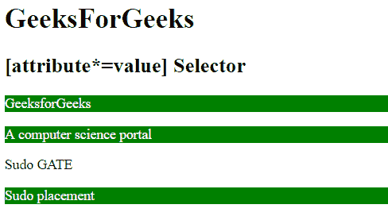

# CSS |【属性* =值】选择器

> 原文:[https://www.geeksforgeeks.org/css-attributevalue-selector/](https://www.geeksforgeeks.org/css-attributevalue-selector/)

[attribute*="str"]选择器用于选择那些属性值包含指定子字符串 str 的元素。这个子字符串可以在类的开始、结束或中间。

**语法:**

```css
element [attribute*="str"] {
    // CSS Property
} 
```

**示例:**

```css
<!DOCTYPE html>
<html>
    <head>
        <title>
            CSS [attribute*="str"] Selector
        </title>

        <!-- CSS property -->
        <style> 
            p[class*="for"] {
                background: green;
                color: white;
            }
        </style>
    </head>
    <body>
        <h1>GeeksForGeeks</h1>
        <h2>[attribute*=value] Selector</h2>

        <p class="GeeksforGeeks">GeeksforGeeks</div>
        <p class="forGeeks">A computer science portal</div>
        <p class="Geeks">Sudo GATE</p>
        <p class="for">Sudo placement</p>
    </body>
</html>                    
```

**输出:**


**支持的浏览器:**以下列出了[属性* =值]选择器支持的浏览器:

*   谷歌 Chrome 4.0
*   Internet Explorer 7.0
*   Firefox 3.5
*   苹果 Safari 3.2
*   歌剧 9.6