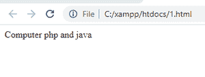

# CSS 方位角属性

> 原文:[https://www.geeksforgeeks.org/css-azimuth-property/](https://www.geeksforgeeks.org/css-azimuth-property/)

**方位角**属性告诉声音发生器(声源)在听者环境水平轴上的位置。值或可能的参数是:角度、左、右、中心。

**语法:**

## 超文本标记语言

```html
<style type="text/css">
    html tag {
        azimuth: 70deg;
    }

    html tag {
        azimuth: behind left;
    }
</style>

<!--This part should be written
    in head tag -->
```

**代码实现:**

## 超文本标记语言

```html
<!DOCTYPE html>
<html>

<head>
    <!-- h1 and h3 with azimuth property  -->
    <style type="text/css">
        h1 {
            azimuth: 70deg;
        }

        h3 {
            azimuth: behind left;
        }
    </style>
</head>

<body>

    <h1>geeks for geeks portal</h1>
    <h3>computer science</h3>

    <!-- Defining h1 and h3 tages with content -->
</body>

</html>
```

**输出:**

## 超文本标记语言

```html
<!DOCTYPE html>
<html>

<head>
    <!-- Defining azimuth property with 
        azimuth by 180 degrees -->
    <style type="text/css">
        p {
            azimuth: 180deg;
        }
    </style>
</head>

<body>

<p>Computer php and java

<p>
        <!-- paragraph tag -->
    </p>

</body>

</html>
```

**输出:**

