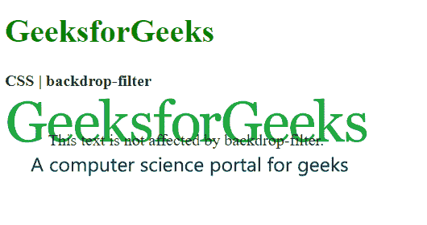

# CSS |背景-滤镜属性

> 原文:[https://www.geeksforgeeks.org/css-backdrop-filter-property/](https://www.geeksforgeeks.org/css-backdrop-filter-property/)

CSS **背景滤镜**属性用于对元素后面的区域应用效果。这与滤镜属性不同，滤镜属性将效果应用于整个元素。它可以用来消除使用额外的元素来单独设置背景的样式。

**语法:**

> 背景-滤镜:模糊()|亮度()|对比度()|阴影()|灰度()|色调-旋转()|反转()|不透明度()|饱和()| sepia() |无|初始|继承

**属性值:**

*   **blur():** It is used to apply a Gaussian blur to the image. The default value of this function is 0 which applies no blur effect.

    **示例:**

    ```
    <!DOCTYPE html>
    <html>

    <head>
        <title>CSS | backdrop-filter</title>

        <style>
            .container {
                background-image: url(
    "https://media.geeksforgeeks.org/wp-content/uploads/geeksforgeeks-25.png");
                background-size: cover;
                display: flex;
                align-items: center;
                justify-content: center;
                height: 100px;
                width: 360px;
            }
            .foreground {
                backdrop-filter: blur(5px);
                padding: 2px;
            }
        </style>
    </head>

    <body>
        <h1 style="color: green">
            GeeksforGeeks
        </h1>

        <b>CSS | backdrop-filter</b>

        <div class="container">
            <div class="foreground">
                This text is not affected
                by backdrop-filter.
            </div>
        </div>
    </body>

    </html>
    ```

    **输出:**
    

*   **brightness():** It is used to make the image lighter or darker. A value over 100% will brighten the image and a value below it will darken the image. If the brightness becomes 0%, it will completely black the image.

    **示例:**

    ```
    <!DOCTYPE html>
    <html>

    <head>
        <title>CSS | backdrop-filter</title>

        <style>
            .container {
                background-image: url(
    "https://media.geeksforgeeks.org/wp-content/uploads/geeksforgeeks-25.png");
                background-size: cover;
                display: flex;
                align-items: center;
                justify-content: center;
                height: 100px;
                width: 360px;     
            }
            .foreground {
                backdrop-filter: brightness(25%);
                padding: 2px;
            }
        </style>
    </head>

    <body>
        <h1 style="color: green">
            GeeksforGeeks
        </h1>

        <b>CSS | backdrop-filter</b>

        <div class="container">
            <div class="foreground">
                This text is not affected
                by backdrop-filter.
            </div>
        </div>
    </body>

    </html>
    ```

    **输出:**
    

*   **contrast():** It is used to set the contrast of the image. The original image is at 100% contrast. If the contrast is below 0%, it will completely black the image.

    **示例:**

    ```
    <!DOCTYPE html>
    <html>

    <head>
        <title>CSS | backdrop-filter</title>

        <style>
            .container {
                background-image: url(
    "https://media.geeksforgeeks.org/wp-content/uploads/geeksforgeeks-25.png");
                background-size: cover;
                display: flex;
                align-items: center;
                justify-content: center;
                height: 100px;
                width: 360px;     
            }
            .foreground {
                backdrop-filter: contrast(20%);
                padding: 2px;
            }
        </style>
    </head>

    <body>
        <h1 style="color: green">
            GeeksforGeeks
        </h1>

        <b>CSS | backdrop-filter</b>

        <div class="container">
            <div class="foreground">
                This text is not affected by
                backdrop-filter.
            </div>
        </div>
    </body>

    </html>
    ```

    **输出:**
    

*   **drop-shadow():** It is used to apply a drop shadow effect to the element. It accepts the horizontal and vertical shadow amounts along with the spread and color values.

    **示例:**

    ```
    <!DOCTYPE html>
    <html>

    <head>
        <title>CSS | backdrop-filter</title>

        <style>
            .container {
                background-image: url(
    "https://media.geeksforgeeks.org/wp-content/uploads/geeksforgeeks-25.png");
                background-size: cover;
                display: flex;
                align-items: center;
                justify-content: center;
                height: 100px;
                width: 360px;     
            }
            .foreground {
                backdrop-filter: drop-shadow(20px 10px red);
                padding: 2px;
            }
        </style>
    </head>

    <body>
        <h1 style="color: green">
            GeeksforGeeks
        </h1>

        <b>CSS | backdrop-filter</b>

        <div class="container">
            <div class="foreground">
                This text is not affected by
                backdrop-filter.
            </div>
        </div>
    </body>

    </html>
    ```

    **输出:**
    

*   **grayscale():** It is used to convert the colors of the image into black and white. A value of 0% indicates the original image and 100% will indicate a completely black and white image.

    **示例:**

    ```
    <!DOCTYPE html>
    <html>

    <head>
        <title>CSS | backdrop-filter</title>

        <style>
            .container {
                background-image: url(
    "https://media.geeksforgeeks.org/wp-content/uploads/geeksforgeeks-25.png");
                background-size: cover;
                display: flex;
                align-items: center;
                justify-content: center;
                height: 100px;
                width: 360px;     
            }
            .foreground {
                backdrop-filter: grayscale(75%);
                padding: 2px;
            }
        </style>
    </head>

    <body>
        <h1 style="color: green">
            GeeksforGeeks
        </h1>

        <b>CSS | backdrop-filter</b>

        <div class="container">
            <div class="foreground">
                This text is not affected by
                backdrop-filter.
            </div>
        </div>
    </body>

    </html>
    ```

    **输出:**
    

*   **hue-rotate():** It is used to apply a hue rotation to the image. The function value denotes the number of degrees around the color circle that the image circle would be adjusted. The default value is 0 which represents the original image.

    **示例:**

    ```
    <!DOCTYPE html>
    <html>

    <head>
        <title>CSS | backdrop-filter</title>

        <style>
            .container {
                background-image: url(
    "https://media.geeksforgeeks.org/wp-content/uploads/geeksforgeeks-25.png");
                background-size: cover;
                display: flex;
                align-items: center;
                justify-content: center;
                height: 100px;
                width: 360px;     
            }
            .foreground {
                backdrop-filter: hue-rotate(180deg);
                padding: 2px;
            }
        </style>
    </head>

    <body>
        <h1 style="color: green">
            GeeksforGeeks
        </h1>

        <b>CSS | backdrop-filter</b>

        <div class="container">
            <div class="foreground">
                This text is not affected by
                backdrop-filter.
            </div>
        </div>
    </body>

    </html>
    ```

    **输出:**
    

*   **invert():** It is used to invert the image. The default value is 0% which represents the original image and 100% will make the image completely inverted.

    **示例:**

    ```
    <!DOCTYPE html>
    <html>

    <head>
        <title>CSS | backdrop-filter</title>

        <style>
            .container {
                background-image: url(
    "https://media.geeksforgeeks.org/wp-content/uploads/geeksforgeeks-25.png");
                background-size: cover;
                display: flex;
                align-items: center;
                justify-content: center;
                height: 100px;
                width: 360px;     
            }
            .foreground {
                backdrop-filter: invert(100%);
                padding: 2px;
            }
        </style>
    </head>

    <body>
        <h1 style="color: green">
            GeeksforGeeks
        </h1>

        <b>CSS | backdrop-filter</b>

        <div class="container">
            <div class="foreground">
                This text is not affected by
                backdrop-filter.
            </div>
        </div>
    </body>

    </html>
    ```

    **输出:**
    

*   **opacity():** It is used to set the opacity of the image. The default value is 0% which indicates that the image is completely transparent and a value of 100% indicates the original image which is completely opaque.

    **示例:**

    ```
    <!DOCTYPE html>
    <html>

    <head>
        <title>CSS | backdrop-filter</title>

        <style>
            .container {
                background-image: url(
    "https://media.geeksforgeeks.org/wp-content/uploads/geeksforgeeks-25.png");
                background-size: cover;
                display: flex;
                align-items: center;
                justify-content: center;
                height: 100px;
                width: 360px;     
            }
            .foreground {
                backdrop-filter: opacity(50%);
                padding: 2px;
            }
        </style>
    </head>

    <body>
        <h1 style="color: green">
            GeeksforGeeks
        </h1>

        <b>CSS | backdrop-filter</b>

        <div class="container">
            <div class="foreground">
                This text is not affected by
                backdrop-filter.
            </div>
        </div>
    </body>

    </html>
    ```

    **输出:**
    

*   **saturate():** It is used to set the saturation of the element. The default value is 100% which indicates the original image. A 0% value would indicate a completely unsaturated image and more than 100% would indicate a super-saturated image.

    **示例:**

    ```
    <!DOCTYPE html>
    <html>

    <head>
        <title>CSS | backdrop-filter</title>

        <style>
            .container {
                background-image: url(
    "https://media.geeksforgeeks.org/wp-content/uploads/geeksforgeeks-25.png");
                background-size: cover;
                display: flex;
                align-items: center;
                justify-content: center;
                height: 100px;
                width: 360px;     
            }
            .foreground {
                backdrop-filter: saturate(50%);
                padding: 2px;
            }
        </style>
    </head>

    <body>
        <h1 style="color: green">
            GeeksforGeeks
        </h1>

        <b>CSS | backdrop-filter</b>

        <div class="container">
            <div class="foreground">
                This text is not affected by
                backdrop-filter.
            </div>
        </div>
    </body>

    </html>
    ```

    **输出:**
    

*   **sepia():** It is used to convert the image to sepia giving it a warmer appearance. A 0% value represents the original image and 100% represents a completely sepia image.

    **示例:**

    ```
    <!DOCTYPE html>
    <html>

    <head>
        <title>CSS | backdrop-filter</title>

        <style>
            .container {
                background-image: url(
    "https://media.geeksforgeeks.org/wp-content/uploads/geeksforgeeks-25.png");
                background-size: cover;
                display: flex;
                align-items: center;
                justify-content: center;
                height: 100px;
                width: 360px;     
            }
            .foreground {
                backdrop-filter: sepia(100%);
                padding: 2px;
            }
        </style>
    </head>

    <body>
        <h1 style="color: green">
            GeeksforGeeks
        </h1>

        <b>CSS | backdrop-filter</b>

        <div class="container">
            <div class="foreground">
                This text is not affected by
                backdrop-filter.
            </div>
        </div>
    </body>

    </html>
    ```

    **输出:**
    

*   **none:** It is the default value and does not apply any effect to the image.

    **示例:**

    ```
    <!DOCTYPE html>
    <html>

    <head>
        <title>CSS | backdrop-filter</title>

        <style>
            .container {
                background-image: url(
    "https://media.geeksforgeeks.org/wp-content/uploads/geeksforgeeks-25.png");
                background-size: cover;
                display: flex;
                align-items: center;
                justify-content: center;
                height: 100px;
                width: 360px;     
            }
            .foreground {
                backdrop-filter: none;
                padding: 2px;
            }
        </style>
    </head>

    <body>
        <h1 style="color: green">
            GeeksforGeeks
        </h1>

        <b>CSS | backdrop-filter</b>

        <div class="container">
            <div class="foreground">
                This text is not affected by
                backdrop-filter.
            </div>
        </div>
    </body>

    </html>
    ```

    **输出:**
    

*   **initial:** It is used to set this property to its default value.

    **示例:**

    ```
    <!DOCTYPE html>
    <html>

    <head>
        <title>CSS | backdrop-filter</title>

        <style>
            .container {
                background-image: url(
    "https://media.geeksforgeeks.org/wp-content/uploads/geeksforgeeks-25.png");
                background-size: cover;
                display: flex;
                align-items: center;
                justify-content: center;
                height: 100px;
                width: 360px;     
            }
            .foreground {
                backdrop-filter: initial;
                padding: 2px;
            }
        </style>
    </head>

    <body>
        <h1 style="color: green">
            GeeksforGeeks
        </h1>

        <b>CSS | backdrop-filter</b>

        <div class="container">
            <div class="foreground">
                This text is not affected by
                backdrop-filter.
            </div>
        </div>
    </body>

    </html>
    ```

    **输出:**
    

*   **inherit:** 它从其父元素继承属性。

**支持的浏览器:***背景过滤*属性支持的浏览器如下:

*   谷歌 Chrome 76.0
*   Edge 17.0
*   Safari 9.0
*   Opera 34.0