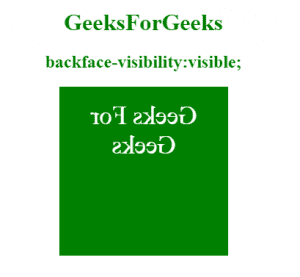
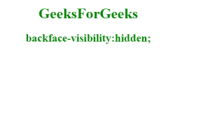
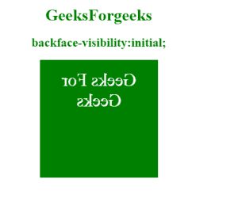

# CSS |背面可见属性

> 原文:[https://www . geesforgeks . org/CSS-back face-visibility-property/](https://www.geeksforgeeks.org/css-backface-visibility-property/)

**背面可见性属性**决定用户是否可以看到元素的背面。它是正面的镜像，作为元素的背面显示给用户。当一个元素被旋转时，它很有用，然后它决定一个元素的背面是否可见。

**语法:**

```html
backface-visibility: visible|hidden|initial|inherit;
```

**属性:**

**可见:**为默认值。面向用户时，元素的背面是可见的。

*   **语法:**

    ```html
    backface-visibility:visible;:
    ```

*   **Example:**

    ## Hypertext Markup Language

    ```html
    <!DOCTYPE html>
    <html>
        <head>
            <title>
                CSS | backface-visibility Property
            </title>
            <style>
                div {
                    position: relative;
                    height: 190px;
                    width: 190px;
                    FONT-SIZE:35PX;
                    COLOR:WHITE;
                    text-align:center;
                    padding:20px;
                    background-color: GREEN;
                    -webkit-transform: rotateY(180deg);
                    transform: rotateY(180deg);
                }

                #GEEKS {
                    -webkit-backface-visibility: hidden;
                    backface-visibility: hidden;
                }
            </style>
        </head>
        <body>
            <center>
            <h1 style="color:green;">GeeksForGeeks</h1>
            <h2 style="color:green;">
                backface-visibility:visible;
            </h2>
            <div id="Gfg">Geeks For Geeks</div>
            </center>
        </body>
    </html>                    
    ```

*   **输出:**
    

**隐藏:**该属性值指定当面向用户时，元素的背面被隐藏。

*   **语法:**

    ```html
    backface-visibility:hidden;
    ```

*   **Example:**

    ## Hypertext Markup Language

    ```html
    <!DOCTYPE html>
    <html>
        <head>
            <title>
                CSS | backface-visibility Property
            </title>
            <style>
                div {
                    position: relative;
                    height: 190px;
                    width: 190px;
                    FONT-SIZE:35PX;
                    COLOR:WHITE;
                    text-align:center;
                    padding:20px;
                    background-color: GREEN;
                    -webkit-transform: rotateY(180deg);
                    transform: rotateY(180deg);
                }

                #GEEKS {
                    -webkit-backface-visibility: hidden;
                    backface-visibility: hidden;
                }
            </style>
        </head>
        <body>
            <center>
            <h1 style="color:green;">GeeksForgeeks</h1>
            <h2 style="color:green;">
               backface-visibility:hidden;
            </h2>
            <div id="GEEKS">Geeks For Geeks</div>
            </center>
        </body>
    </html>                    
    ```

*   **输出:**
    

**初始值:**将属性设置为默认值。

*   **语法:**

    ```html
    backface-visibility:initial;
    ```

*   **Example:**

    ## Hypertext Markup Language

    ```html
    <!DOCTYPE html>
    <html>
        <head>
            <title>
                CSS | backface-visibility Property
            </title>
            <style>
                div {
                    position: relative;
                    height: 190px;
                    width: 190px;
                    FONT-SIZE:35PX;
                    COLOR:WHITE;
                    text-align:center;
                    padding:20px;
                    background-color: GREEN;
                    -webkit-transform: rotateY(180deg);
                    transform: rotateY(180deg);
                }

                #GEEKS {
                    -webkit-backface-visibility: initial; 
                    backface-visibility: initial;
                }
            </style>
        </head>
        <body>
            <center>
            <h1 style="color:green;">GeeksForgeeks</h1>
            <h2 style="color:green;">
              backface-visibility:initial;
            </h2>
            <div id="GEEKS">Geeks For Geeks</div>
            </center>
        </body>
    </html>                    
    ```

*   **输出:**
    

**支持的浏览器:***背面可见性属性*支持的浏览器如下:

*   谷歌 Chrome 36.0，12.0 -webki-
*   Internet Explorer 10.0
*   火狐 16.0， 10.0 -moz-
*   Opera 23.0，15-网络工具包
*   Safari 9.0，4.0 -webkit