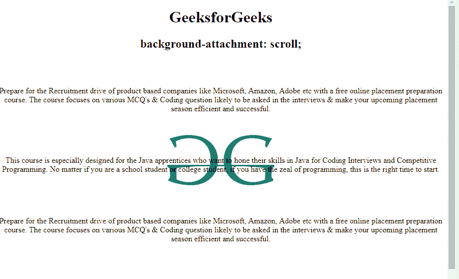
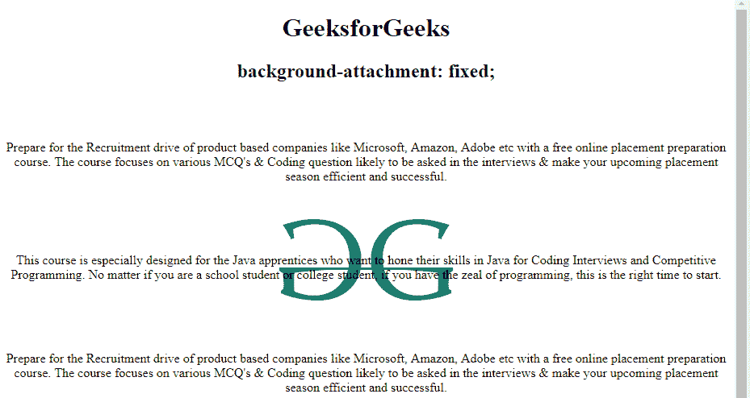
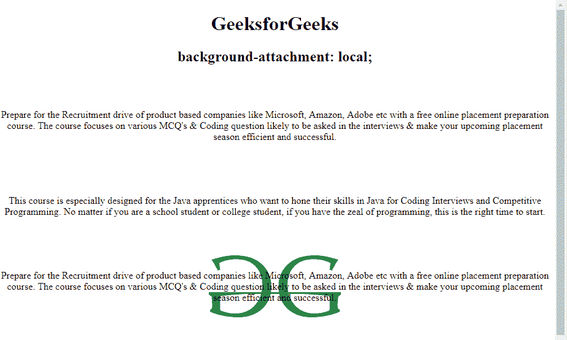
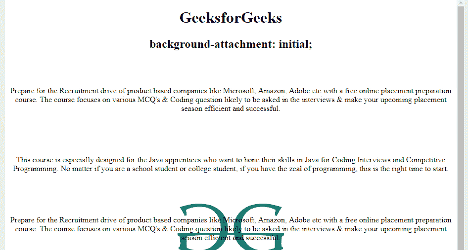

# CSS |背景-附件属性

> 原文:[https://www . geesforgeks . org/CSS-background-attachment-property/](https://www.geeksforgeeks.org/css-background-attachment-property/)

CSS 中的**属性背景-附件属性**用于指定背景图像相对于其容器的附件种类。它可以设置为滚动或保持固定。它可以应用于所有的 HTML 元素。

**语法:**

```
background-attachment: scroll|fixed|local|initial|inherit;
```

**属性默认值:**
**滚动:**设置背景图像固定在相对于包含元素的位置，随页面滚动。这是默认值。

*   **语法:**

    ```
    background-attachment: scroll;
    ```

*   **Example:**

    ## Hypertext Markup Language

    ```
    <!DOCTYPE html>
    <html>
        <head>
            <title>
                background-attachment property
            </title>

            <style>
                #example {
                    background-image: 
    url("https://media.geeksforgeeks.org/wp-content/uploads/geeks-25.png");
                    background-position: center;
                    background-repeat: no-repeat;
                    background-attachment: fixed;
                }
            </style>
        </head>

        <body style = "text-align:center">
            <h1>GeeksforGeeks</h1>
            <h2> background-attachment: scroll;</h2><br><br>

            <div id="example">
        <p> 
          Prepare for the Recruitment drive of product
          based companies like Microsoft, Amazon, 
          Adobe etc with a free online placement 
          preparation course. The course focuses on 
          various MCQ's & Coding question likely to 
          be asked in the interviews & make your 
          upcoming placement season efficient and 
          successful.
        </p>
        <br>
        <br>
        <br>

        <p>
          This course is especially designed for the
          Java apprentices who want to hone their 
          skills in Java for Coding Interviews and
          Competitive Programming. No matter if you 
          are a school student or college student, 
          if you have the zeal of programming, this 
          is the right time to start.
        </p>
        <br>
        <br>
        <br>

        <p> 
          Prepare for the Recruitment drive of product
          based companies like Microsoft, Amazon, 
          Adobe etc with a free online placement 
          preparation course. The course focuses on 
          various MCQ's & Coding question likely to 
          be asked in the interviews & make your 
          upcoming placement season efficient and 
          successful
        </p>
        <br>
        <br>
        <br>

        <p>
          This course is especially designed for the
          Java apprentices who want to hone their 
          skills in Java for Coding Interviews and
          Competitive Programming. No matter if you 
          are a school student or college student, 
          if you have the zeal of programming, this 
          is the right time to start.  
        </p>
        <br>
        <br>
        <br>

        <p> 
          Prepare for the Recruitment drive of product
          based companies like Microsoft, Amazon, 
          Adobe etc with a free online placement 
          preparation course. The course focuses on 
          various MCQ's & Coding question likely to 
          be asked in the interviews & make your 
          upcoming placement season efficient and 
          successful
        </p>    
    </div>
        </body>
    </html>                                
    ```

*   **输出:**
    

**固定:**该属性用于将背景图像设置为固定在相对于视口的位置。

*   **语法:**

    ```
    background-attachment: fixed;
    ```

*   **Example:**

    ## Hypertext Markup Language

    ```
    <!DOCTYPE html>
    <html>
        <head>
            <title>
                background-attachment property
            </title>

            <style>
                #example {
                    background-image: 
    url("https://media.geeksforgeeks.org/wp-content/uploads/geeks-25.png");
                    background-position: center;
                    background-repeat: no-repeat;
                    background-attachment: fixed;
                }
            </style>
        </head>

        <body style = "text-align:center">
            <h1>GeeksforGeeks</h1>
            <h2> background-attachment: fixed;</h2><br><br>

            <div id="example">
             <p> 
              Prepare for the Recruitment drive of product
              based companies like Microsoft, Amazon, 
              Adobe etc with a free online placement 
              preparation course. The course focuses on 
              various MCQ's & Coding question likely to 
              be asked in the interviews & make your 
              upcoming placement season efficient and 
              successful.
             </p>
             <br>
             <br>
             <br>

             <p>
              This course is especially designed for the
              Java apprentices who want to hone their 
              skills in Java for Coding Interviews and
              Competitive Programming. No matter if you 
              are a school student or college student, 
              if you have the zeal of programming, this 
              is the right time to start.
             </p>
             <br>
             <br>
             <br>

             <p> 
              Prepare for the Recruitment drive of product
              based companies like Microsoft, Amazon, 
              Adobe etc with a free online placement 
              preparation course. The course focuses on 
              various MCQ's & Coding question likely to 
              be asked in the interviews & make your 
              upcoming placement season efficient and 
              successful
             </p>
             <br>
             <br>
             <br>

             <p>
              This course is especially designed for the
              Java apprentices who want to hone their 
              skills in Java for Coding Interviews and
              Competitive Programming. No matter if you 
              are a school student or college student, 
              if you have the zeal of programming, this 
              is the right time to start.  
             </p>
             <br>
             <br>
             <br>

             <p> 
              Prepare for the Recruitment drive of product
              based companies like Microsoft, Amazon, 
              Adobe etc with a free online placement 
              preparation course. The course focuses on 
              various MCQ's & Coding question likely to 
              be asked in the interviews & make your 
              upcoming placement season efficient and 
              successful
             </p>
            </div>
        </body>
    </html>                    
    ```

*   **输出:**
    

**local:** 此属性用于设置背景图像与其容器元素的内容一起滚动，而不是页面。

*   **语法:**

    ```
    background-attachment: local;
    ```

*   **Example:**

    ## Hypertext Markup Language

    ```
    <!DOCTYPE html>
    <html>
        <head>
            <title>
                background-attachment property
            </title>

            <style>
                #example {
                    background-image: 
    url("https://media.geeksforgeeks.org/wp-content/uploads/geeks-25.png");
                    background-position: center;
                    background-repeat: no-repeat;
                    background-attachment: local;
                }
            </style>
        </head>

        <body style = "text-align:center">
            <h1>GeeksforGeeks</h1>
            <h2> background-attachment: local;</h2><br><br>

            <div id="example">
             <p> 
              Prepare for the Recruitment drive of product
              based companies like Microsoft, Amazon, 
              Adobe etc with a free online placement 
              preparation course. The course focuses on 
              various MCQ's & Coding question likely to 
              be asked in the interviews & make your 
              upcoming placement season efficient and 
              successful.
             </p>
             <br>
             <br>
             <br>

             <p>
              This course is especially designed for the
              Java apprentices who want to hone their 
              skills in Java for Coding Interviews and
              Competitive Programming. No matter if you 
              are a school student or college student, 
              if you have the zeal of programming, this 
              is the right time to start.
             </p>
             <br>
             <br>
             <br>

             <p> 
              Prepare for the Recruitment drive of product
              based companies like Microsoft, Amazon, 
              Adobe etc with a free online placement 
              preparation course. The course focuses on 
              various MCQ's & Coding question likely to 
              be asked in the interviews & make your 
              upcoming placement season efficient and 
              successful
             </p>
             <br>
             <br>
             <br>

             <p>
              This course is especially designed for the
              Java apprentices who want to hone their 
              skills in Java for Coding Interviews and
              Competitive Programming. No matter if you 
              are a school student or college student, 
              if you have the zeal of programming, this 
              is the right time to start.  
             </p>
             <br>
             <br>
             <br>

             <p> 
              Prepare for the Recruitment drive of product
              based companies like Microsoft, Amazon, 
              Adobe etc with a free online placement 
              preparation course. The course focuses on 
              various MCQ's & Coding question likely to 
              be asked in the interviews & make your 
              upcoming placement season efficient and 
              successful
             </p>
            </div>
        </body>
    </html>                    
    ```

*   **输出:**
    

**初始值:**用于将背景-附件属性设置为默认值。

*   **语法:**

    ```
    background-attachment: initial;
    ```

*   **Example:**

    ## Hypertext Markup Language

    ```
    <!DOCTYPE html>
    <html>
        <head>
            <title>
                background-attachment property
            </title>

            <style>
                #example {
                    background-image: 
    url("https://media.geeksforgeeks.org/wp-content/uploads/geeks-25.png");
                    background-position: center;
                    background-repeat: no-repeat;
                    background-attachment: initial;
                }
            </style>
        </head>

        <body style = "text-align:center">
            <h1>GeeksforGeeks</h1>
            <h2> background-attachment: initial;</h2><br><br>

            <div id="example">
             <p> 
              Prepare for the Recruitment drive of product
              based companies like Microsoft, Amazon, 
              Adobe etc with a free online placement 
              preparation course. The course focuses on 
              various MCQ's & Coding question likely to 
              be asked in the interviews & make your 
              upcoming placement season efficient and 
              successful.
             </p>
             <br>
             <br>
             <br>

             <p>
              This course is especially designed for the
              Java apprentices who want to hone their 
              skills in Java for Coding Interviews and
              Competitive Programming. No matter if you 
              are a school student or college student, 
              if you have the zeal of programming, this 
              is the right time to start.
             </p>
             <br>
             <br>
             <br>

             <p> 
              Prepare for the Recruitment drive of product
              based companies like Microsoft, Amazon, 
              Adobe etc with a free online placement 
              preparation course. The course focuses on 
              various MCQ's & Coding question likely to 
              be asked in the interviews & make your 
              upcoming placement season efficient and 
              successful
             </p>
             <br>
             <br>
             <br>

             <p>
              This course is especially designed for the
              Java apprentices who want to hone their 
              skills in Java for Coding Interviews and
              Competitive Programming. No matter if you 
              are a school student or college student, 
              if you have the zeal of programming, this 
              is the right time to start.  
             </p>
             <br>
             <br>
             <br>

             <p> 
              Prepare for the Recruitment drive of product
              based companies like Microsoft, Amazon, 
              Adobe etc with a free online placement 
              preparation course. The course focuses on 
              various MCQ's & Coding question likely to 
              be asked in the interviews & make your 
              upcoming placement season efficient and 
              successful
             </p>
            </div>
        </body>
    </html>                    
    ```

*   **输出:**
    

**inherit:** 用于从其父元素设置属性。

**支持的浏览器:***后台附件属性*支持的浏览器如下:

*   谷歌 Chrome 1.0
*   Internet Explorer 4.0
*   Firefox 1.0
*   歌剧 3.5
*   Safari 1.0