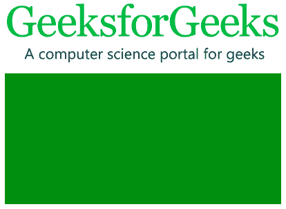
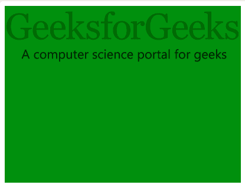
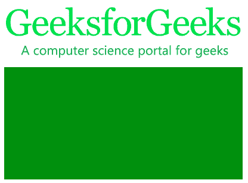
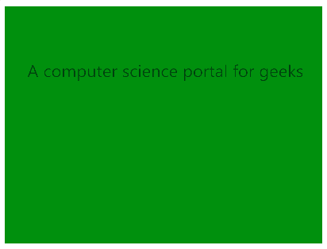
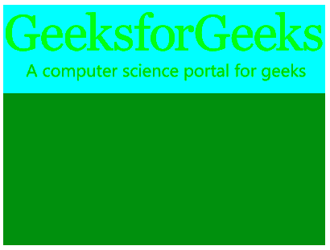
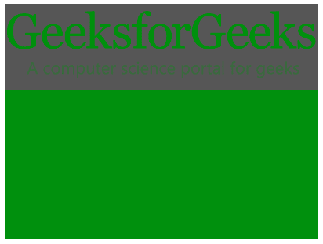
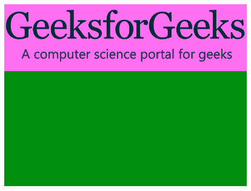
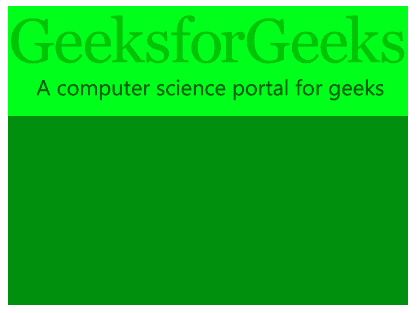

# CSS |背景-混合-模式属性

> 原文:[https://www . geesforgeks . org/CSS-background-blend-mode-property/](https://www.geeksforgeeks.org/css-background-blend-mode-property/)

**背景混合模式属性**定义元素的背景图像应该如何相互混合以及如何与元素的背景颜色混合。

**语法:**

```css
background-blend-mode: normal|multiply|screen|darken|lighten|
color-dodge|saturation|difference|luminosity|overlay;
```

**默认值:**

*   **正常**

**属性:**
**正常:**这是默认值。它将混合模式设置为正常。

*   **语法:**

```css
background-blend-mode: normal;
```

*   **示例:**

## 超文本标记语言

```css
<!DOCTYPE html>
<html>

<head>
    <title>background-blend-mode Property</title>
    <style>
        #myDIV {
            width: 400px;
            height: 299px;
            background-color: green;
            background-repeat: no-repeat;
            background-image:
url("https://media.geeksforgeeks.org/wp-content/uploads/geeksforgeeks-logo.png");
            background-blend-mode: normal;
            background-size: contain;
        }
    </style>
</head>

<body>
    <div id="myDIV"></div>
</body>

</html>
```

*   **输出:**



**乘法:**设置混合模式为乘法。这导致图像比以前更暗。

*   **语法:**

```css
background-blend-mode: multiply;
```

*   **示例:**

## 超文本标记语言

```css
<!DOCTYPE html>
<html>

<head>
    <title>background-blend-mode Property</title>
    <style>
        #myDIV {
            width: 400px;
            height: 299px;
            background-color: green;
            background-repeat: no-repeat;
            background-image:
url("https://media.geeksforgeeks.org/wp-content/uploads/geeksforgeeks-logo.png");
            background-blend-mode: multiply;
            background-size: contain;
        }
    </style>
</head>

<body>
    <div id="myDIV"></div>
</body>

</html>
```

*   **输出:**



**屏幕:**设置混合模式为屏幕。在这种模式下，图像和颜色都被反转、相乘然后反转。又来了。

*   **语法:**

```css
background-blend-mode: screen;
```

*   **示例:**

## 超文本标记语言

```css
<!DOCTYPE html>
<html>

<head>
    <title>background-blend-mode Property</title>
    <style>
        #myDIV {
            width: 400px;
            height: 299px;
            background-color: green;
            background-repeat: no-repeat;
            background-image:
url("https://media.geeksforgeeks.org/wp-content/uploads/geeksforgeeks-logo.png");
            background-blend-mode: screen;
            background-size: contain;
        }
    </style>
</head>

<body>
    <div id="myDIV"></div>
</body>

</html>
```

*   **输出:**



**变暗:**将混合模式设置为变暗。在这种模式下，如果背景图像比背景颜色暗，则图像被替换，否则，图像保持原样。

*   **语法:**

```css
background-blend-mode: darken;
```

*   **示例:**

## 超文本标记语言

```css
<!DOCTYPE html>
<html>

<head>
    <title>background-blend-mode Property</title>
    <style>
        #myDIV {
            width: 400px;
            height: 299px;
            background-color: green;
            background-repeat: no-repeat;
            background-image:
url("https://media.geeksforgeeks.org/wp-content/uploads/geeksforgeeks-logo.png");
            background-blend-mode: darken;
            background-size: contain;
        }
    </style>
</head>

<body>
    <div id="myDIV"></div>
</body>

</html>
```

*   **输出:**



**变亮:**设置混合模式变亮。在这种模式下，如果背景图像比背景颜色浅，则图像被替换，否则，图像保持原样。

*   **语法:**

```css
background-blend-mode: lighten;
```

*   **示例:**

## 超文本标记语言

```css
<!DOCTYPE html>
<html>

<head>
    <title>background-blend-mode Property</title>
    <style>
        #myDIV {
            width: 400px;
            height: 299px;
            background-color: green;
            background-repeat: no-repeat;
            background-image:
url("https://media.geeksforgeeks.org/wp-content/uploads/geeksforgeeks-logo.png");
            background-blend-mode: lighten;
            background-size: contain;
        }
    </style>
</head>

<body>
    <div id="myDIV"></div>
</body>

</html>
```

*   **输出:**


**颜色-减淡:**设置混合模式为颜色-减淡。在这种模式下，背景色被背景图像的反转所分割。这与屏幕混合模式非常相似。

*   **语法:**

```css
background-blend-mode: color-dodge;
```

*   **示例:**

## 超文本标记语言

```css
<!DOCTYPE html>
<html>

<head>
    <title>background-blend-mode Property</title>
    <style>
        #myDIV {
            width: 400px;
            height: 299px;
            background-color: green;
            background-repeat: no-repeat;
            background-image:
url("https://media.geeksforgeeks.org/wp-content/uploads/geeksforgeeks-logo.png");
            background-blend-mode: color-dodge;
            background-size: contain;
        }
    </style>
</head>

<body>
    <div id="myDIV"></div>
</body>

</html>
```

*   **输出:**



**饱和度:**设置混合模式变亮。该模式保持背景图像的饱和度，同时混合背景颜色的色调和亮度。

*   **语法:**

```css
background-blend-mode: saturation;
```

*   **示例:**

## 超文本标记语言

```css
<!DOCTYPE html>
<html>

<head>
    <title>background-blend-mode Property</title>
    <style>
        #myDIV {
            width: 400px;
            height: 299px;
            background-color: green;
            background-repeat: no-repeat;
            background-image:
url("https://media.geeksforgeeks.org/wp-content/uploads/geeksforgeeks-logo.png");
            background-blend-mode: saturation;
            background-size: contain;
        }
    </style>
</head>

<body>
    <div id="myDIV"></div>
</body>

</html>
```

*   **输出:**



**差异:**设置混合模式为差异。该模式是从最亮的背景图像中减去较暗的背景图像颜色和背景颜色的结果。通常图像会有很高的对比度。

*   **语法:**

```css
background-blend-mode: difference;
```

*   **示例:**

## 超文本标记语言

```css
<!DOCTYPE html>
<html>

<head>
    <title>background-blend-mode Property</title>
    <style>
        #myDIV {
            width: 400px;
            height: 299px;
            background-color: green;
            background-repeat: no-repeat;
            background-image:
url("https://media.geeksforgeeks.org/wp-content/uploads/geeksforgeeks-logo.png");
            background-blend-mode: difference;
            background-size: contain;
        }
    </style>
</head>

<body>
    <div id="myDIV"></div>
</body>

</html>
```

*   **输出:**



**光度:**将混合模式设置为光度。在这种模式下，顶部颜色的亮度被保留，同时使用背景颜色的饱和度和色调。

*   **语法:**

```css
background-blend-mode: luminosity;
```

*   **示例:**

## 超文本标记语言

```css
<!DOCTYPE html>
<html>

<head>
    <title>background-blend-mode Property</title>
    <style>
        #myDIV {
            width: 400px;
            height: 299px;
            background-color: green;
            background-repeat: no-repeat;
            background-image:
url("https://media.geeksforgeeks.org/wp-content/uploads/geeksforgeeks-logo.png");
            background-blend-mode: luminosity;
            background-size: contain;
        }
    </style>
</head>

<body>
    <div id="myDIV"></div>
</body>

</html>
```

*   **输出:**


**叠加:**设置混合模式为叠加。在这种模式下，背景色与背景图像混合，以反映背景的亮度或暗度。

*   **语法:**

```css
background-blend-mode: Overlay;
```

*   **示例:**

## 超文本标记语言

```css
<!DOCTYPE html>
<html>

<head>
    <title>background-blend-mode Property</title>
    <style>
        #myDIV {
            width: 400px;
            height: 299px;
            background-color: green;
            background-repeat: no-repeat;
            background-image:
url("https://media.geeksforgeeks.org/wp-content/uploads/geeksforgeeks-logo.png");
            background-blend-mode: overlay;
            background-size: contain;
        }
    </style>
</head>

<body>
    <div id="myDIV"></div>
</body>

</html>
```

*   **输出:**



**支持的浏览器:***背景混合模式*属性支持的浏览器如下:

*   谷歌 Chrome 35.0
*   Firefox 30.0
*   Opera 22.0
*   苹果 Safari 7.1