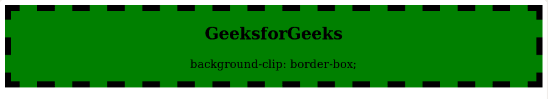
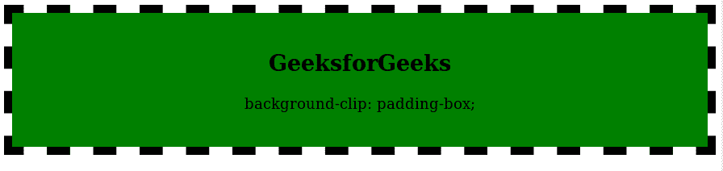
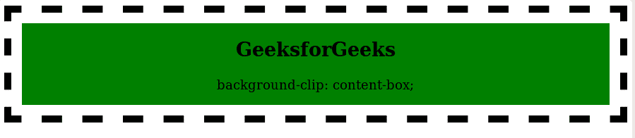
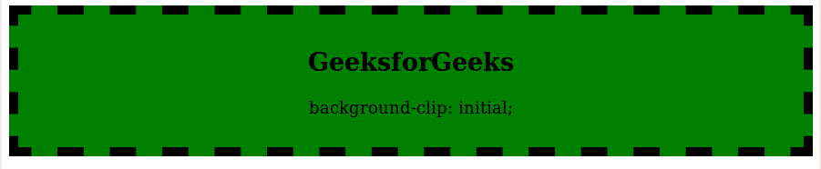

# CSS |背景剪辑属性

> 原文:[https://www.geeksforgeeks.org/css-background-clip-property/](https://www.geeksforgeeks.org/css-background-clip-property/)

CSS 中的**背景剪辑属性**用于定义如何在元素中扩展背景(颜色或图像)。

**默认值:**

*   **边框框**

**语法:**

```
background-clip: border-box|padding-box|content-box|initial|inherit;
```

**属性值:**
**边框:**边框属性用于设置整个分区的背景颜色。

*   **语法:**

```
background-clip: border-box;
```

*   **示例:**

## 超文本标记语言

```
<!DOCTYPE html>
<html>
    <head>
        <title>Border Box</title>
        <style>
            .gfg {
                background-color: green;
                background-clip:border-box;
                text-align:center;
                border:10px dashed black;
            }
        </style>
    </head>

    <body>
        <div class = "gfg">
            <h2>
                GeeksforGeeks
            </h2>

<p>
                background-clip: border-box;
            </p>

        </div>
    </body>
</html>                           
```

*   **输出:**



**填充框:**填充框属性用于设置边框内的背景。

*   **语法:**

```
background-clip:padding-box;
```

*   **示例:**

## 超文本标记语言

```
<!DOCTYPE html>
<html>
    <head>
        <title>padding-box property</title>
        <style>
            .gfg {
                background-color: green;
                background-clip:padding-box;
                padding: 25px;
                border: 10px dashed black;
            }
        </style>
    </head>

    <body style = "text-align:center">

        <div class = "gfg">
            <h2>
                GeeksforGeeks
            </h2>

<p>
                background-clip: padding-box;
            </p>

        </div>
    </body>
</html>                   
```

*   **输出:**



**内容框:**内容框属性仅用于设置内容的背景颜色。

*   **语法:**

```
background-clip:content-box;
```

*   **示例:**

## 超文本标记语言

```
<!DOCTYPE html>
<html>
    <head>
        <title>content-box property</title>
        <style>
            .gfg {
                background-color: green;
                background-clip:content-box;
                padding: 15px;
                border: 10px dashed black;
            }
        </style>
    </head>

    <body style = "text-align:center">

        <div class = "gfg">
            <h2>
                GeeksforGeeks
            </h2>

<p>
                background-clip: content-box;
            </p>

        </div>
    </body>
</html>                           
```

*   **输出:**



**初始值:**为默认值。它用于设置覆盖整个部门的背景颜色。

*   **语法:**

```
background-clip:initial-box;
```

**例:**

## 超文本标记语言

```
<!DOCTYPE html>
<html>
    <head>
        <title>Initial</title>
        <style>
            .gfg {
                background-color: green;
                background-clip:initial;
                padding: 15px;
                border: 10px dashed black;
            }
        </style>
    </head>

    <body style = "text-align:center">

        <div class = "gfg">
            <h2>
                GeeksforGeeks
            </h2>

<p>
                background-clip: initial;
            </p>

        </div>
    </body>
</html>                   
```

*   **输出:**



**支持的浏览器:***背景剪辑属性*支持的浏览器如下:

*   谷歌 Chrome 4.0
*   Internet Explorer 9.0
*   Firefox 4.0
*   歌剧 10.5
*   Safari 3.0