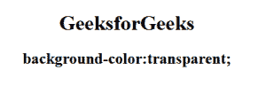

# CSS |背景色属性

> 原文:[https://www . geesforgeks . org/CSS-background-color-property/](https://www.geeksforgeeks.org/css-background-color-property/)

CSS 中的**背景色属性**用于指定元素的背景色。背景覆盖有填充和边框但不包括边距的元素的总大小。它使文本对用户来说非常容易阅读。

**语法:**

```html
element {
    background-color property
}
```

**默认值:**有默认值，即透明。

**属性值:**

**color:**

*   **语法:**

    ```html
    element {
        background-color: color_name;
    }
    ```

*   **例:**

    ```html
    <!DOCTYPE html>
    <html>
        <head>
            <title>background-color property</title>
            <style> 
                body {
                    text-align:center;
                    background-color:green;
                }
                h1 { 
                    color:white;
                    background-color:blue;
                } 
                h2 {
                    color:white;
                    background-color:black;
                }
            </style> 
        </head>
        <body> 
            <h1>Geeksforgeeks </h1> 
            <h2>background-color: color_name;</h2>     
        </body> 
    </html>                                
    ```

*   **输出:**
    

**透明:**为默认值。它指定透明的背景色。

*   **语法:**

    ```html
    element {
        background-color:transparent;
    }
    ```

*   **例:**

    ```html
    <!DOCTYPE html>
    <html>
        <head>
            <title>background-color property</title>
            <style> 
                body {
                    background-color:transparent;
                    text-align:center;
                }
                h1 { 
                    background-color: transparent; 
                } 
                h2 {
                    background-color:transparent;
                }
            </style> 
        </head>
        <body> 
            <h1>GeeksforGeeks</h1> 
            <h2>background-color: transparent;</h2>     
        </body> 
    </html>                    
    ```

*   **输出:**
    

**初始值:**用于设置默认值。它不设置背景颜色。

*   **语法:**

    ```html
    element {
        background-color: initial;
    }
    ```

**继承:**是从其父代继承背景色。

**支持的浏览器:**CSS 背景色属性支持的浏览器如下:

*   Chrome 1.0
*   Internet Explorer 4.0
*   Firefox 1.0
*   歌剧 3.5
*   Safari 1.0