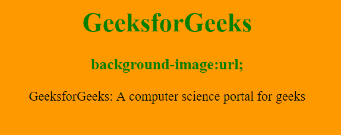
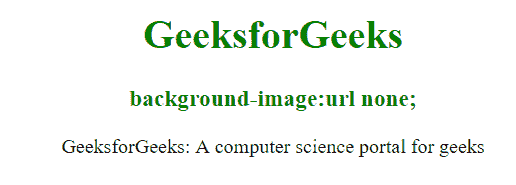
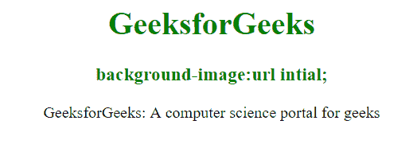

# CSS 背景图像属性

> 原文:[https://www . geesforgeks . org/CSS-background-image-property/](https://www.geeksforgeeks.org/css-background-image-property/)

**背景图像**属性用于为元素设置一个或多个背景图像。默认情况下，它将图像放在左上角。要指定两个或多个图像，我们需要为两个图像指定带有逗号的独立 URL。

**语法:**

```css
background-image: url('url')|none|initial|inherit;
```

**属性值:**

*   **url('url'):** 指定图像的 url。为了指定多个图像的网址，请用逗号分隔这些网址。
*   **无:**这是不能显示图像的默认情况。
*   **初始值:**用于将属性设置为默认值。
*   **inherit:** 它从其父元素继承属性。

**背景图像**属性也可用于以下值:

*   [**【线性渐变()**](https://www.geeksforgeeks.org/css-combine-background-image-with-gradient-overlay/) :用于设置自上而下定义至少 2 种颜色的线性渐变背景图像。
*   [**【径向渐变():**](https://www.geeksforgeeks.org/css-combine-background-image-with-gradient-overlay/) 用于设置从中心到边缘至少定义 2 种颜色的径向渐变背景图像。

我们将利用上述属性值，并通过示例来理解它们。

**url('url'):** 当背景图像有 url 时。

**语法:**

```css
background-image: url('url')
```

**示例 1:** 本示例通过将 url 值设置为 url 来说明背景图像属性。

## 超文本标记语言

```css
<!DOCTYPE html>
<html>
<head>
    <title>background-image property</title>
    <style>
    body {
        background-image: url(
"https://media.geeksforgeeks.org/wp-content/uploads/rk.png");
    }

    h1,
    h3 {
        color: green;
    }

    body {
        text-align: center;
    }
    </style>
</head>

<body>
    <h1>GeeksforGeeks</h1>
    <h3>background-image:url;</h3>
    <div>
      GeeksforGeeks: A computer science portal for geeks
    </div>
</body>
</html>
```

**输出:**



**无:**此属性用于设置无背景图像&不会显示任何内容，这是默认属性。

**语法:**

```css
background-image: url('url') none
```

**示例 2:** 该示例通过将 url 值设置为 none 来说明背景图像属性。

## 超文本标记语言

```css
<!DOCTYPE html>
<html>
<head>
    <title>background-image property</title>
    <style>
    body {
        background-image: url(
"https://media.geeksforgeeks.org/wp-content/uploads/rk.png") none;
    }

    h1,
    h3 {
        color: green;
    }

    body {
        text-align: center;
    }
    </style>
</head>

<body>
    <h1>GeeksforGeeks</h1>
    <h3>background-image:url none;</h3>
    <div>
      GeeksforGeeks: A computer science portal for geeks
    </div>
</body>
</html>
```

**输出:**



**初始值:**将属性设置为默认值。

**语法:**

```css
background-image: url('url') initial;
```

**示例 3:** 该示例通过将 url 值设置为初始值来说明背景图像属性。

## 超文本标记语言

```css
<!DOCTYPE html>
<html>
<head>
    <title>CSS background-image property</title>
    <style>
    body {
        background-image: url(
"https://media.geeksforgeeks.org/wp-content/uploads/rk.png") initial;
    }

    h1,
    h3 {
        color: green;
    }

    body {
        text-align: center;
    }
    </style>
</head>

<body>
    <center>
        <h1>GeeksforGeeks</h1>
        <h3>CSS background-image:url initial;</h3>
   </center>
</body>
</html>
```

**输出:**



**支持的浏览器:***背景图片属性*支持的浏览器如下:

*   谷歌 Chrome 1.0
*   微软边缘 4.0
*   Firefox 1.0
*   歌剧 3.5
*   Safari 1.0