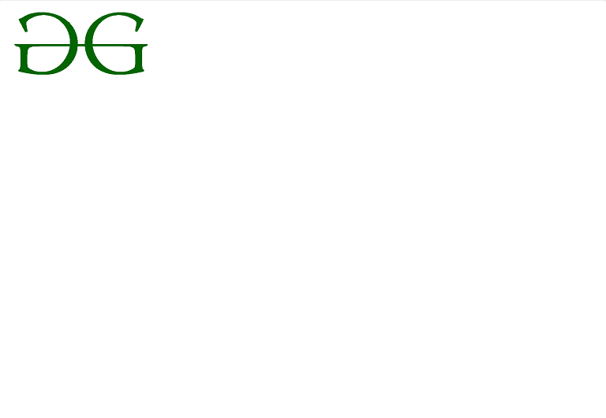

# CSS 背景-位置属性

> 原文:[https://www . geesforgeks . org/CSS-background-position-property/](https://www.geeksforgeeks.org/css-background-position-property/)

CSS 中的**背景位置**属性主要用于设置背景图像 ie 的初始位置。，它用于在某个位置设置图像。相对于定位层的位置可以通过使用[背景-原点](https://www.geeksforgeeks.org/css-background-origin-property/)属性来设置。

**语法:**

```
background-position: value;
```

**注意:**[背景图像](https://www.geeksforgeeks.org/css-background-image-property/)默认放置在元素的左上角，水平重复&垂直重复。

**属性值:**

**背景-位置:左上；**:此属性用于设置左上角的图像。

**示例:**此示例说明了**背景位置**属性的使用，其中位置值设置为左上角。

## 超文本标记语言

```
<!DOCTYPE html>
<html>
<head>
    <title> CSS | background-position Property </title>
    <style>
    body {
        background-image: url(
"https://media.geeksforgeeks.org/wp-content/uploads/background-position1.png");
        background-repeat: no-repeat;
        background-attachment: fixed;
        background-position: left top;
    }
    </style>
</head>

<body>
</body>
</html>
```

**输出:**



**背景-位置:左中；**:此属性用于设置图像在左中心。

**示例:**该示例说明了**背景位置**属性的使用，其中位置值设置为左中心。

## 超文本标记语言

```
<!DOCTYPE html>
<html>
<head>
    <title> CSS | background-position Property </title>
    <style>
    body {
        background-image: url(
"https://media.geeksforgeeks.org/wp-content/uploads/background-position1.png");
        background-repeat: no-repeat;
        background-attachment: fixed;
        background-position: left center;
    }
    </style>
</head>
<body>
</body>
</html>
```

**输出:**


**背景-位置:左下方；**:此属性用于设置左下方的图像。

**示例:**该示例说明了**背景位置**属性的使用，其中位置值被设置为左下方位置。

## 超文本标记语言

```
<!DOCTYPE html>
<html>
<head>
    <title> CSS | background-position Property </title>
    <style>
    body {
        background-image: url(
"https://media.geeksforgeeks.org/wp-content/uploads/background-position1.png");
        background-repeat: no-repeat;
        background-attachment: fixed;
        background-position: left bottom;
    }
    </style>
</head>
<body>
</body>
</html>
```

**输出:**


**背景-位置:中上；**:该属性用于将图像设置在中心顶部位置。

**示例:**该示例说明了**背景位置**属性的使用，其中位置值被设置为中心顶部位置。

## 超文本标记语言

```
<!DOCTYPE html>
<html>
<head>
    <title> CSS | background-position Property </title>
    <style>
    body {
        background-image: url(
"https://media.geeksforgeeks.org/wp-content/uploads/background-position1.png");
        background-repeat: no-repeat;
        background-attachment: fixed;
        background-position: center top;
    }
    </style>
</head>
<body>
</body>
</html>
```

**输出:**


**背景-位置:中心中心；**:该属性用于将图像设置在中心中心位置。

**示例:**该示例说明了**背景位置**属性的使用，其中位置值被设置为中心中心位置。

## 超文本标记语言

```
<!DOCTYPE html>
<html>
<head>
    <title> CSS | background-position Property </title>
    <style>
    body {
        background-image: url(
"https://media.geeksforgeeks.org/wp-content/uploads/background-position1.png");
        background-repeat: no-repeat;
        background-attachment: fixed;
        background-position: center center;
    }
    </style>
</head>
<body>
</body>
</html>
```

**输出:**


**背景-位置:中底；**:该属性用于设置图像在中心底部的位置。

**示例:**该示例说明了**背景位置**属性的使用，其中位置值被设置为中心底部位置。

## 超文本标记语言

```
<!DOCTYPE html>
<html>
<head>
    <title> CSS | background-position Property </title>
    <style>
    body {
        background-image: url(
"https://media.geeksforgeeks.org/wp-content/uploads/background-position1.png");
        background-repeat: no-repeat;
        background-attachment: fixed;
        background-position: center bottom;
    }
    </style>
</head>
<body>
</body>
</html>
```

**输出:**


**背景-位置:右上方；**:此属性用于将图像设置在右上方位置。

**示例:**该示例说明了**背景位置**属性的使用，其中位置值被设置为右上方位置。

## 超文本标记语言

```
<!DOCTYPE html>
<html>
<head>
    <title> CSS | background-position Property </title>
    <style>
    body {
        background-image: url(
"https://media.geeksforgeeks.org/wp-content/uploads/background-position1.png");
        background-repeat: no-repeat;
        background-attachment: fixed;
        background-position: right top;
    }
    </style>
</head>
<body>
</body>
</html>
```

**输出:**


**背景-位置:右中；**:此属性用于将图像设置在右中心位置。

**示例:**该示例说明了**背景位置**属性的使用，其中位置值被设置为右中心位置。

## 超文本标记语言

```
<!DOCTYPE html>
<html>
<head>
    <title> CSS | background-position Property </title>
    <style>
    body {
        background-image: url(
"https://media.geeksforgeeks.org/wp-content/uploads/background-position1.png");
        background-repeat: no-repeat;
        background-attachment: fixed;
        background-position: right center;
    }
    </style>
</head>
<body>
</body>
</html>
```

**输出:**


**背景-位置:右下方；**:此属性用于将图像设置在右下方位置。

**示例:**该示例说明了**背景位置**属性的使用，其中位置值被设置为右下方位置。

## 超文本标记语言

```
<!DOCTYPE html>
<html>
<head>
    <title> CSS | background-position Property </title>
    <style>
    body {
        background-image: url(
"https://media.geeksforgeeks.org/wp-content/uploads/background-position1.png");
        background-repeat: no-repeat;
        background-attachment: fixed;
        background-position: right bottom;
    }
    </style>
</head>
<body>
</body>
</html>
```

**输出:**


**背景-位置:25% 75%；**:此属性用于将图像设置为从左侧开始 25%，从顶部开始 75%。

**注:**对于 x%y%记数法，这里 x%表示水平位置& y%表示相对于初始位置即左上方的垂直位置。

**示例:**该示例说明了**背景位置**属性的使用，其中位置值以百分比的形式设置。

## 超文本标记语言

```
<!DOCTYPE html>
<html>
<head>
    <title> CSS | background-position Property </title>
    <style>
    body {
        background-image: url(
"https://media.geeksforgeeks.org/wp-content/uploads/background-position1.png");
        background-repeat: no-repeat;
        background-attachment: fixed;
        background-position: 25% 75&;
    }
    </style>
</head>
<body>
</body>
</html>
```

**输出:**


**背景-位置:30px 80px**:该属性用于将图像设置在左侧 30px，顶部 80px。

**注**:对于 x-pos y-pos 记数法，这里的单位是以像素或者任何其他 CSS 单位来表示的。

**示例:**该示例说明了**背景位置**属性的使用，其中位置值以像素的形式设置。

## 超文本标记语言

```
<!DOCTYPE html>
<html>
<head>
    <title> CSS | background-position Property </title>
    <style>
    body {
        background-image: url(
"https://media.geeksforgeeks.org/wp-content/uploads/background-position1.png");
        background-repeat: no-repeat;
        background-attachment: fixed;
        background-position: 30px 80px;
    }
    </style>
</head>
<body>
</body>
</html>
```

**输出:**


**支持的浏览器:**由**背景位置**属性支持的浏览器如下:

*   谷歌 Chrome 1.0
*   Internet Explorer 4.0
*   微软边缘 12.0
*   Firefox 1.0
*   歌剧 3.5
*   Safari 1.0