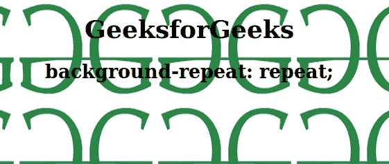
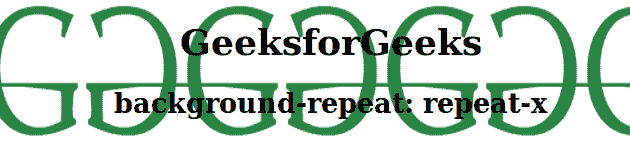
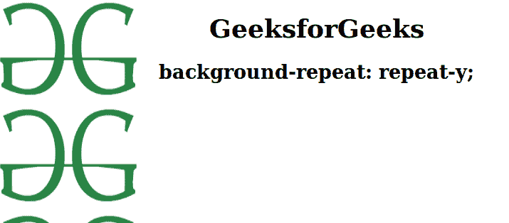
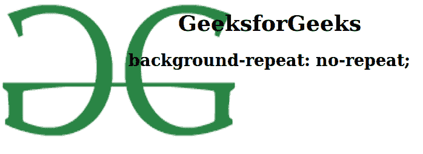

# CSS |背景-重复属性

> 原文:[https://www . geesforgeks . org/CSS-background-repeat-property/](https://www.geeksforgeeks.org/css-background-repeat-property/)

CSS 中的**背景重复属性**用于水平和垂直重复背景图像。它还决定背景图像是否重复。
**语法**

```html
background-repeat: repeat|repeat-x|repeat-y|no-repeat|initial|
inherit;
```

**默认值:**其默认值为初始值。

**属性值**
**重复:**该属性用于水平和垂直重复背景图像。如果最后一个图像不适合浏览器窗口，它将被剪切。

*   **语法:**

```html
element {
    background-repeat: repeat;
}
```

*   **例:**

## 超文本标记语言

```html
<!DOCTYPE html>
<html>
    <head>
        <title>background-repeat property</title>
        <style>
            body {
                background-image: url(
"https://media.geeksforgeeks.org/wp-content/uploads/geeks-25.png");
                background-repeat: repeat;
                background-size: 200px 150px;
                text-align:center;
            }
        </style>
    </head>
    <body>
        <h1>GeeksforGeeks</h1>
        <h2>background-repeat: repeat;</h2>
    </body>
</html>                   
```

*   **输出:**



**repeat-x:** 此属性用于水平重复背景图像。

*   **语法:**

```html
element {
    background-repeat: repeat-x;
}
```

*   **例:**

## 超文本标记语言

```html
<!DOCTYPE html>
<html>
    <head>
        <title>background-repeat property</title>
        <style>
            body {
                background-image: url(
"https://media.geeksforgeeks.org/wp-content/uploads/geeks-25.png");
                background-repeat: repeat-x;
                background-size: 200px 150px;
                text-align:center;
            }
        </style>
    </head>
    <body>
        <h1>GeeksforGeeks</h1>
        <h2>background-repeat: repeat-x;</h2>
    </body>
</html>                   
```

*   **输出:**



**repeat-y:** 此属性用于设置背景图像仅垂直重复。

*   **语法:**

```html
element {
    background-repeat: repeat-y;
}
```

*   **例:**

## 超文本标记语言

```html
<!DOCTYPE html>
<html>
    <head>
        <title>background-repeat property</title>
        <style>
            body {
                background-image: url(
"https://media.geeksforgeeks.org/wp-content/uploads/geeks-25.png");
                background-repeat: repeat-y;
                background-size: 200px 150px;
                text-align:center;
            }
        </style>
    </head>
    <body>
        <h1>GeeksforGeeks</h1>
        <h2>background-repeat: repeat-y;</h2>
    </body>
</html>                   
```

*   **输出:**



**不重复:**该属性不重复背景图像。它只显示一次背景图像。

*   **语法:**

```html
element {
    background-image: no-repeat;
}
```

*   **例:**

## 超文本标记语言

```html
<!DOCTYPE html>
<html>
    <head>
        <title>background-repeat property</title>
        <style>
            body {
                background-image: url(
"https://media.geeksforgeeks.org/wp-content/uploads/geeks-25.png");
                background-repeat: no-repeat;
                background-size: 400px 250px;
                text-align:center;
            }
        </style>
    </head>
    <body>
        <h1>GeeksforGeeks</h1>
        <h2>background-repeat: no-repeat;</h2>
    </body>
</html>                   
```

*   **输出:**



**支持的浏览器:***后台重复属性*支持的浏览器如下:

*   谷歌 Chrome 1.0
*   Internet Explorer 4.0
*   Firefox 1.0
*   歌剧 3.5
*   苹果 Safari 1.0