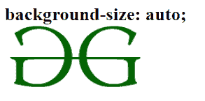
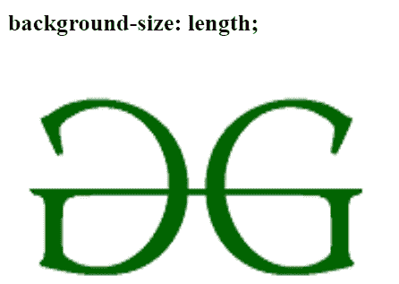
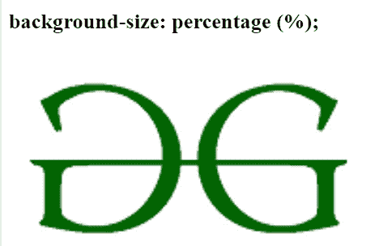
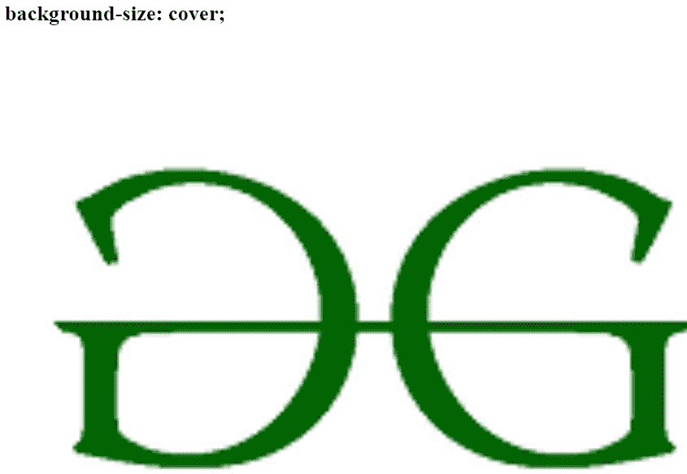

# CSS 背景大小属性

> 原文:[https://www.geeksforgeeks.org/css-background-size-property/](https://www.geeksforgeeks.org/css-background-size-property/)

CSS 中的**背景大小**属性用于设置背景图像的大小。图像可以从其自然大小向左定位、拉伸或约束以适合可用空间。

**语法:**

```css
background-size: auto|length|cover|contain|initial|inherit; 
```

可以使用以下语法之一指定**背景尺寸**属性:

*   使用关键字值作为“ *auto* ”、“*cover*“&”*contain*。
*   使用单值语法。，将高度属性设置为默认值的宽度属性设置为“*自动*”。
*   使用同时具有宽度和高度属性的双值语法，其中第一个值设置图像的宽度，第二个值设置图像的高度。每个值可以是百分比、像素或自动。
*   要指定多个背景图像的大小，请使用逗号分隔每个值。

**默认值:**其默认值为自动。

**属性值:**下面的例子很好地描述了所有的属性。

**自动:**用于将背景大小属性设置为默认值。它用于将[背景图像](https://www.geeksforgeeks.org/css-background-image-property/)显示为原始尺寸。

**语法:**

```css
background-size: auto;
```

**示例:**本示例说明了**背景尺寸**属性的使用，该属性的值设置为自动。

## 超文本标记语言

```css
<!DOCTYPE html>
<html>
<head>
    <title> background-size Property </title>
    <style>
    body {
        background-image: url(
'https://media.geeksforgeeks.org/wp-content/cdn-uploads/gfg_200X200.png');
        background-size: auto;
        background-repeat: no-repeat;
    }
    </style>
</head>

<body>
    <h2>background-size: auto;</h2>
</body>
</html>
```

**输出:**



**长度:**用于设置背景图像的宽度和高度。第一个值表示宽度，第二个值表示以 px、pt、em 等表示的背景图像的高度。如果没有给出任何值，则设置为自动。

**语法:**

```css
background-size: length;
```

**示例:**该示例说明了**背景尺寸**属性的使用，该属性的值被设置为特定的长度值。

## 超文本标记语言

```css
<!DOCTYPE html>
<html>
<head>
    <title> background-size Property </title>
    <style>
    body {
        background-image: url(
'https://media.geeksforgeeks.org/wp-content/cdn-uploads/gfg_200X200.png');
        background-size: 400px 450px;
        background-repeat: no-repeat;
    }
    </style>
</head>

<body>
    <h2>background-size: length;</h2>
</body>
</html>
```

**输出:**



**百分比:**用于设置与父元素相关的宽度和高度的百分比。第一个值表示宽度，第二个值表示背景图像的高度。如果没有给出任何值，则设置为自动。

**语法:**

```css
background-size: percentage;
```

**示例:**本示例说明了**背景大小**属性的使用，该属性的值以百分比指定。

## 超文本标记语言

```css
<!DOCTYPE html>
<html>
<head>
    <title> background-size Property </title>
    <style>
    body {
        background-image: url(
'https://media.geeksforgeeks.org/wp-content/cdn-uploads/gfg_200X200.png');
        background-size: 50%;
        background-repeat: no-repeat;
    }
    </style>
</head>

<body>
    <h2>background-size: percentage (%);</h2>
</body>
</html>
```

**输出:**



**覆盖:**用于调整背景图像大小，覆盖整个容器元素。

**语法:**

```css
background-size: cover;
```

**示例:**该示例说明了**背景大小的**属性的使用，该属性的值被设置为*覆盖。*

## 超文本标记语言

```css
<!DOCTYPE html>
<html>
<head>
    <title> background-size Property </title>
    <style>
    body {
        background-image: url(
'https://media.geeksforgeeks.org/wp-content/cdn-uploads/gfg_200X200.png');
        background-size: cover;
        background-repeat: no-repeat;
    }
    </style>
</head>

<body>
    <h2>background-size: cover;</h2>
</body>
</html>
```

**输出:**



*   [](https://www.geeksforgeeks.org/css-value-initial/)****:**用于将元素的 CSS 属性设置为默认值。**
*   **[**继承**](https://www.geeksforgeeks.org/css-value-inherit/) **:** 用于从元素的父元素属性值继承元素的属性。**

****支持的浏览器:**由*背景尺寸*属性支持的浏览器如下:**

*   **谷歌 Chrome 4.0，1.0 -webkit-**
*   **Internet Explorer 9.0**
*   **微软边缘 12.0**
*   **火狐 4.0， 3.6-moz-**
*   **Opera 10.5**
*   **Safari 4.1 3.0 -webkit-**