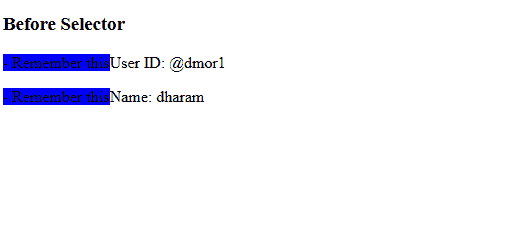

# CSS::在选择器

之前

> 原文:[https://www.geeksforgeeks.org/css-before-selector/](https://www.geeksforgeeks.org/css-before-selector/)

[**::在选择器**](https://www.geeksforgeeks.org/css-before-selector/) CSS [伪元素](https://www.geeksforgeeks.org/css-pseudo-elements/)之前，用于在其他元素的内容之前多次添加相同的内容。该选择器与[相同:在选择器](https://www.geeksforgeeks.org/css-after-selector/)之后。它有助于创建表示所选元素的第一个子元素的伪元素&通常用于使用[内容属性](https://www.geeksforgeeks.org/css-content-property/)向元素添加装饰内容。它的默认值是内联的。

**语法:**

```html
::before{
        content:
}
```

**示例**:下面的 HTML/CSS 代码展示了::before 选择器的功能。

## 超文本标记语言

```html
<!DOCTYPE html>
<html>

<head>
    <style>
    p::before {
        content: " - Remember this";
        background-color: blue;
    }
    </style>
</head>

<body>
    <h3>Before Selector</h3>
    <p>User ID: @dmor1</p>

    <p>Name: dharam</p>

</body>

</html>
```

**输出:**



**支持的浏览器:**

*   谷歌 Chrome 4.0
*   Edge 12.0
*   Internet Explorer 9.0
*   Firefox 3.5
*   Safari 3.1
*   Opera 7.0

**注意:** Internet Explorer 8 和 Opera 4-6 支持带单冒号。(*之前)。