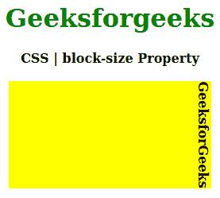
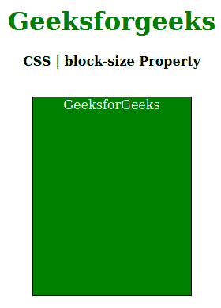

# CSS |块大小属性

> 原文:[https://www.geeksforgeeks.org/css-block-size-property/](https://www.geeksforgeeks.org/css-block-size-property/)

CSS 中的**块大小属性**用于定义元素块的水平或垂直大小。根据[书写模式 p](https://www.geeksforgeeks.org/css-writing-mode-property/) 属性的值，它与宽度或高度属性一致。它会在元素文本的左边留下空白。
**语法:**

```css
block-size: length|percentage|auto|inherit|initial|unset
```

**房产价值:**

*   **长度:**设置 px、cm、pt 等定义的固定值。允许负值。它的默认值是 0px。
*   **百分比:**与长度相同，但以窗口大小的百分比设置。
*   **自动:**当希望浏览器确定块大小时使用。
*   **初始值:**用于将块大小属性的值设置为默认值。
*   **inherit:** 当希望元素继承其父元素的块大小属性作为自己的属性时使用。
*   **取消设置:**用于取消设置默认块大小。

以下示例说明了 CSS 中的**块大小属性**:
**示例 1:**

## 超文本标记语言

```css
<!DOCTYPE html>
<html>

<head>
    <title>CSS | block-size Property</title>
    <style>
        h1 {
            color: green;
        }

        .geek {
            background-color: yellow;
            block-size: 40%;
            writing-mode: vertical-rl;
        }
    </style>
</head>

<body>
    <center>
        <h1>Geeksforgeeks</h1>
        <b>CSS | block-size Property</b>
        <br><br>
        <div>
            <b class="geek">GeeksforGeeks</b>
        </div>
    </center>
</body>

</html>
```

**输出:**



**例 2:**

## 超文本标记语言

```css
<!DOCTYPE html>
<html>

<head>
    <title>CSS | block-size Property</title>
    <style>
        h1 {
            color: green;
        }

        p.geek {
                width: 200px;
                height: 200px;
                border: 1px solid black;
                writing-mode: horizontal-tb;
                color: white;
                background: green;
                block-size: 250px;

            }
    </style>
</head>

<body>
    <center>
        <h1>Geeksforgeeks</h1>
        <b>CSS | block-size Property</b>
        <br><br>
        <div>
            <p class="geek">GeeksforGeeks</p>

        </div>
    </center>
</body>

</html>                   
```

**输出:**



**支持的浏览器:**块大小属性支持的浏览器如下:

*   谷歌 Chrome
*   边缘
*   Mozilla Firefox
*   歌剧
*   旅行队