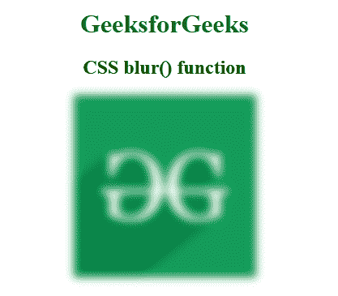

# CSS |模糊()功能

> 原文:[https://www.geeksforgeeks.org/css-blur-function/](https://www.geeksforgeeks.org/css-blur-function/)

模糊()函数是一个内置函数，用于在图像上应用模糊效果滤镜。

**语法:**

```html
blur( radius )
```

**参数:**该功能接受单参数**半径**，以长度形式保存模糊半径。此参数定义高斯函数的标准偏差值。

下面的例子说明了 CSS 中的 blur()函数:

**示例:**

```html
<!DOCTYPE html> 
<html> 

<head> 
    <title>CSS blur() Function</title> 

    <style>
        h1 {
            color:green;
        }
        body {
            text-align:center;
        }
        .blur_effect {
            filter: blur(5px);
        }
    </style>
</head> 

<body> 
    <h1>GeeksforGeeks</h1> 

    <h2>CSS blur() function</h2>

     
</body> 

</html> 
```

**输出:**


**支持的浏览器:**blur()功能支持的浏览器如下:

*   谷歌 Chrome
*   微软公司出品的 web 浏览器
*   火狐浏览器
*   旅行队
*   歌剧