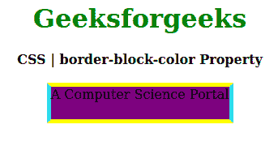
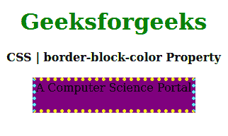

# CSS |边框-块-颜色属性

> 原文:[https://www . geesforgeks . org/CSS-border-block-color-property/](https://www.geeksforgeeks.org/css-border-block-color-property/)

CSS 中的**边框块颜色属性**用于在样式表中的单个位置设置单个逻辑块边框颜色属性值。它设置定义边框元素的顶部和底部的边框颜色。

**语法:**

```css
border-block-color: color;
```

**属性值:**

*   **颜色:**该属性保存边框的颜色。

以下示例说明了 CSS 中的**边框块颜色属性**:

**例 1:**

```css
<!DOCTYPE html>
<html>

<head>
    <title>CSS | border-block-color Property</title>
    <style>
        h1 {
            color: green;
        }

        div {
            background-color: yellow;
            width: 220px;
            height: 40px;
        }

        .one {
            border: 5px solid cyan;
            border-block-color: yellow;
            background-color: purple;
        }
    </style>
</head>

<body>
    <center>
        <h1>Geeksforgeeks</h1>
        <b>CSS | border-block-color Property</b>
        <br><br>
        <div class="one">A Computer Science Portal</div>
    </center>
</body>

</html>                    
```

**输出:**


**例 2:**

```css
<!DOCTYPE html>
<html>

<head>
    <title>CSS | border-block-color Property</title>
    <style>
        h1 {
            color: green;
        }

        div {
            background-color: yellow;
            width: 220px;
            height: 40px;
        }

        .one {
            border: 5px dotted cyan;
            border-block-color: yellow;
            background-color: purple;
        }
    </style>
</head>

<body>
    <center>
        <h1>Geeksforgeeks</h1>
        <b>CSS | border-block-color Property</b>
        <br><br>
        <div class="one">A Computer Science Portal</div>
    </center>
</body>

</html>                    
```

**输出:**


**支持的浏览器:****边框块色属性**支持的浏览器如下:

*   火狐浏览器
*   歌剧
*   边缘