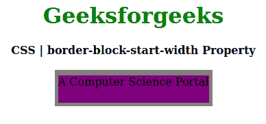
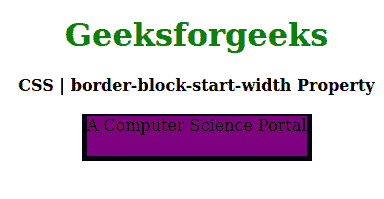

# CSS |边框块起始宽度属性

> 原文:[https://www . geesforgeks . org/CSS-border-block-start-width-property/](https://www.geeksforgeeks.org/css-border-block-start-width-property/)

CSS 中的**边框块起始宽度属性**用于在样式表中的一个位置定义单个逻辑块起始边框属性值。此属性设置定义元素边框顶部的边框宽度。

**语法:**

```
border-block-start-width: border-width;
```

**属性值:**

*   **边框宽度:**该属性保存边框的宽度。

以下示例说明了 CSS 中的**边框块起始宽度属性**:

**例 1:**

```
<!DOCTYPE html>
<html>

<head>
    <title>CSS | border-block-start-width Property</title>
    <style>
        h1 {
            color: green;
        }

        div {
            background-color: yellow;
            width: 220px;
            height: 40px;
        }
        .one {
            border: 5px solid gray;
            border-block-start-width: 8px;
            background-color: purple;
        }
    </style>
</head>

<body>
    <center>
        <h1>Geeksforgeeks</h1>
        <b>CSS | border-block-start-width Property</b>
        <br><br>
        <div class="one">A Computer Science Portal</div>
    </center>
</body>

</html>
```

**输出:**


**例 2:**

```
<!DOCTYPE html>
<html>

<head>
    <title>CSS | border-block-start-width Property</title>
    <style>
        h1 {
            color: green;
        }

        div {
            background-color: yellow;
            width: 220px;
            height: 40px;
        }
        .one {
            border: 5px solid black;
            border-block-start-width: 2px;
            background-color: purple;
        }
    </style>
</head>

<body>
    <center>
        <h1>Geeksforgeeks</h1>
        <b>CSS | border-block-start-width Property</b>
        <br><br>
        <div class="one">A Computer Science Portal</div>
    </center>
</body>

</html>
```

**输出:**


**支持的浏览器:****边框块起始宽度属性**支持的浏览器如下:

*   火狐浏览器
*   歌剧
*   边缘