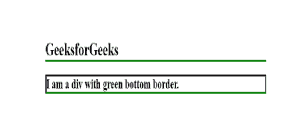

# CSS |边框-底部-颜色属性

> 原文:[https://www . geesforgeks . org/CSS-border-bottom-color-property/](https://www.geeksforgeeks.org/css-border-bottom-color-property/)

CSS **边框-下边框颜色**属性用于设置元素下边框的颜色。在使用 border-bottom-color 属性之前，必须声明 border-style 或 border-bottom-style 属性，因为在更改颜色之前，必须先有边框。
元素的当前值是该属性的默认颜色。CSS 边框-底部属性是可动画化的，但不能被继承。
**语法**

```
border-bottom-color: color|transparent|initial|inherit;
```

**默认值:**它的默认值是初始值。

**属性值:**边框底色属性值如下:

*   **颜色:**指定下边框的颜色。
*   **透明:**指定边框颜色要透明。
*   **初始值:**用于设置其默认值。
*   **inherit:** 当元素从其父元素继承该属性时使用。

**例:**

## 超文本标记语言

```
<!DOCTYPE html>
<html>
<head>
    <title>
        CSS | border-bottom-color Property
    </title>
    <style>
        h1 {
            border-bottom-style: solid;
            border-bottom-color: green;
        }

        div {
            border-style: solid;
            border-bottom-color: green;
        }
    </style>
</head>

<body>
    <h1>GeeksforGeeks</h1>
    <div>I am a div with green bottom border. </div>
</body>
</html>                   
```

**输出:**



**支持的浏览器:***边框底色属性*支持的浏览器如下:

*   谷歌 Chrome 1.0
*   Internet Explorer 4.0
*   Firefox 1.0
*   Safari 1.0
*   歌剧 3.5