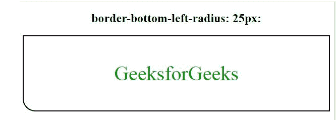
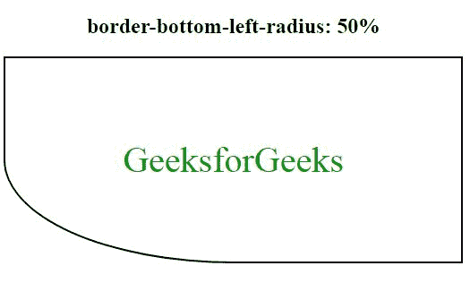
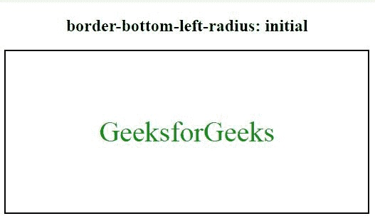

# CSS 边框-左下角-半径属性

> 原文:[https://www . geesforgeks . org/CSS-border-左下角-radius-property/](https://www.geeksforgeeks.org/css-border-bottom-left-radius-property/)

边框左下角半径属性用于定义边框左下角的半径，即它使边框左下角变圆。
**语法:**

```html
border-bottom-left-radius: length|% [length|%]|initial|inherit;
```

**默认值:**其默认值为 0。

**属性值:**
**长度:**该属性用于指定边界长度的半径(例如 px)。其默认值为 0。
**注意:**如果我们为半径设置了两个值，那么第一个值分配给下边框，第二个值分配给左边框。

*   **语法:**

```html
border-bottom-left-radius: 20px 50px;
```

*   **例:**

## 超文本标记语言

```html
<!DOCTYPE html>
<html>

<head>
    <title>
        CSS border-bottom-left-radius Property
    </title>
    <style>
        #bdr {
            border: 2px solid black;
            padding: 10px;
            color: #009900;
            font-size: 40px;
            border-bottom-left-radius: 25px;
        }
    </style>
</head>

<body>
    <center>
        <h2>border-bottom-left-radius: 25px:</h2>
        <div id="bdr">

<p>GeeksforGeeks</p>

        </div>
    </center>
</body>

</html>
```

*   **输出:**



**(百分比)%:** 以百分比定义边框左下角半径。

*   **语法:**

```html
border-bottom-left-radius: % [length|%];
```

*   **例:**

## 超文本标记语言

```html
<!DOCTYPE html>
<html>

<head>
    <title>
        CSS border-bottom-left-radius Property
    </title>
    <style>
        #bdr {
            border: 2px solid black;
            padding: 50px;
            color: #009900;
            font-size: 40px;
            border-bottom-left-radius: 50%;
        }
    </style>
</head>

<body>
    <center>
        <h2>border-bottom-left-radius: 50%:</h2>
        <div id="bdr">

<p>GeeksforGeeks</p>

        </div>
    </center>
</body>

</html>
```

*   **输出:**



**初始:**初始设置左下半径的默认属性，即 0，产生方形边框。

*   **语法:**

```html
border-bottom-left-radius: initial;
```

*   **例:**

## 超文本标记语言

```html
<!DOCTYPE html>
<html>

<head>
    <title>
        CSS border-bottom-left-radius Property
    </title>
    <style>
        #bdr {
            border: 2px solid black;
            padding: 50px;
            color: #009900;
            font-size: 40px;
            border-bottom-left-radius: initial;
        }
    </style>
</head>

<body>
    <center>
        <h2>border-bottom-left-radius: initial</h2>
        <div id="bdr">

<p>GeeksforGeeks</p>

        </div>
    </center>
</body>

</html>
```

*   **输出:**



**继承:**通过使用 Inherit 属性，继承父元素的属性，并将其用于当前边框的左下半径。

*   **语法:**

```html
border-bottom-left-radius: inherit;
```

**支持的浏览器:**CSS 边框左下半径属性支持的浏览器如下:

*   谷歌 Chrome
*   微软公司出品的 web 浏览器
*   火狐浏览器
*   歌剧
*   旅行队