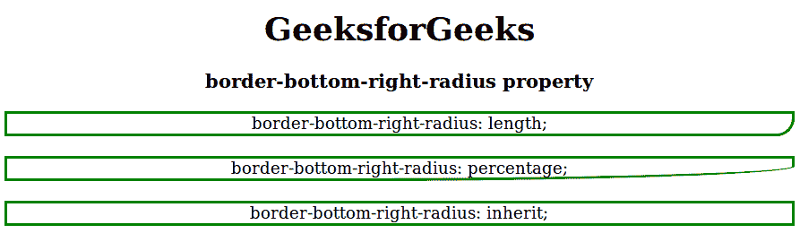

# CSS |边框-右下角-半径属性

> 原文:[https://www . geesforgeks . org/CSS-border-右下角-radius-property/](https://www.geeksforgeeks.org/css-border-bottom-right-radius-property/)

CSS 中的边框右下角半径属性用于定义给定元素边框右下角的半径。它用来绕过下边框右侧的角。

**语法:**

```html
border-bottom-right-radius:length|[value%]|initial|inherit;
```

**属性值:**边框-右下角-半径属性值如下:

*   **长度:**用于在 px、em 等中指定固定长度的右下角半径。默认值为 0。
*   **百分比%**用于以百分比的形式指定边框右下角的半径。
*   **初始值:**用于将边框-右下角-半径属性设置为默认值。
*   **inherit:** 该属性从其父元素继承而来。

**示例:**

```html
<!DOCTYPE html>
<html>
    <head>
        <title>
            border-bottom-right-radius property
        </title>
        <style>
            #length {
                border-color: green;
                border-style: solid;
                border-bottom-right-radius: 20px;
            }
            #percentage {
                border-color: green;
                border-style: solid;
                border-bottom-right-radius:59%;
            }
            #inherit {
                border-color: green;
                border-style: solid;
                border-bottom-right-radius: inherit;
            }
        </style>
    </head>

    <body style = "text-align:center">

        <h1>GeeksforGeeks</h1>
        <h3>border-bottom-right-radius property</h3>

        <div id="length">
            border-bottom-right-radius: length;
        </div><br>

        <div id="percentage">
            border-bottom-right-radius: percentage;
        </div><br>

        <div id="inherit">
            border-bottom-right-radius: inherit;
        </div>
    </body>
</html>                    
```

**输出:**


**支持的浏览器:**边框-右下角-半径属性支持的浏览器如下:

*   谷歌 Chrome 5.0，4.0-webkit-
*   Internet Explorer 9.0
*   火狐 4.0， 3.0-moz-
*   Safari 5.0、3.1-webkit-
*   歌剧 10.5