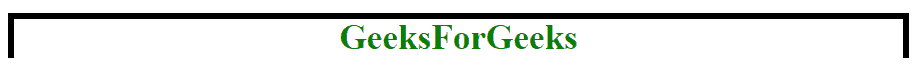
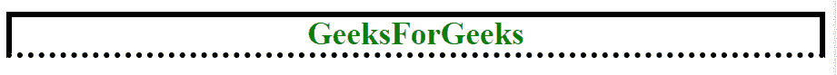
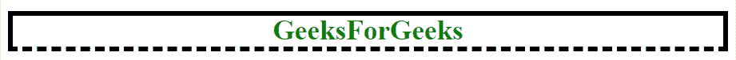
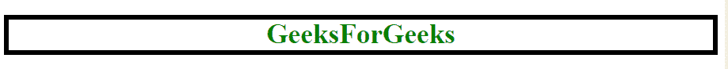
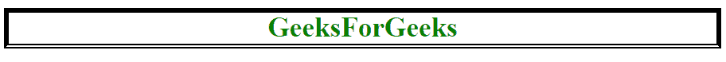
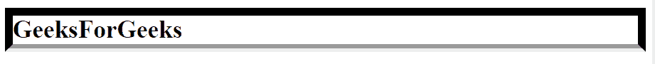
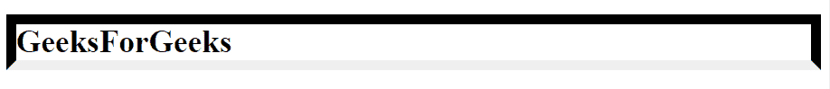
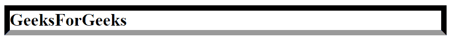
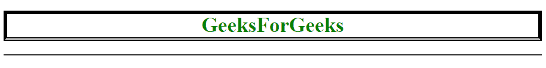

# CSS |边框-底部样式属性

> 原文:[https://www . geesforgeks . org/CSS-border-bottom-style-property/](https://www.geeksforgeeks.org/css-border-bottom-style-property/)

CSS 中的**边框-下边框样式属性**用于设置元素下边框的样式。

**语法:**

```html
border-bottom-style:none|hidden|dotted|dashed|solid|double|groove|
ridge|inset|outset|initial|inherit;
```

**属性值:**

**无:**为默认值，使下边框宽度为零。因此，它是不可见的。

*   **语法:**

    ```html
    border-bottom-style: none;
    ```

*   **例:**

    ```html
    <!DOCTYPE html> 
    <html> 
        <head> 
            <title> 
                CSS border-bottom-style property 
            </title> 

            <!-- Internal CSS Style Sheet -->
            <style> 
                h1 { 
                    color: green; 
                    text-align: center; 
                    border: 5px solid black; 

                    /* CSS Property for border-bottom-style */ 
                    border-bottom-style: none; 
                } 
            </style> 

        </head> 

        <body> 
            <!-- border-bottom-style:none; -->
            <h1>GeeksForGeeks</h1> 
        </body> 
    </html>                     
    ```

*   **输出:**
    

**隐藏:**用于使下边框不可见。除了在表元素的边界冲突解决的情况下，它类似于无值。

*   **语法:**

    ```html
    border-bottom-style: hidden;
    ```

*   **例:**

    ```html
    <!DOCTYPE html> 
    <html> 
        <head> 
            <title> 
                CSS border-bottom-style property 
            </title> 

            <!-- Internal CSS Style Sheet -->
            <style> 
                h1 { 
                    color: green; 
                    text-align: center; 
                    border: 5px solid black; 

                    /* CSS Property for border-bottom-style */ 
                    border-bottom-style: hidden; 
                } 
            </style> 

        </head> 

        <body> 
            <!-- border-bottom-style:hidden; -->
            <h1>GeeksForGeeks</h1> 
        </body> 
    </html>                  

    ```

*   **输出:**
    

**虚线:**用一系列点组成下边框。

*   **语法:**

    ```html
    border-bottom-style: dotted;
    ```

*   **例:**

    ```html
    <!DOCTYPE html> 
    <html> 
        <head> 
            <title> 
                CSS border-bottom-style property 
            </title> 

            <!-- Internal CSS Style Sheet -->
            <style> 
                h1 { 
                    color: green; 
                    text-align: center; 
                    border: 5px solid black; 

                    /* CSS Property for border-bottom-style */ 
                    border-bottom-style: dotted; 
                } 
            </style> 

        </head> 

        <body> 
            <!-- border-bottom-style:dotted; -->
            <h1>GeeksForGeeks</h1> 
        </body> 
    </html>                     
    ```

*   **输出:**
    

**虚线:**用一系列短线段做下边框。

*   **语法:**

    ```html
    border-bottom-style: dashed;
    ```

*   **例:**

    ```html
    <!DOCTYPE html> 
    <html> 
        <head> 
            <title> 
                CSS border-bottom-style property 
            </title> 

            <!-- Internal CSS Style Sheet -->
            <style> 
                h1 { 
                    color: green; 
                    text-align: center; 
                    border: 5px solid black; 

                    /* CSS Property for border-bottom-style */ 
                    border-bottom-style: dashed; 
                } 
            </style> 

        </head> 

        <body> 
            <!-- border-bottom-style:dashed; -->
            <h1>GeeksForGeeks</h1> 
        </body> 
    </html>                     
    ```

*   **输出:**
    

**实线:**用于制作单个实线线段的下边框。

*   **语法:**

    ```html
    border-bottom-style: solid;
    ```

*   **例:**

    ```html
    <!DOCTYPE html> 
    <html> 
        <head> 
            <title> 
                CSS border-bottom-style property 
            </title> 

            <!-- Internal CSS Style Sheet -->
            <style> 
                h1 { 
                    color: green; 
                    text-align: center; 
                    border: 5px solid black; 

                    /* CSS Property for border-bottom-style */ 
                    border-bottom-style: solid; 
                } 
            </style> 

        </head> 

        <body> 
            <!-- border-bottom-style:solid; -->
            <h1>GeeksForGeeks</h1> 
        </body> 
    </html>                     
    ```

*   **输出:**
    

**双:**使下边框变为双实线。在这种情况下，边框宽度等于两条线段的宽度和它们之间的间距之和。

*   **语法:**

    ```html
    border-bottom-style: double;
    ```

*   **例:**

    ```html
    <!DOCTYPE html> 
    <html> 
        <head> 
            <title> 
                CSS border-bottom-style property 
            </title> 

            <!-- Internal CSS Style Sheet -->
            <style> 
                h1 { 
                    color: green; 
                    text-align: center; 
                    border: 5px solid black; 

                    /* CSS Property for border-bottom-style */ 
                    border-bottom-style: double; 
                } 
            </style> 

        </head> 

        <body> 
            <!-- border-bottom-style:double; -->
            <h1>GeeksForGeeks</h1> 
        </body> 
    </html>                     
    ```

*   **输出:**
    

**凹槽:**用有凹槽的线段做底边，让人感觉是往里走。

*   **语法:**

    ```html
    border-bottom-style: groove;
    ```

*   **例:**

    ```html
    <!DOCTYPE html> 
    <html> 
        <head> 
            <title> 
                CSS border-bottom-style property 
            </title> 

            <!-- Internal CSS Style Sheet -->
            <style> 
                h1 { 
                    border: 10px; 
                    border-style: solid; 

                    /* CSS Property for border-bottom-style */ 
                    border-bottom-style: groove; 
                } 
            </style> 

        </head> 

        <body> 
            <!-- border-bottom-style:groove; -->
            <h1>GeeksForGeeks</h1> 
        </body> 
    </html>                                 
    ```

*   **输出:**
    

**插页:**用内嵌线段做下边框，让人感觉在屏幕上固定的很深。

*   **语法:**

    ```html
    border-bottom-style: inset;
    ```

*   **例:**

    ```html
    <!DOCTYPE html> 
    <html> 
        <head> 
            <title> 
                CSS border-bottom-style property 
            </title> 

            <!-- Internal CSS Style Sheet -->
            <style> 
                h1 { 
                    border: 10px; 
                    border-style: solid; 

                    /* CSS Property for border-bottom-style */ 
                    border-bottom-style: inset; 
                } 
            </style> 

        </head> 

        <body> 
            <!-- border-bottom-style:inset; -->
            <h1>GeeksForGeeks</h1> 
        </body> 
    </html>                                 
    ```

*   **输出:**
    

**开头:**与插页相反。它用一条线段做下边框，看起来像是要出来了。

*   **语法:**

    ```html
    border-bottom-style: outset;
    ```

*   **例:**

    ```html
    <!DOCTYPE html> 
    <html> 
        <head> 
            <title> 
                CSS border-bottom-style property 
            </title> 

            <!-- Internal CSS Style Sheet -->
            <style> 
                h1 { 
                    border: 10px; 
                    border-style: solid; 

                    /* CSS Property for border-bottom-style */ 
                    border-bottom-style: outset; 
                } 
            </style> 

        </head> 

        <body> 
            <!-- border-bottom-style:outset; -->
            <h1>GeeksForGeeks</h1> 
        </body> 
    </html>                                 
    ```

*   **输出:**
    

**初始值:**将边框-底部样式属性设置为默认值。

*   **语法:**

    ```html
    border-bottom-style: initial;
    ```

*   **例:**

    ```html
    <!DOCTYPE html> 
    <html> 
        <head> 
            <title> 
                CSS border-bottom-style property 
            </title> 

            <!-- Internal CSS Style Sheet -->
            <style> 
                h1 { 
                    color: green; 
                    text-align: center; 
                    border: 5px solid black; 

                    /* CSS Property for border-bottom-style */ 
                    border-bottom-style: initial; 
                } 
            </style> 

        </head> 

        <body> 
            <!-- border-bottom-style:initial; -->
            <h1>GeeksForGeeks</h1> 
        </body> 
    </html>                     
    ```

*   **输出:**
    

**继承:**要从其父元素继承的边框-底部样式属性。

*   **语法:**

    ```html
    border-bottom-style: inherit;
    ```

*   **例:**

    ```html
    <!DOCTYPE html> 
    <html> 
        <head> 
            <title> 
                CSS border-bottom-style Property 
            </title> 

            <!-- Internal CSS Style Sheet -->
            <style> 
                div { 
                    border-bottom-style: double; 
                } 
                h1 { 
                    color: green; 
                    text-align: center; 
                    border: 5px solid black; 

                    /* CSS Property | border-bottom-style */ 
                    border-bottom-style: inherit; 
                } 
            </style> 
        </head> 

        <body> 
            <div>

                <!-- border-bottom-style: inherit; -->
                <h1>GeeksForGeeks</h1> 
            </div>
        </body> 
    </html>                     
    ```

*   **输出:**
    

**支持的浏览器:***边框底纹属性*支持的浏览器如下:

*   谷歌 Chrome 1.0
*   Internet Explorer 5.5
*   Firefox 1.0
*   歌剧 9.2
*   Safari 1.0