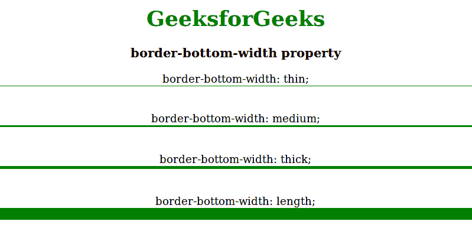

# CSS |边框底宽属性

> 原文:[https://www . geesforgeks . org/CSS-border-bottom-width-property/](https://www.geeksforgeeks.org/css-border-bottom-width-property/)

CSS 中的**边框-底部宽度属性**用于设置元素底部边框的特定宽度。在使用边框底部宽度属性之前，元素使用边框底部样式或边框样式属性。

**语法:**

```html
border-bottom-width: length|thin|medium|thick|initial|inherit;
```

**属性值:**边框底宽属性值如下:

*   **薄:**用于设置底部的薄边框。
*   **中:**用于设置中等大小的下边框。这是默认值。
*   **粗:**用于设置粗底边框。
*   **长度:**用于设置边框的宽度。它不取负值。

**示例:**

```html
<!DOCTYPE html>
<html>
    <head>
        <title>
            border-bottom-width property
        </title>

        <style>
            #thin {
                border-color: green;
                border-bottom-style: solid;
                border-bottom-width: thin;
            }
            #medium {
                border-color: green;
                border-bottom-style: solid;
                border-bottom-width: medium;
            }
            #thick {
                border-color: green;
                border-bottom-style: solid;
                border-bottom-width:thick;
            }
            #length {
                border-color: green;
                border-bottom-style: solid;
                border-bottom-width: 20px;
            }
        </style>
    </head>

    <body style = "text-align:center">

        <h1 style = "color:green">GeeksforGeeks</h1>

        <h3>border-bottom-width property</h3>

        <div id="thin">
            border-bottom-width: thin;
        </div><br><br>

        <div id="medium">
            border-bottom-width: medium;
        </div><br><br>

        <div id="thick">
            border-bottom-width: thick;
        </div><br><br>

        <div id="length">
            border-bottom-width: length;
        </div>
    </body>
</html>                                
```

**输出:**


**支持的浏览器:***边框底宽*属性支持的浏览器如下:

*   谷歌 Chrome 1.0
*   Internet Explorer 4.0
*   Firefox 1.0
*   歌剧 3.5
*   Safari 1.0