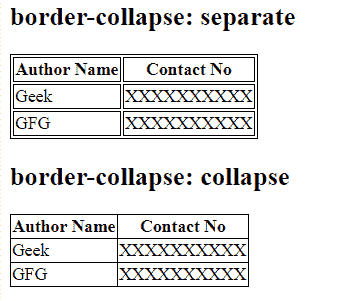
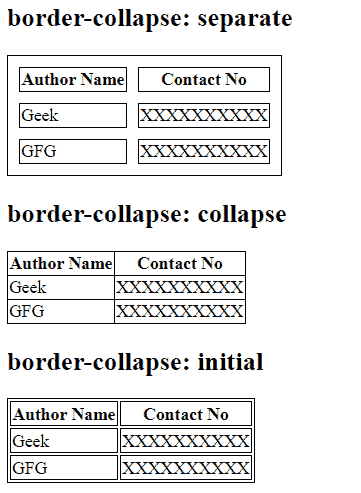

# CSS |边框折叠属性

> 原文:[https://www.geeksforgeeks.org/css-border-collapse-property/](https://www.geeksforgeeks.org/css-border-collapse-property/)

CSS 中的**边框折叠属性**用于设置表格内部单元格的边框，并告知这些单元格是否共享一个公共边框。
**语法:**

```css
border-collapse: separate|collapse|initial|inherit;
```

**默认值:**其默认值是单独的。

**房产价值:**

*   **分隔:**该属性用于设置单元格的分隔边框。
*   **折叠:**用于折叠相邻单元格，制作公共边框。
*   **初始值:**用于将边框折叠属性设置为默认值。
*   **继承:**当边框折叠属性从其父元素继承时使用。

**例 1:**

## 超文本标记语言

```css
<!DOCTYPE html>
<html>
    <head>
        <title>
            CSS border-collapse Property
        </title>

        <!-- border-collapse CSS property -->
        <style>
            table, td, th {
                border: 1px solid black;
            }
            #separateTable {
                border-collapse: separate;
            }
            #collapseTable {
                border-collapse: collapse;
            }
        </style>
    </head>

    <body>
        <h2>
            border-collapse: separate
        </h2>

        <table id = "separateTable">
            <tr>
                <th>Author Name</th>
                <th>Contact No</th>
            </tr>
            <tr>
                <td>Geek</td>
                <td>XXXXXXXXXX</td>
            </tr>
            <tr>
                <td>GFG</td>
                <td>XXXXXXXXXX</td>
            </tr>
        </table>

        <h2>
            border-collapse: collapse
        </h2>

        <table id = "collapseTable">
            <tr>
                <th>Author Name</th>
                <th>Contact No</th>
            </tr>
            <tr>
                <td>Geek</td>
                <td>XXXXXXXXXX</td>
            </tr>
            <tr>
                <td>GFG</td>
                <td>XXXXXXXXXX</td>
            </tr>
        </table>
    </body>
</html>                   
```

**输出:**



**例 2:**

## 超文本标记语言

```css
<!DOCTYPE html>
<html>
    <head>
        <title>
            CSS border-collapse Property
        </title>

        <style>
            table, td, th {
                border: 1px solid black;
            }

            /* border spacing is used to specify the
            width between border and adjacent cells */
            #separateTable {
                border-collapse: separate;
                border-spacing: 10px;
            }
            #collapseTable {
                border-collapse: collapse;
                border-spacing: 10px;
            }
            #initialTable {
                border-collapse: initial;
            }
        </style>
    </head>

    <body>
        <h2>
            border-collapse: separate
        </h2>

        <table id = "separateTable">
            <tr>
                <th>Author Name</th>
                <th>Contact No</th>
            </tr>
            <tr>
                <td>Geek</td>
                <td>XXXXXXXXXX</td>
            </tr>
            <tr>
                <td>GFG</td>
                <td>XXXXXXXXXX</td>
            </tr>
        </table>

        <h2>
            border-collapse: collapse
        </h2>

        <!-- border spacing property has no
        effect on border-collapse property-->
        <table id="collapseTable">
            <tr>
                <th>Author Name</th>
                <th>Contact No</th>
            </tr>
            <tr>
                <td>Geek</td>
                <td>XXXXXXXXXX</td>
            </tr>
            <tr>
                <td>GFG</td>
                <td>XXXXXXXXXX</td>
            </tr>
        </table>

        <h2>
            border-collapse: initial
        </h2>

        <table id="initialTable">
            <tr>
                <th>Author Name</th>
                <th>Contact No</th>
            </tr>
            <tr>
                <td>Geek</td>
                <td>XXXXXXXXXX</td>
            </tr>
            <tr>
                <td>GFG</td>
                <td>XXXXXXXXXX</td>
            </tr>
        </table>
    </body>
</html>                               
```

**输出:**



**支持的浏览器:**支持的浏览器*边框折叠*属性如下:

*   谷歌 Chrome 1.0
*   互联网探索/边缘 5.0
*   Firefox 1.0
*   Opera 4.0
*   苹果 Safari 1.2