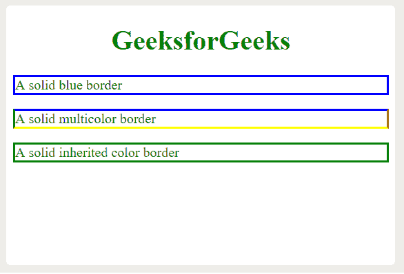
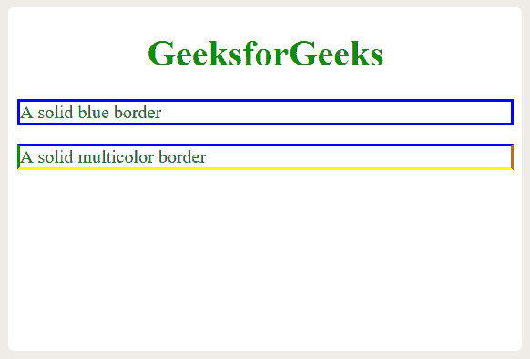
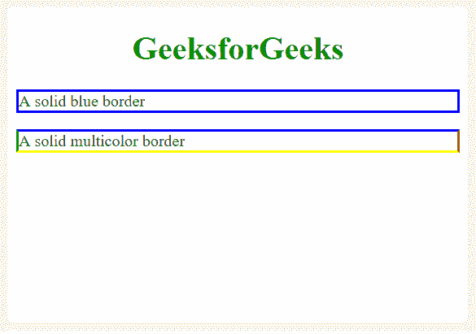
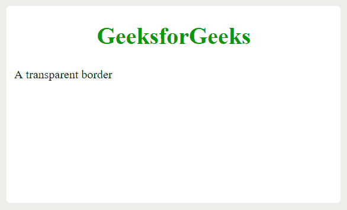

# CSS 边框颜色属性

> 原文:[https://www.geeksforgeeks.org/css-border-color-property/](https://www.geeksforgeeks.org/css-border-color-property/)

**边框颜色属性**用于为元素的边框添加颜色。*边框颜色*属性仅在首先定义*边框样式*属性时有效，该属性用于设置边框。这个属性不会单独工作。这可以分别为上边框、右边框、下边框和左边框取一到四个值。如果未设置此属性，则它将继承元素的颜色。

**语法:**

```html
border-color: color-value;
```

**默认值:**元素的当前颜色

**属性值:**其中**颜色值**可以是以下任意值:

*   **名称:**指定一个颜色名称，如“蓝色”。
*   **十六进制:**指定一个十六进制值，如“#0000ff”。
*   **RGB:** 指定一个 RGB 值，如“rgb(0，0，255)”。
*   **透明:**将对应元素的边框颜色设置为透明。

**边框颜色**属性可以使用以下属性单独设置:

*   [**CSS 边框-左边框颜色属性**](https://www.geeksforgeeks.org/css-border-left-color-property/) **:用于设置元素中左边框的颜色。**
*   [**CSS 边框-上边框颜色属性:**](https://www.geeksforgeeks.org/css-border-top-color-property/) 可以提供从父边框颜色到容器上边框填充不同颜色的选项。
*   [**CSS 边框-右边框颜色属性**](https://www.geeksforgeeks.org/css-border-right-color-property/) :用于设置元素中右边框的颜色。
*   [**CSS 边框-下边框颜色属性**](https://www.geeksforgeeks.org/css-border-bottom-color-property/) :用于设置元素下边框的颜色。
*   [**CSS 边框-块-颜色属性:**](https://www.geeksforgeeks.org/css-border-block-color-property/) 它用于在样式表的单个位置设置单个逻辑块边框-颜色属性值。
*   [**CSS 边框内联颜色属性**](https://www.geeksforgeeks.org/css-border-inline-color-property/) :用于在样式表的单一位置设置单个逻辑内联边框颜色属性值。

我们将通过示例了解每个属性值。

**按名称设置颜色值**:所有 140 个有效的 CSS 颜色名称都可以分配给边框颜色。

**语法:**

```html
border-color: blue;
```

**示例:**本示例通过使用名称值设置颜色来说明**边框颜色**属性。

## 超文本标记语言

```html
<!DOCTYPE html>
<html>
<head>
    <title>CSS border-color property</title>
    <style>
    h1 {
        color: #009900;
    }

    p.one {
        border-style: solid;
        border-color: blue;
    }

    p.two {
        border-style: solid;
        border-color: blue red yellow green;
    }

    p.three {
        border-style: solid;
        color: green;
    }
    </style>
</head>

<body>
    <h1 align="center">GeeksforGeeks</h1>
    <p class="one">A solid blue border</p>

    <p class="two">A solid multicolor border</p>

    <p class="three">A solid inherited color border</p>

</body>
</html>
```

**输出:**



**通过 HEX** 设置颜色值:HEX 颜色值可以分配给边框颜色。 **#rrggbb** 中的一对值代表十六进制系统中的 RGB 值。

**语法:**

```html
border-color: #0000ff;
```

**示例:**本示例通过使用十六进制值设置颜色来说明**边框颜色**属性。

## 超文本标记语言

```html
<!DOCTYPE html>
<html>
<head>
    <title>CSS border-color property</title>
    <style>
    h1 {
        color: #009900;
    }

    p.one {
        border-style: solid;
        border-color: #0000ff;
    }

    p.two {
        border-style: solid;
        border-color: #0000ff #ff0000 #ffff00 #00ff00;
    }
    </style>
</head>

<body>
    <h1 align="center">GeeksforGeeks</h1>
    <p class="one">A solid blue border</p>

    <p class="two">A solid multicolor border</p>

</body>
</html>
```

**输出:**



**通过 RGB 设置颜色值** : RGB 颜色值可以分配给边框颜色。在 **rgb(r，g，b)** 中，r，g 和 b 的值可以在 0 到 255 之间变化。

**语法:**

```html
border-color: rgb(0, 0, 255);
```

**示例:**本示例通过使用 RGB 值设置颜色来说明**边框颜色**属性。

## 超文本标记语言

```html
<!DOCTYPE html>
<html>
<head>
    <title>CSS border-color property</title>
    <style>
    h1 {
        color: #009900;
    }

    p.one {
        border-style: solid;
        border-color: rgb(0, 0, 255);
    }

    p.two {
        border-style: solid;
        border-color: rgb(0, 0, 255)
                      rgb(255, 0, 0)
                      rgb(255, 255, 0)
                      rgb(0, 255, 0);
    }
    </style>
</head>

<body>
    <h1 align="center">GeeksforGeeks</h1>
    <p class="one">A solid blue border</p>

    <p class="two">A solid multicolor border</p>

</body>
</html>
```

**输出:**



**将颜色值设置为透明**:透明值可以分配给边框颜色。透明值效果不会被观察到，因为它让背景色穿过它。

**语法:**

```html
border-color: transparent;
```

**示例:**本示例通过使用透明值设置颜色来说明**边框颜色**属性。

## 超文本标记语言

```html
<!DOCTYPE html>
<html>
<head>
    <title>CSS border-color property</title>
    <style>
    h1 {
        color: #009900;
    }

    p.one {
        border-style: solid;
        border-color: transparent;
    }
    </style>
</head>

<body>
    <h1 align="center">GeeksforGeeks</h1>
    <p class="one">A transparent border</p>

</body>
</html>
```

**输出:**



**注意:****边框颜色**属性可以通过使用一个、两个、三个或四个值来定义，如下所示:

*   如果分配了单个颜色值，它会将其设置为所有边。
*   如果分配了两个颜色值，第一个颜色将被设置为顶部和底部，第二个颜色将被设置为左侧和右侧。
*   如果分配了三个颜色值，第一个颜色设置在顶部，第二个颜色设置在左侧和右侧，第三个颜色设置在底部。
*   如果分配了四种颜色的值，颜色将设置为顶部、右侧、底部和左侧，这遵循顺时针顺序。

**支持的浏览器:**CSS |边框颜色属性支持的浏览器如下:

*   谷歌 Chrome 1.0
*   Internet Explorer 4.0
*   微软边缘 12.0
*   Firefox 1.0
*   歌剧 3.5
*   Safari 1.0