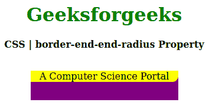
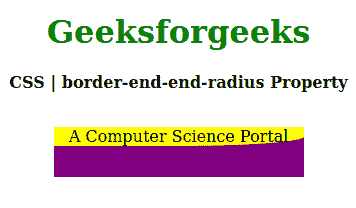

# CSS |边框-端点-端点-半径属性

> 原文:[https://www . geesforgeks . org/CSS-border-end-end-radius-property/](https://www.geeksforgeeks.org/css-border-end-end-radius-property/)

CSS 中的**边界-结束-结束-半径**属性用于指定块结束边界处的逻辑边界半径。它可以通过元素的**书写模式**、**方向**和**文本方向**进行调整。

**语法:**

```
border-end-end-radius: length | percentage;
```

**属性值:**

*   **长度:**该属性以特定单位保存边界半径长度。
*   **percentage:** This property holds the percentage value compare to parent elements.

    以下示例说明了 CSS 中的**边界-端点-端点-半径属性**:

    **例 1:**

    ```
    <!DOCTYPE html>
    <html>

    <head>
        <title>CSS | border-end-end-radius Property</title>
        <style>
            h1 {
                color: green;
            }

            div {
                background-color: purple;
                width: 250px;
                height: 50px;
            }
            .one {
                background-color: yellow;
                border-end-end-radius: 10px;
            }
        </style>
    </head>

    <body>
        <center>
            <h1>Geeksforgeeks</h1>
            <b>CSS | border-end-end-radius Property</b>
            <br><br>
            <div>
                <p class="one">A Computer Science Portal</p>
            </div>
        </center>
    </body>

    </html>
    ```

    **输出:**
    

    **例 2:**

    ```
    <!DOCTYPE html>
    <html>

    <head>
        <title>CSS | border-end-end-radius Property</title>
        <style>
            h1 {
                color: green;
            }

            div {
                background-color: purple;
                width: 250px;
                height: 50px;
            }
            .one {
                background-color: yellow;
                border-end-end-radius: 50%;
            }
        </style>
    </head>

    <body>
        <center>
            <h1>Geeksforgeeks</h1>
            <b>CSS | border-end-end-radius Property</b>
            <br><br>
            <div>
                <p class="one">A Computer Science Portal</p>
            </div>
        </center>
    </body>

    </html>
    ```

    **输出:**
    

    **支持的浏览器:****边界-端点-半径属性**支持的浏览器如下:

    *   火狐浏览器