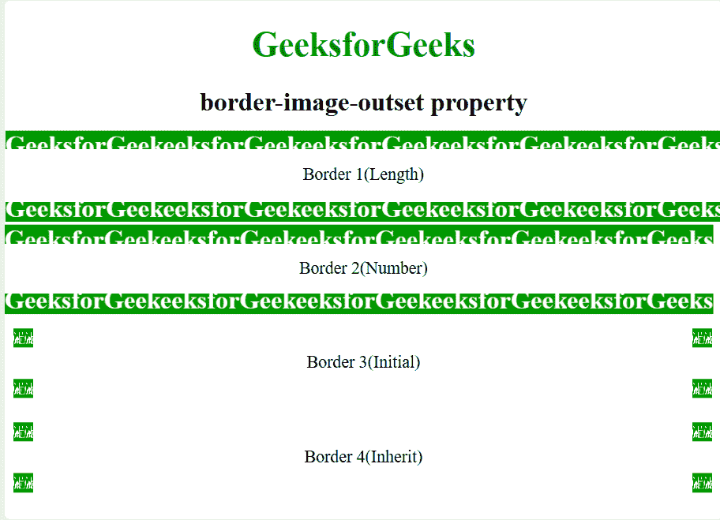

# CSS |边框-图像-开始属性

> 原文:[https://www . geeksforgeeks . org/CSS-border-image-begin-property/](https://www.geeksforgeeks.org/css-border-image-outset-property/)

**CSS 边框图像开始属性**是一个简写属性，用于指定元素的[边框图像](https://www.geeksforgeeks.org/css-border-images/)放置在其框外的距离。

**注:**边框-图像-开头对边框-图像-来源指定的图片生效。

**语法:**

```html
border-image-outset: value;

```

**属性值:**

| 价值 | 影响 |
| --- | --- |
| 长度 | 将边界起点的大小指定为尺寸。 |
| 数字 | 将边框的大小指定为相应边框宽度的倍数。 |
| 最初的 | 将边框的大小指定为默认大小。 |
| 继承 | 从其父元素继承值。 |

**示例程序:**

```html
<!DOCTYPE html> 
<html> 
    <head> 
        <style> 
            body { 
                text-align:center; 
            } 
            h1 { 
                color:green; 
            } 

            .border1 { 
                border: 10px solid transparent; 
                padding: 15px; 
                border-image-source: url( 
https://media.geeksforgeeks.org/wp-content/uploads/border1-2.png); 
                   border-image-repeat: round; 
                border-image-width: 20px;
                border-image-slice: 30;
                border-image-outset: 10px 20px 12px 9px; 
            } 
            .border2 { 
                border: 10px solid transparent; 
                padding: 15px; 
                border-image-source: url( 
https://media.geeksforgeeks.org/wp-content/uploads/border1-2.png); 
                border-image-repeat: round; 
                border-image-outset: 1;
                border-image-slice: 30;
                border-image-width: 20px; 
            } 
            .border3 { 
                border: 10px solid transparent; 
                padding: 15px; 
                border-image-source: url( 
https://media.geeksforgeeks.org/wp-content/uploads/border1-2.png); 
                border-image-repeat: round; 
                border-image-outset: initial; 
                border-image-width: 20px; 
            } 
            .border4 { 
                border: 10px solid transparent; 
                padding: 15px; 
                border-image-source: url( 
https://media.geeksforgeeks.org/wp-content/uploads/border1-2.png); 
                border-image-repeat: round; 
                border-image-outset: inherit; 
                border-image-width: 20px; 
            } 

            div { 
                margin-top:20px; 
            } 
        </style> 
    </head> 
    <body> 
        <h1>GeeksforGeeks</h1> 
        <h2>border-image-outset property</h2> 
        <div class = "border1">Border 1(Length)</div> 
        <div class = "border2">Border 2(Number)</div> 
        <div class = "border3">Border 3(Initial)</div> 
        <div class = "border4">Border 4(Inherit)</div> 
    </body> 
</html>    
```

**输出:**


**浏览器支持:**由*边框-图像-开头属性*支持的浏览器如下:

*   Chrome-15.0
*   Edge-11.0
*   Firefox-15.0
*   Opera-15.0
*   Safari-6.0