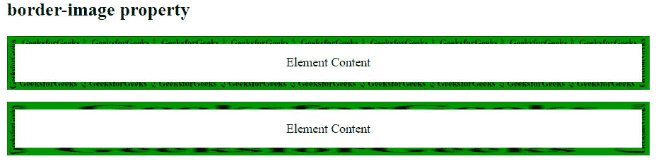
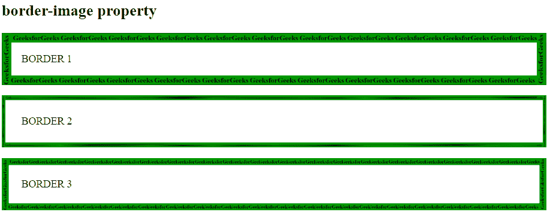

# CSS |边框-图像属性

> 原文:[https://www.geeksforgeeks.org/css-border-image-property/](https://www.geeksforgeeks.org/css-border-image-property/)

CSS 中的**边框-图像属性**用于设置元素的边框。

**语法:**

```
border-image: source slice width outset repeat|initial|inherit;
```

边框图像属性是下面列出的许多属性的组合:

*   边界图像源
*   边界图像切片
*   边框图像宽度
*   边界图像开始
*   边框-图像-重复

**属性值:**

*   **边框-图像-来源:**该属性用于设置边框图像的来源位置。
    **语法:**

```
border-image-source: url(image source location);
```

*   **border-image-slice:** The border-image-slice property is used to divide or slice an image specified by border-image-source property.
    The border-slice property divides a given image into:
    *   9 个地区
    *   4 个角
    *   4 条边
    *   中部地区

    **语法:**

    ```
    border-image-slice: value;
    ```

    *   **border-image-width:** The border-image-width property is used to set the width of the border.

    **语法:**

    ```
    border-image-width: value;
    ```

    *   **边界图像开始:**边界图像开始属性设置元素边界图像从其边界框开始的距离。
    **语法:**

    ```
    border-image-outset: value;
    ```

    *   **边框-图像-重复:**边框-图像-重复属性定义如何调整源图像的边缘区域以适合元素边框图像的尺寸。
    **语法:**

    ```
    border-image-repeat: value;
    ```

    *   **初始值:**用于将边框图像属性设置为默认值。*   **inherit:** It is used to set border-image property from its parent.

    **例 1:**

    ```
    <!DOCTYPE html>
    <html>
        <head>
            <title>
                CSS border-image Property
            </title>

            <style>
                #borderimg1 {
                    border: 10px solid transparent;
                    padding: 15px;
                    -webkit-border-image: url(
    'https://media.geeksforgeeks.org/wp-content/uploads/border2-2.png')
                    30 round;
                    border-image: url(
    'https://media.geeksforgeeks.org/wp-content/uploads/border2-2.png')
                    30 round;
                    text-align:center;
                }

                #borderimg2 {
                    border: 10px solid transparent;
                    padding: 15px;
                    -webkit-border-image: url(
    'https://media.geeksforgeeks.org/wp-content/uploads/border2-2.png')
                    30 stretch;
                    border-image: url(
    'https://media.geeksforgeeks.org/wp-content/uploads/border2-2.png')
                    30 stretch;
                    text-align:center;
                }
            </style>
        </head>

        <body>
            <h2>border-image property</h2>

            <p id = "borderimg1">
                Element Content
            </p>
            <p id = "borderimg2">
                Element Content
            </p>
        </body>
    </html>                    
    ```

    **输出:**
    

    **例 2:**

    ```
    <!DOCTYPE html>
    <html>
        <head>
            <title>
                CSS border-image Property
            </title>

            <style>
                #borderimg1 {
                    border: 15px solid transparent;
                    padding: 15px;
                    border-image:url(
    'https://media.geeksforgeeks.org/wp-content/uploads/border2-2.png')
                    50 round;
                }

                #borderimg2 {
                    border: 15px solid transparent;
                    padding: 15px;
                    border-image:url(
    'https://media.geeksforgeeks.org/wp-content/uploads/border2-2.png') 
                    40% stretch;
                }
                #borderimg3 {
                    border: 15px solid transparent;
                    padding: 15px;
                    border-image:url(
    'https://media.geeksforgeeks.org/wp-content/uploads/border2-2.png')
                    70 round;
                }
            </style>
        </head>

        <body>
            <h2>border-image property</h2>
            <p id = "borderimg1">BORDER 1</p>
            <p id = "borderimg2">BORDER 2</p>
            <p id = "borderimg3">BORDER 3</p>
        </body>
    </html>                    
    ```

    **输出:**
    

    **支持的浏览器:***边框图像属性*支持的浏览器如下:

    *   谷歌 Chrome 16.0，4.0 -webkit-
    *   Internet Explorer 11.0
    *   火狐 15.0， 3.5 -moz-
    *   Opera 15.0，11.0 -o-
    *   Safari 6.0，3.1 -webkit-