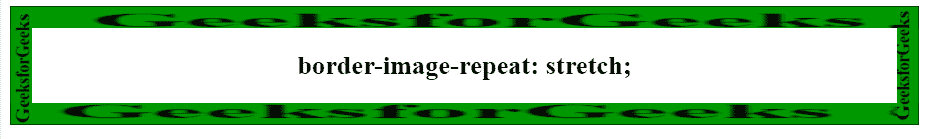
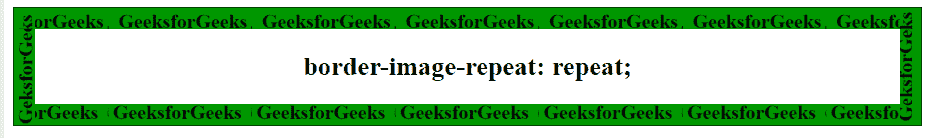
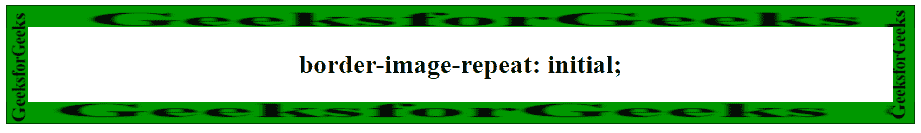

# CSS |边框-图像-重复属性

> 原文:[https://www . geesforgeks . org/CSS-border-image-repeat-property/](https://www.geeksforgeeks.org/css-border-image-repeat-property/)

CSS 中的**边框-图像-重复属性**用于缩放和平铺边框图像。它可以用来匹配边框图像的中间部分和边框的大小。它可以有一个或两个值。一个用于水平轴，一个用于垂直轴。只给出一个值，那么它适用于所有边，但是给出两个值，一个值用于水平边，另一个值用于垂直边。

**语法:**

```html
border-image-repeat: stretch|repeat|round|initial|inherit
```

**属性值:**

**拉伸:**为默认值，用于拉伸图像填充区域。

*   **语法:**

    ```html
    border-image-repeat: stretch;
    ```

*   **例:**

    ```html
    <!DOCTYPE html> 
    <html> 
        <head> 
            <title>
                CSS border-image-repeat Property
            </title> 

            <!-- CSS property -->
            <style> 
                h2 {
                    border: 20px solid transparent;
                    padding: 20px;
                    border-image-source: 
    url(https://media.geeksforgeeks.org/wp-content/uploads/border2-2.png);
                    border-image-repeat: stretch;
                    border-image-slice: 40;
                    text-align:center;
                }
            </style>
        </head>

        <body>
            <h2>border-image-repeat: stretch;</h2>
        </body>
    </html>                    
    ```

*   **输出:**
    

**重复:**此属性用于重复背景图像。

*   **语法:**

    ```html
    border-image-repeat: repeat;
    ```

*   **例:**

    ```html
    <!DOCTYPE html> 
    <html> 
        <head> 
            <title>
                CSS border-image-repeat Property
            </title> 

            <!-- CSS property -->
            <style> 
                h2 {
                    border: 20px solid transparent;
                    padding: 20px;
                    border-image-source: 
    url(https://media.geeksforgeeks.org/wp-content/uploads/border2-2.png);
                    border-image-repeat: repeat;
                    border-image-slice: 40;
                    text-align:center;
                }
            </style>
        </head>

        <body>
            <h2>border-image-repeat: repeat;</h2>
        </body>
    </html>                    
    ```

*   **输出:**
    

**round:** 用于重复图像填充区域。如果图像没有填满所有图块中的区域，图像将被重新缩放。

*   **语法:**

    ```html
    border-image-repeat: round;
    ```

*   **例:**

    ```html
    <!DOCTYPE html> 
    <html> 
        <head> 
            <title>
                CSS border-image-repeat Property
            </title> 

            <!-- CSS property -->
            <style> 
                h2 {
                    border: 20px solid transparent;
                    padding: 20px;
                    border-image-source: 
    url(https://media.geeksforgeeks.org/wp-content/uploads/border2-2.png);
                    border-image-repeat: round;
                    border-image-slice: 40;
                    text-align:center;
                }
            </style>
        </head>

        <body>
            <h2>border-image-repeat: round;</h2>
        </body>
    </html>                    
    ```

*   **输出:**
    

**初始值:**用于将边框-图像-重复属性设置为默认值。

*   **语法:**

    ```html
    border-image-repeat: initial;
    ```

*   **例:**

    ```html
    <!DOCTYPE html> 
    <html> 
        <head> 
            <title>
                CSS border-image-repeat Property
            </title> 

            <!-- CSS property -->
            <style> 
                h2 {
                    border: 20px solid transparent;
                    padding: 20px;
                    border-image-source: 
    url(https://media.geeksforgeeks.org/wp-content/uploads/border2-2.png);
                    border-image-repeat: initial;
                    border-image-slice: 40;
                    text-align:center;
                }
            </style>
        </head>

        <body>
            <h2>border-image-repeat: initial;</h2>
        </body>
    </html>                    
    ```

*   **输出:**
    

**继承:**用于从其父级设置边框-图像-重复属性。

**支持的浏览器:***边框-图像-重复*属性支持的浏览器如下:

*   谷歌 Chrome 15.0
*   Internet Explorer 11.0
*   Firefox 15.0
*   Opera 15.0
*   Safari 6.0