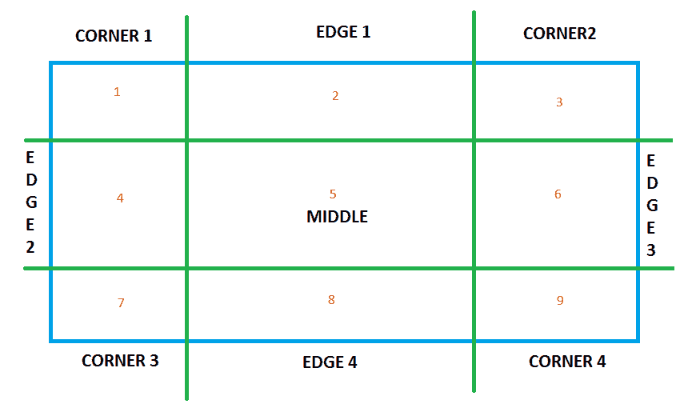
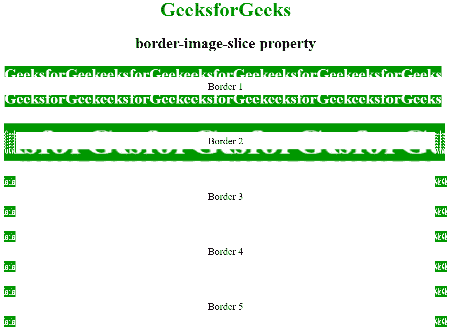

# CSS |边框-图像-切片属性

> 原文:[https://www . geesforgeks . org/CSS-border-image-slice-property/](https://www.geeksforgeeks.org/css-border-image-slice-property/)

在 CSS 中**边框-图像-切片**属性用于分割或切片由 [**边框-图像-来源**](https://www.geeksforgeeks.org/css-border-images/) 属性指定的图像。
**边界切片**属性将给定图像分为:

*   9 个地区
*   4 个角
*   4 条边
*   中部地区。

**注意:**中间区域默认保持透明，**填充**值用于使其不透明/半透明。
下图显示了上述区域:



*   区域 1、3、7、9 是拐角区域。

*   区域 2、4、6、8 是边缘区域。

*   区域 5 是中间区域。

**语法:**

```css
border-image-slice= value;
```

**默认值:**其默认值为 100%。

**属性值:**

<figure class="table">

| value | Effect/functionality |
| --- | --- |
| figure | Represents the coordinates of the edge offset pixels of raster image and vector image. ( **See:** [Vector vs raster pattern)](https://www.geeksforgeeks.org/vector-vs-raster-graphics/) |
| percentage | Indicates the percentage of edge offset to the size of the source image: the width of the image is horizontal offset and the height is vertical offset. |
| Fill
 | Make the middle area appear as the background image.
 |
| Initial
 | Initializes the property to the default value.
 |
| Inherit
 | Inherit the value of the attribute from its parent element.
 |

</figure>

下面的程序举例说明了边框-图像-切片属性:
**示例:**

## 超文本标记语言

```css
<!DOCTYPE html>
<html>
    <head>
        <title>
            CSS | border-image-slice Property
        </title>
        <style>
            body {
                text-align:center;
            }
            h1 {
                color:green;
            }

            .border1 {
                border: 10px solid transparent;
                padding: 15px;
                border-image-source: url(
https://media.geeksforgeeks.org/wp-content/uploads/border1-2.png);
                border-image-repeat: round;
                border-image-slice: 30;
                border-image-width: 20px;
            }
            .border2 {
                border: 10px solid transparent;
                padding: 15px;
                border-image-source: url(
https://media.geeksforgeeks.org/wp-content/uploads/border1-2.png);
                border-image-repeat: round;
                border-image-slice: 30%;
                border-image-width: 20px;
            }
            .border3 {
                border: 10px solid transparent;
                padding: 15px;
                border-image-source: url(
https://media.geeksforgeeks.org/wp-content/uploads/border1-2.png);
                border-image-repeat: round;
                border-image-slice: fill;
                border-image-width: 20px;
            }
            .border4 {
                border: 10px solid transparent;
                padding: 15px;
                border-image-source: url(
https://media.geeksforgeeks.org/wp-content/uploads/border1-2.png);
                border-image-repeat: round;
                border-image-slice: initial;
                border-image-width: 20px;
            }
            .border5 {
                border: 10px solid transparent;
                padding: 15px;
                border-image-source: url(
https://media.geeksforgeeks.org/wp-content/uploads/border1-2.png);
                border-image-repeat: round;
                border-image-slice: inherit;
                border-image-width: 20px;
            }

            div {
                margin-top:20px;
            }
        </style>
    </head>
    <body>
        <h1>GeeksforGeeks</h1>
        <h2>border-image-slice property</h2>
        <div class = "border1">Border 1</div>
        <div class = "border2">Border 2</div>
        <div class = "border3">Border 3</div>
        <div class = "border4">Border 4</div>
        <div class = "border5">Border 5</div>
    </body>
</html>   
```

**输出:**



**支持的浏览器**:*边框图像属性*支持的浏览器如下:

*   谷歌 Chrome 16.0

*   Internet Explorer 11.0

*   Firefox 15.0

*   Opera 15.0

*   Safari 6.0