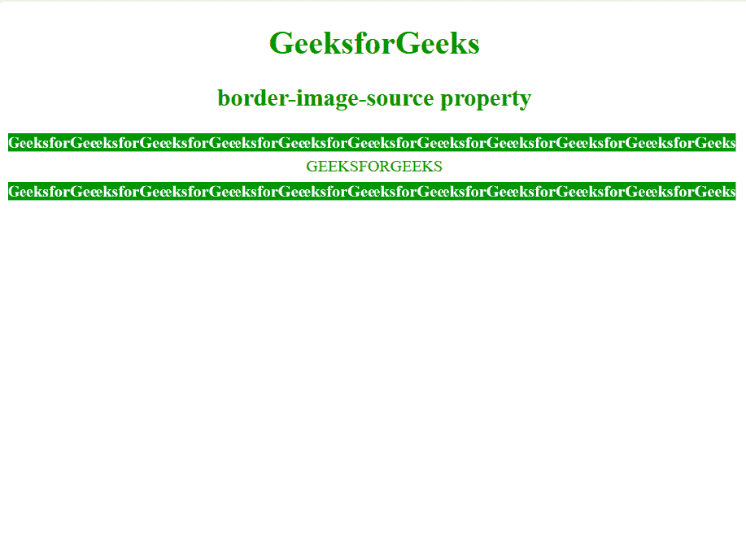

# CSS |边框-图片-来源属性

> 原文:[https://www . geesforgeks . org/CSS-border-image-source-property/](https://www.geeksforgeeks.org/css-border-image-source-property/)

**边框-图像源**属性用于指定要设置为元素边框的图像源。

**语法:**

```
border-image-source: url(image-path.png)| none| initial| inherit;
```

**注意:**如果值为无，将使用边框样式。借助[边界-图像-切片](https://www.geeksforgeeks.org/css-border-image-slice-property/)属性，可以将指定的图像划分为多个区域。

**默认值:**默认值为无。
**价值观:**

*   **无:**未指定图像。
*   **图像:**用于指定要用作元素边框的图像的路径。
*   **初始值:**用默认值初始化属性。
*   **inherit:** 从父元素取值。

**例:**

## 超文本标记语言

```
<!DOCTYPE html> 
<html> 
    <head> 
        <title>
            CSS | border-image-source Property
        </title>
        <style> 
            body { 
                text-align:center;
                color:green;
            } 

            .border1 { 
                border: 10px solid transparent; 
                padding: 15px; 
                border-image-source: url( 
https://media.geeksforgeeks.org/wp-content/uploads/border1-2.png); 
                border-image-repeat: round; 
                border-image-slice: 50; 
                border-image-width: 20px; 
            }  

        </style> 
    </head> 
    <body> 
        <h1>GeeksforGeeks</h1> 
        <h2>border-image-source property</h2> 
        <div class = "border1">GEEKSFORGEEKS</div> 
    </body>
</html>    
```

**输出:**



**支持的浏览器:**CSS |边框-图片-来源属性支持的浏览器如下:

*   铬合金 15.0
*   Edge 11.0
*   Firefox 15.0
*   Opera 15.0
*   Safari 6.0