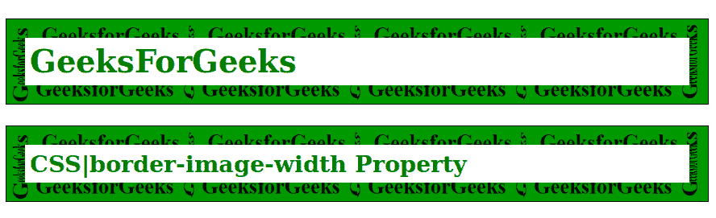
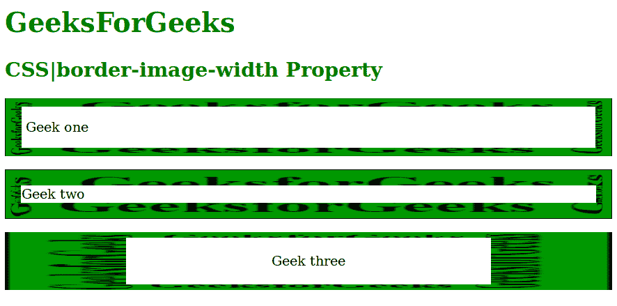

# CSS |边框-图像宽度属性

> 原文:[https://www . geesforgeks . org/CSS-border-image-width-property/](https://www.geeksforgeeks.org/css-border-image-width-property/)

**CSS 边框-图像宽度属性**用于设置边框图像的宽度。可以通过提供多个值来设置。

*   如果只提供一个值，它将应用于所有四个边。
*   当指定两个值时，第一个值应用于“顶部和底部”，第二个值应用于“左侧和右侧”。
*   当指定三个值时，第一个值位于顶部，第二个值由“左右”共享，第三个值位于底部。
*   如果给定了四个值，那么它们将应用于顶部、右侧、底部和左侧(顺时针)顺序。

**语法:**

```html
border-image-width: number | % | auto | initial | inherit;
```

**默认值:**其默认值为 1。

**房产价值:**

*   **长度:**用于以相对方式指定值。
*   **百分比:**用百分比表示宽度。
*   **数字:**用于将宽度设置为边框宽度对应计算值的倍数
*   **初始值:**将该属性设置为默认值
*   **继承:**用于从父元素继承值

**例 1:**

## 超文本标记语言

```html
<!DOCTYPE html>
<html>

<head>
    <title>CSS|border-image-width Property</title>
    <style>
        h1,
        h2 {
            color: green;
        }

        #gfg {
            border: 10px solid transparent;
            padding: 15px;
            border-image-source:
        url(https://media.geeksforgeeks.org/wp-content/uploads/border2-2.png);
            border-image-repeat: round;
            border-image-slice: 30;
            border-image-width: 20px;
        }
    </style>
</head>

<body>
    <h1 id="gfg">GeeksForGeeks</h1>
    <h2 id="gfg">CSS|border-image-width Property</h2>

</body>

</html>
```

**输出:**



**例 2:**

## 超文本标记语言

```html
<!DOCTYPE html>
<html>

<head>
    <title>CSS|border-image-width Property</title>
    <style>
        h1,
        h2 {
            color: green;
        }

        #geek1 {
            border: 10px solid transparent;
            padding: 15px;
            border-image-source:
        url(https://media.geeksforgeeks.org/wp-content/uploads/border2-2.png);
            border-image-slice: 30;
            border-image-width: 10px 20px;
        }

        #geek2 {
            border: 10px solid transparent;
            padding: 10px;
            border-image-source:
         url(https://media.geeksforgeeks.org/wp-content/uploads/border2-2.png);
            border-image-slice: 30;
            border-image-width: 1.2rem;
        }

        #geek3 {
            border: 10px solid transparent;
            padding: 15px;
            border-image-source:
         url(https://media.geeksforgeeks.org/wp-content/uploads/border2-2.png);
            border-image-slice: 30;
            border-image-width: 10% 20% 10% 20%;
        }
    </style>
</head>

<body>
    <h1 id="gfg">GeeksForGeeks</h1>
    <h2 id="gfg">CSS|border-image-width Property</h2>
    <p id="geek1"> Geek one </p>

    <p id="geek2"> Geek two </p>

    <p id="geek3" style="text-align:center"> Geek three </p>

</body>

</html>

```

**输出:**



**支持的浏览器:**支持的浏览器*边框图像宽度*属性如下:

*   谷歌 Chrome 15.0
*   Edge 11.0
*   Firefox 13.0
*   Opera 15.0
*   苹果 Safari 6.0