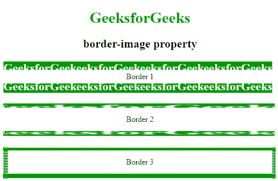

# CSS |边框图像

> 原文:[https://www.geeksforgeeks.org/css-border-images/](https://www.geeksforgeeks.org/css-border-images/)

CSS 中的**边框-图像属性**用于指定图像的边框。此属性使用图像而不是普通边框创建边框。该属性包含以下三部分:

*   完整的图像用作边框。
*   图像切片用作边框
*   图像的中间部分用作(重复或拉伸)边框

border-image 属性用于将图像分割成九个部分，就像井字游戏棋盘一样。

**语法:**

```css
element {
    border-image: url(border.png);
}
```

**边框图像属性:**有很多边框图像属性，如下所示:

*   **边框-图像-来源:**此属性用于设置图像路径。
*   **边框-图像-宽度:**该属性用于设置边框图像的宽度。
*   **边框-图像-切片:**此属性用于对图像的边框进行切片。
*   **边框-图像-重复:**此属性用于将图像的边框设置为圆角、重复和拉伸。
*   **边框-图像-开始:**该属性用于指定边框图像区域超出边框框的量。

**示例:**

```css
<!DOCTYPE html>
<html>
    <head>
        <title>
            CSS | Border Images
        </title>
        <style>
            body {
                text-align:center;
            }
            h1 {
                color:green;
            }
            .border1 { 
                border: 10px solid transparent;
                padding: 15px;
                border-image-source: url(
https://media.geeksforgeeks.org/wp-content/uploads/border1-2.png);
                border-image-repeat: round;
                border-image-slice: 30;
                border-image-width: 20px;
            }
            .border2 { 
                border: 10px solid transparent;
                padding: 15px;
                border-image: url(
https://media.geeksforgeeks.org/wp-content/uploads/border1-2.png)
                30 stretch;
            }
            .border3 {
                border: 10px solid transparent;
                padding: 15px;
                border-image: url(
https://media.geeksforgeeks.org/wp-content/uploads/border1-2.png) 
                20% round;
            }
            div {
                margin-top:20px;
            }
        </style>
    </head>
    <body>
        <h1>GeeksforGeeks</h1>
        <h2>border-image property</h2>
        <div class = "border1">Border 1</div>
        <div class = "border2">Border 2</div>
        <div class = "border3">Border 3</div>
    </body>
</html>                                    
```

**输出:**


**支持的浏览器:***边框图像属性*支持的浏览器如下:

*   谷歌 Chrome 16.0
*   Internet Explorer 11.0
*   Firefox 15.0
*   Opera 15.0
*   Safari 6.0