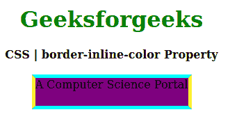
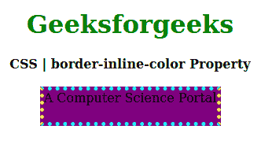

# CSS |边框内联颜色属性

> 原文:[https://www . geesforgeks . org/CSS-border-inline-color-property/](https://www.geeksforgeeks.org/css-border-inline-color-property/)

CSS 中的**边框内联颜色属性**用于在样式表的单个位置设置单个逻辑内联边框颜色属性值。它设置定义边框元素的顶部和底部的边框颜色。

**语法:**

```
border-inline-color: color;
```

**属性值:**

*   **颜色:**该属性保存边框的颜色。

以下示例说明了 CSS 中的**边框内联颜色属性**:

**例 1:**

```
<!DOCTYPE html>
<html>

<head>
    <title>CSS | border-inline-color Property</title>
    <style>
        h1 {
            color: green;
        }

        div {
            background-color: yellow;
            width: 220px;
            height: 40px;
        }

        .one {
            border: 5px solid cyan;
            border-inline-color: yellow;
            background-color: purple;
        }
    </style>
</head>

<body>
    <center>
        <h1>Geeksforgeeks</h1>
        <b>CSS | border-inline-color Property</b>
        <br><br>
        <div class="one">A Computer Science Portal</div>
    </center>
</body>

</html>                    
```

**输出:**


**例 2:**

```
<!DOCTYPE html>
<html>

<head>
    <title>CSS | border-inline-color Property</title>
    <style>
        h1 {
            color: green;
        }

        div {
            background-color: yellow;
            width: 220px;
            height: 40px;
        }

        .one {
            border: 5px dotted cyan;
            border-inline-color: yellow;
            background-color: purple;
        }
    </style>
</head>

<body>
    <center>
        <h1>Geeksforgeeks</h1>
        <b>CSS | border-inline-color Property</b>
        <br><br>
        <div class="one">A Computer Science Portal</div>
    </center>
</body>

</html>                    
```

**输出:**


**参考:**[https://developer . Mozilla . org/en-US/docs/Web/CSS/border-inline-color #:~:text = The % 20 border % 2 inline % 2 color % 20CSS，% 2C % 20 directionity % 2C % 20 和%20text%20orientation。](https://developer.mozilla.org/en-US/docs/Web/CSS/border-inline-color#:~:text=The%20border%2Dinline%2Dcolor%20CSS,%2C%20directionality%2C%20and%20text%20orientation.)

**支持的浏览器:****边框内联颜色属性**支持的浏览器如下:

*   火狐浏览器
*   歌剧
*   边缘